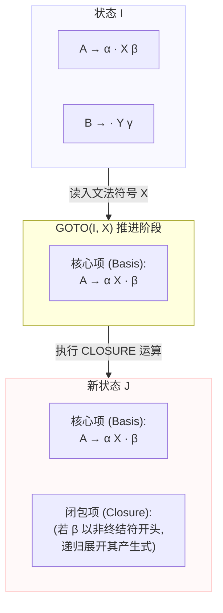

---
aliases:
- 跳转函数（Goto Function）
- GO(I, X)
- Transition Function
- Goto Function
- 跳转函数
- GOTO Function
- 跳转函数：接收输入并转换状态的导航机制
created: 2026-06-11
english: Goto Function
source_chapter:
- 5
tags:
- 编译原理
- 语法分析
- 自底向上
- DFA构建
title: 跳转函数
type: concept
used_in_chapter:
- 5
---
# 跳转函数：接收输入并转换状态的导航机制

**跳转函数**（在算法里写为 $\text{GOTO}(I, X)$）说白了就是状态机里**“拿着道具去刷卡开门，进入下一个新房间”**的跳转物理引擎。它规定了当分析器在状态 $I$ 读到符号 $X$ 时，该如何安全地跳转到下一个新状态。

---

## 🚗 直觉比喻：密室逃脱中的“通关刷卡开门” (Escape Room Check-in Port)

> [!NOTE]
> **跳转函数（大白话通俗解释）**
> 
> 如果把状态机构建看作一场多房间的密室逃脱游戏，那么跳转函数就是**“刷卡开门前往下一关”**的物理引擎：
> 
> *   **当前关卡（状态 $I$）**：你目前所在的密室房间。墙上贴着你需要搜集的线索和任务卡片（项目集中的各种项目）。
> *   **通关卡片（文法符号 $X$）**：你在房间里搜集到并握在手里的通关道具（终结符或非终结符 $X$）。
> *   **跳转函数（$\text{GOTO}(I, X)$）**：这就是你拿着卡片 $X$ 去刷卡开门。系统检测后，大门打开， **将你无偏差地送入下一个指定的关卡房间 $J$** （跳转到目标状态）。
> *   **三步开门法**：
>     1.  **收起有用线索**：系统只带走房间里需要 $X$ 道具的线索，其他无关线索留在老房间失效（挑选圆点后是 $X$ 的项目）。
>     2.  **成功跨过大门**：你跨过门槛，把道具 $X$ 放入背包（圆点推进越过 $X$，获得新房间的**核心项**）。
>     3.  **灯光亮起，浮现新线索**：进入新房间的瞬间，房间灯光亮起，根据你的主创队伍，自动浮现出所有相关的额外线索（对核心项求**[[闭包运算]]**，得到新房间的完整闭包项目集）。

---

## 1. 形式化数学定义

设 $I$ 为一个项目集（LR(0) 或 LR(1) 项目集），$X$ 为文法符号（可以是非终结符 $V_N$ 或终结符 $V_T$）。跳转函数 $\text{GOTO}(I, X)$ 定义为：

$$\text{GOTO}(I, X) = \text{CLOSURE}(\{ A \to \alpha X \cdot \beta \mid A \to \alpha \cdot X \beta \in I \})$$

### 核心逻辑分解：
1.  **筛选种子** ：从 $I$ 中找出所有圆点紧挨着 $X$ 的项目（即形如 $A \to \alpha \cdot X \beta$ 的项目）。
2.  **推进圆点** ：将这些项目的圆点越过 $X$，生成推进后的项目集合（形如 $A \to \alpha X \cdot \beta$）。这一步得到的集合称为新状态的 **核心项（Basis Items）** 。
3.  **展开求包** ：对核心项集合进行 **[[闭包运算]]** ，顺藤摸瓜地把所有相关的闭包项补充进来，生成一个自洽的、确定性的新状态。

---

## 2. 状态转移工作流 (Mermaid 可视化)

---

## 3. 计算示例（活前缀 DFA 状态转移）

考虑产生式：
(1) $E \to E + T$
(2) $E \to T$
(3) $T \to \textbf{id}$

计算状态 $I_0 = \text{CLOSURE}(\{E' \to \cdot E\})$ 在输入符号 $E$ 上的跳转 $\text{GOTO}(I_0, E)$：

### 第一步：找出 $I_0$ 中圆点后为 $E$ 的项目
在 $I_0$ 中，以下两个项目圆点后为 $E$：
*   $S' \to \cdot E$
*   $E \to \cdot E + T$

### 第二步：将圆点越过 $E$，得到新状态的核心项
*   $S' \to E \cdot$
*   $E \to E \cdot + T$

### 第三步：对核心项求闭包 $\text{CLOSURE}$
由于圆点后一个是结束符（无符号），另一个是终结符 `+`，均不为非终结符，因此闭包运算没有增加新项。
最终得到状态 $I_1$：
$$I_1 = \{ S' \to E \cdot,\; E \to E \cdot + T \}$$

这表明：$\text{GOTO}(I_0, E) = I_1$。

---

## 4. 跳转函数与 ACTION/GOTO 表的映射关系

跳转函数是把“DFA 状态机”翻译成“矩阵分析表”的直接桥梁。根据跳转符号 $X$ 的类型，映射逻辑分为两类：

| 符号 $X$ 的类型 | 理论跳转表达 | 分析表映射规则 | 说明 |
|:---:|:---:|---|---|
| **终结符** ($a \in V_T$) | $\text{GOTO}(I_i, a) = I_j$ | $\text{ACTION}[i, a] = \textbf{s} j$ | 映射为 **ACTION 表** 的 **移进（Shift）** 动作，表示读入 $a$ 并压入状态 $j$ |
| **非终结符** ($A \in V_N$) | $\text{GOTO}(I_i, A) = I_j$ | $\text{GOTO}[i, A] = j$ | 映射为 **GOTO 表** 的 **跳转** 动作，用于在归约弹出栈后查表压入新状态 |

---

## ⚠️ 空产生式（$\varepsilon$）的跳转死胡同

> [!WARNING] 应试核心陷阱
> 对于空产生式 $A \to \varepsilon$，其在项目集闭包中对应的项目是 **$A \to \cdot$** 。
> 
> *   **跳转特点** ：由于圆点已经处于产生式的最右端（且右部无任何字符）， **圆点后面没有任何符号可供跳转** 。
> *   **结论** ：项目 $A \to \cdot$ **永远不参与任何 $\text{GOTO}(I, X)$ 的跳转计算** 。它在当前状态中是一个 **“死胡同”** ，唯一的出路是触发 **归约** 。
> *   **经典关联** ：在 [[Ex5.2_SLR分析与LR0冲突_空产生式文法]] 中，状态 $I_0$ 中含有 $S \to \cdot$，计算 $\text{GOTO}(I_0, \text{任何符号})$ 时，该项目均直接被忽略，只有移进/非空项参与跳转。

---

## 🔗 关联笔记与双链

*   [[闭包运算]] ── 跳转函数的最后一步是执行闭包运算。
*   [[项目集规范族]] ── 通过反复对初始状态应用跳转函数 $\text{GOTO}$，求得所有状态的并集。
*   [[ACTION表]] / [[GOTO表]] ── 跳转函数在表格中的运行时体现。
*   [[Ex5.2_SLR分析与LR0冲突_空产生式文法]] ── 含有空产生式跳转过滤的综合例题。
