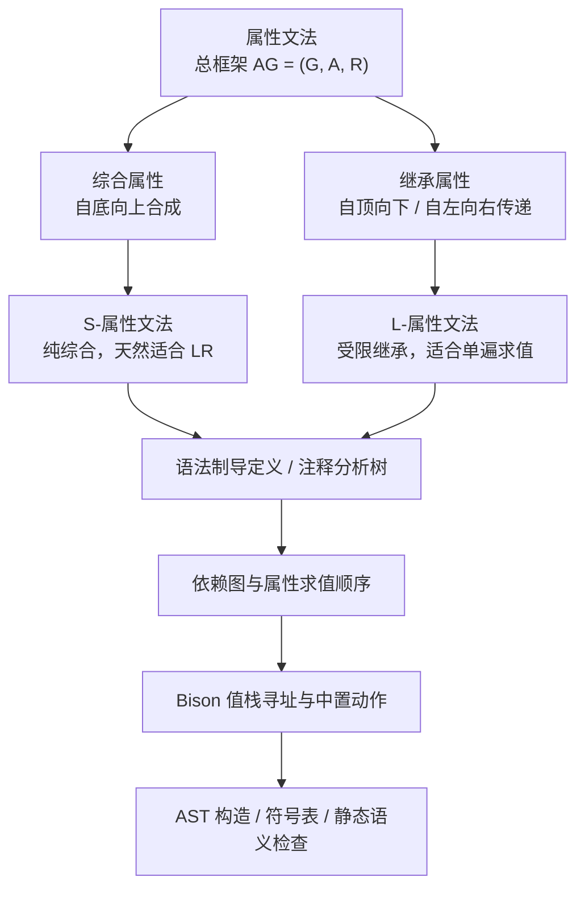

---
aliases:
- 语义分析学习路线图
- Semantic Analysis Learning Path
created: 2026-06-15
english: Semantic Analysis Learning Path
tags:
- 编译原理
- 语义分析
- 属性文法
- 学习路线
title: 语义分析学习路线图
type: overview
used_in_chapter:
- 6
---
# 语义分析学习路线图：给语法树贴属性，再让属性流起来

> English: **Semantic Analysis Learning Path**

语义分析不是重新判断一句话“长得合不合法”，而是在语法分析已经通过之后，继续追问：这棵树里的变量、类型、值、代码和作用域信息应该怎样计算、检查和传递。

---

## 1. 大白话通俗解释（核心直觉）

> [!NOTE]
> **毛坯验收到精装修走线的比喻**：
> *   **语法分析**只确认房子结构没塌：墙、门、窗的位置合不合法。
> *   **属性文法**开始给每个房间贴标签：面积、材料、承重、线路、用途。
> *   **综合属性**像楼下往楼上汇报数据，子节点把信息合成给父节点。
> *   **继承属性**像总控室往房间分发配置，父节点或左兄弟把上下文传给当前节点。
> *   **Bison 语义动作**则是把这些属性计算嵌进归约过程，让 parser 边识别边计算。

*   **一句话总结**：语义分析的路线是 **属性文法总框架 → 综合/继承属性 → S/L 属性文法 → 求值顺序 → Bison 动作与 AST/符号表落地**。

---

## 2. 推荐阅读顺序

| 顺序 | 笔记 | 学习目标 |
|---|---|---|
| 1 | [[属性文法]] | 知道属性、语义规则和 CFG 的关系 |
| 2 | [[综合属性]] / [[继承属性]] | 会判断属性信息流方向 |
| 3 | [[S-属性文法]] / [[L-属性文法]] | 会判断属性文法适合哪类求值方式 |
| 4 | [[语法制导定义]] / [[注释分析树]] | 会把规则写成 SDD 并标到树上 |
| 5 | [[依赖图与属性求值顺序（谁依赖谁、谁先算的排队图）]] | 会按依赖关系安排求值顺序 |
| 6 | [[Bison值栈寻址与中置动作（传送带定位取货与临时工占位）]] | 会把 `$1`、`$$`、中置动作和属性栈对应起来 |
| 7 | [[AST]] / [[用产生式搭乐高积木（自底向上的AST物理构造）]] | 会在归约时构造抽象语法树 |
| 8 | [[给语法树注入灵魂（符号表存取与AST递归求值）]] / [[静态语义]] | 会做符号表查询、类型检查、未定义变量检查 |
| 9 | [[后缀表达式]] | 用一个小例子练习语法制导翻译 |

---

## 3. 理论到实验的落地路线

> [!TIP]
> 做实验时不要先写 C 代码。先写出每条产生式对应的属性规则，再决定这些属性在 Bison 里是 `int`、`char *`、`Set *` 还是 AST 指针。

---

## 4. 常见岔路提醒

> [!WARNING]
> *   只写代码、不写属性规则，实验报告会显得像“会调工具但不会解释理论”。
> *   只写属性文法、不说明 `%union` / `%type` / `$i`，评分标准里的实现部分会缺证据。
> *   碰到继承属性时，要特别说明它如何在 LR/Bison 中传递：中置动作、虚产生式，或先建 AST 再遍历，三者至少讲清一种。
