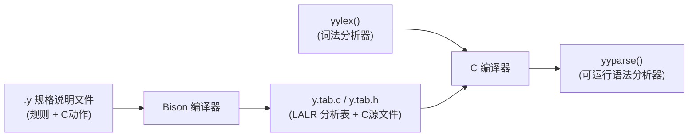

---
aliases:
- Bison值栈寻址与中置动作（传送带定位取货与临时工占位）
- Bison语法
- Bison 语法
- Bison 与 Yacc
- Bison
- 传送带定位取货与临时工占位
- Bison值栈寻址与中置动作：传送带定位取货与临时工占位
created: 2026-06-11
english: Bison Syntax & Parsing
source_chapter:
- 6
tags:
- 编译原理
- 语法分析
- 语义分析
- Bison
- Yacc
title: Bison值栈寻址与中置动作（传送带定位取货与临时工占位）
type: concept
used_in_chapter:
- 6
---
# Bison值栈寻址与中置动作：传送带定位取货与临时工占位

> English: **Bison Syntax & Parser Generator**

**Bison** 是 GNU 计划开发的、兼容 Yacc 的 **语法分析器生成器** （Parser Generator）。它基于 **LALR(1)** 分析算法，读取上下文无关文法（CFG）规格说明文件，自动生成用 C/C++ 编写的语法分析器函数 `yyparse()`。

---

## 1. 🌟 大白话通俗解释 (核心直觉)

> [!TIP]
> **双轨道传送带与倒数拿箱子的比喻**：
> Bison 就像是一个自动化的**流水线工厂车间**：
> *   **双轨道传送带**：工厂里有两条平行移动的传送带。第一条叫“状态栈”，上面放着当前装装到了哪一步的工艺卡（状态数）；第二条叫“属性值栈”，上面并排放着对应的行李箱（属性值，比如数值或字符串）。
> *   **倒数拿行李箱（相对寻址）**：当工人准备进行一次拼装归约（比如把 `A B C` 拼成一个大箱子 `S`）时，当前传送带的指针 `yyvsp` 刚好指在最右边的行李箱 `C` 上。
>     此时，工人要想拿这 3 个行李箱：
>     *   手头这格（偏移量为 0，即 `yyvsp[0]`）就是第 3 个行李箱 `C`（对应 Bison 里的 **`$3`**）。
>     *   往左退 1 格（偏移量为 -1，即 `yyvsp[-1]`）就是第 2 个行李箱 `B`（对应 Bison 里的 **`$2`**）。
>     *   往左退 2 格（偏移量为 -2，即 `yyvsp[-2]`）就是第 1 个行李箱 `A`（对应 Bison 里的 **`$1`**）。
>     *   拼装好的新大行李箱 `S` 的值就是临时变量 `yyval`（对应 Bison 里的 **`$$`**）。

*   **一句话总结**：Bison 就是用两个平行栈进行移进-归约，并且翻译语义动作时，通过“倒数偏移”来精准定位获取变量属性。

---

## 2. 📝 学术规范定义 (考试硬核)

### 工具规格工作流
Bison 规格说明文件 `.y` 经 Bison 编译生成 LALR(1) 分析表及 C 语言分析器源码：



### 三段式结构规格文件
Bison 规范说明文件以双百分号 `%%` 分隔为三部分：
```yacc
%{
/* 第一部分：C 声明与全局类型配置 (Definitions) */
#include <stdio.h>
#include <limits.h>
%}

%union {
    int ival;
    char *sval;
}
%token <ival> NUMBER
%type <ival> expr

%left '+' '-'
%left '*' '/'

%%
/* 第二部分：文法产生式规则与语义动作 (Rules) */
program: expr            { printf("Result: %d\n", $1); }
       ;
expr: expr '+' expr      { $$ = $1 + $3; }
    | NUMBER             { $$ = $1; }
    ;

%%
/* 第三部分：辅助 C 用户函数 (Routines) */
int yylex(void) {
    // 词法分析，由 yyparse 调用以获取下一个 Token
}
void yyerror(const char *s) {
    fprintf(stderr, "Error: %s\n", s);
}
```

### 属性栈物理模型与寻址映射
对于产生式：$A \to X_1 X_2 \dots X_n$
在生成的 C 代码中，Bison 通过相对值栈指针 `yyvsp` 进行相对寻址：
*   **`$$`** $\to$ 局部归约结果临时变量 **`yyval`**
*   **`$i`** $\to$ **`yyvsp[i - n]`**（其中 $1 \le i \le n$）

对于表达式 `expr: expr '+' expr`（右侧共 3 个符号，$n=3$），Bison 编译生成的 C 归约代码为：
```c
case 12: // 语义动作执行
  yyval = yyvsp[-2] + yyvsp[0]; // 即 $$ = $1 + $3 (忽略了运算符 '+')
  break;
```

#### 归约时的双栈物理演变示意图
```text
1. 归约前 (执行 C 动作前)：
   状态栈指针 yyssp 指向 s_3，值栈指针 yyvsp 指向 v_expr2。
   
   状态栈 (State Stack): [ ..., s_prev,  s_expr1,  s_plus,   s_expr2 ] ← yyssp (栈顶)
   属性栈 (Value Stack): [ ..., v_prev,  v_expr1,  v_plus,   v_expr2 ] ← yyvsp (栈顶)
                                            │         │         │
                                            │         │         └─ yyvsp[0]  (即 $3)
                                            │         └─────────── yyvsp[-1] (即 $2)
                                            └───────────────────── yyvsp[-2] (即 $1)
                                            
   【动作】：执行 yyval = yyvsp[-2] + yyvsp[0]; (计算 v_expr1 + v_expr2)

2. 归约中 (双栈弹出 3 个符号)：
   状态栈与属性栈同时向下收缩 3 格。
   
   状态栈 (State Stack): [ ..., s_prev ] ← yyssp 新位置
   属性栈 (Value Stack): [ ..., v_prev ] ← yyvsp 新位置

3. 归约后 (压入新状态与结果)：
   - 将计算好的新值 yyval 压入属性栈。
   - 查 GOTO 跳转表，将新状态 s_new 压入状态栈。
   
   状态栈 (State Stack): [ ..., s_prev,  s_new ]   ← yyssp (栈顶)
   属性栈 (Value Stack): [ ..., v_prev,  yyval ]   ← yyvsp (栈顶)
```

---

## 3. 🎯 应试痛点与解题模板 (拿分关键)

### 痛点一：中置动作（Mid-rule Actions）的物理偏移计算
*   **考场场景**：在 L-属性计算中，有时需要在产生式中间插入动作，例如：
    `A : B { /* 动作 1 */ } C { /* 动作 2 */ };`
*   **物理翻译**：Bison 在编译时，会将中间的 `{ 动作 1 }` 隐式改写为一个产生空串的虚非终结符 `M`（即 `A : B M C` 和 `M : ε { 动作 1 }`）。
*   **寻址偏移陷阱**：在最后的 `{ 动作 2 }` 中，符号的索引位置会随之发生偏移！
    *   `$1` 对应 `B`。
    *   `$2` 对应中间动作 `{ 动作 1 }` 的返回值（即 `M` 的值）。
    *   `$3` 对应 `C`。
    *   如果忘记计算中间动作的占位，后面的属性值索引将完全数错。

### 痛点二：二义性文法的冲突消除规则
Bison 默认在移进-归约冲突时选择 **Shift (移进)**，在归约-归约冲突时选择 **先声明的产生式归约**。但我们可以显式使用优先级指令消除冲突：
1.  **左结合** `%left`：如 `%left '+' '-'`。面临移进 `+` 还是按 `+` 归约时，决定执行**归约**。
2.  **右结合** `%right`：如 `%right '='`。遇到冲突时执行**移进**。
3.  **非结合** `%nonassoc`：如 `%nonassoc '<'`。强制限制 `a < b < c` 连续比较为非法。

---

## 4. 🔗 关联上下文 (双链图谱)

- **上级章节 MOC**：[[00_Chapter6_语义分析_题型总览]]
- **前置底层理论**：[[LALR(1)分析算法]] / [[属性文法]]
- **孪生对比工具**：[[Bison工程落地（从设计图纸到能跑的生产线）]]
- **典型实践真题**：[[Ex6.3_属性文法_二叉搜索树有序性判定]]
