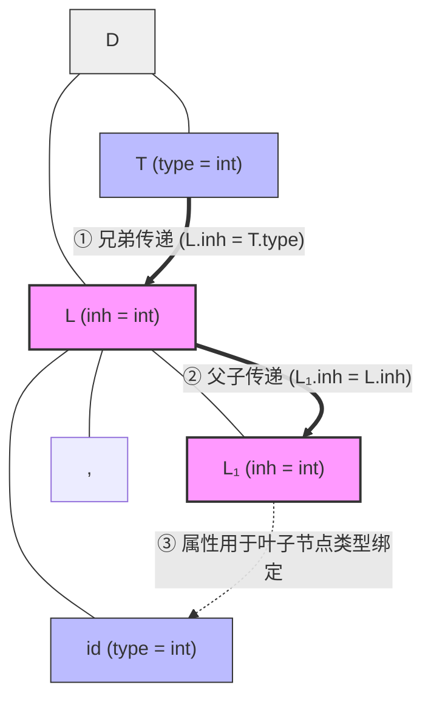

---
aliases:
- L-属性文法
- L-属性定义
- L-Attributed Definition
- L-Attributed Grammar
- L-Attribute Grammar
- L-属性文法：计算顺序受限的温和属性文法
created: 2026-06-10
english: L-Attributed Grammar
source_chapter:
- 6
tags:
- 编译原理
- 语义分析
- 属性文法
- L-属性
title: L-属性文法
type: concept
used_in_chapter:
- 6
---
# L-属性文法：计算顺序受限的温和属性文法

> English: **L-Attributed Definition**

**L-属性文法**是允许[[综合属性]]和[[继承属性]]共存的一类属性文法。但为了保证属性可计算性，它对继承属性的依赖关系进行了严格限制：任何子节点的继承属性只能依赖其**父节点**或语法树中其**左侧兄弟**节点的属性。

---

## 1. 🌟 大白话通俗解释 (核心直觉)

> [!NOTE]
> **长幼有序的有爱大家庭比喻**：
> *   **L 的物理含义**：L 代表 **Left-to-right（从左向右）**。在这个大家庭里，属性物资的继承流动规则非常温和且尊卑分明：一个孩子（右部非终结符 $X_i$）可以继承父母（父节点 $X_0$）派发下来的遗产，或者接收哥哥姐姐们（左侧兄弟 $X_1 \dots X_{i-1}$）传递的数据物资。
> *   **绝对禁止向右看/啃小**：它绝对不允许依赖任何还没有出生或者还没访问到的弟弟妹妹（右侧兄弟 $X_{i+1} \dots X_n$）的任何属性。这种“只向左看、不向右看”的规则，保证了编译器只需要做一次最简单的**从左到右深度优先遍历（DFS）**，就能顺理成章地一次性计算完毕所有属性，绝不会卡死。

*   **一句话总结**：属性只能从上往下传，或者从左往右传，绝对不能从下往上传（给继承属性）或者从右往左传。

---

## 2. 📝 学术规范定义 (考试硬核)

### 形式化定义
一个属性文法（SDD）是 L-属性的，当且仅当对于文法中的每条产生式：
$$p: X_0 \to X_1 X_2 \dots X_n$$

其右部符号 $X_i$（其中 $1 \le i \le n$）的每个继承属性 $X_i.b$ 的语义规则中，其参数只能来自：
1.  **$X_0$（父节点）的继承属性**；
2.  **$X_1, X_2, \dots, X_{i-1}$（左侧兄弟节点）的任何属性**（包括综合属性或继承属性）；
3.  **$X_i$ 自身的其他属性**，但这些属性计算不能形成环路。

> **绝对禁区**：禁止依赖右侧兄弟 $X_{i+1} \dots X_n$ 的属性，也禁止依赖父节点 $X_0$ 的**综合**属性。

### 属性计算的 DFS 物理遍历伪代码
L-属性文法可以通过一次深度优先遍历（DFS）结合左到右的扫描完成求值：
```text
dfs(node):
    for child in node.children (从左到右):
        // 1. 计算当前子节点的继承属性 (依赖于父节点 node 继承属性和已访问的左兄弟属性)
        calculate_inherited_attributes(child)
        // 2. 递归遍历子树
        dfs(child)
    // 3. 当所有子节点都访问并求值完毕后，计算当前节点的综合属性
    calculate_synthesized_attributes(node)
```

以声明语句 $D \to T L$ 及其继承属性传递为例，其 DFS 流动过程如下：



---

## 3. 🎯 应试痛点与解题模板 (拿分关键)

### 常见题型：判定给定的文法是否是 L-属性文法
*   **解题步骤**：
    1. 扫描所有的语义规则，过滤出所有**等式左侧为右部符号**的规则（即所有的继承属性规则）。
    2. 检查等式右侧的参数。
    3. **若发现冲突**：如 $A \to B C$ 且 $B.inh = C.val$，由于 $C$ 在 $B$ 的右侧，违反了“不能依赖右侧兄弟”的法则，指出此规则并下结论：“不是 L-属性文法”。

### 经典反例解析
```text
产生式：A → B C
语义规则：B.x = C.y  (B 的继承属性依赖了右侧兄弟 C 的综合属性)
```
*   **判定结论**：非 L-属性文法。在深度优先从左到右遍历时，遍历到 $B$ 准备计算其继承属性时，$C$ 尚未被访问，`C.y` 还没有值，编译器无法求值。

### 关系定理
$$S\text{-属性文法} \subset L\text{-属性文法}$$
S-属性文法是 L-属性文法的特例（其继承属性集为空）。L-属性文法通过引入受限的继承属性，极大地增强了在单遍扫描编译器中的表达能力。

---

## 4. 🔗 关联上下文 (双链图谱)

- **上级章节 MOC**：[[00_Chapter6_语义分析_题型总览]]
- **孪生对比概念**：[[S-属性文法]] (更窄的纯综合子集)
- **前置依赖卡片**：[[综合属性]] / [[继承属性]] / [[属性文法]]
- **相关解题套路**：[[03_依赖图与计算顺序套路]] / [[Ex6.13_属性文法依赖图]]
