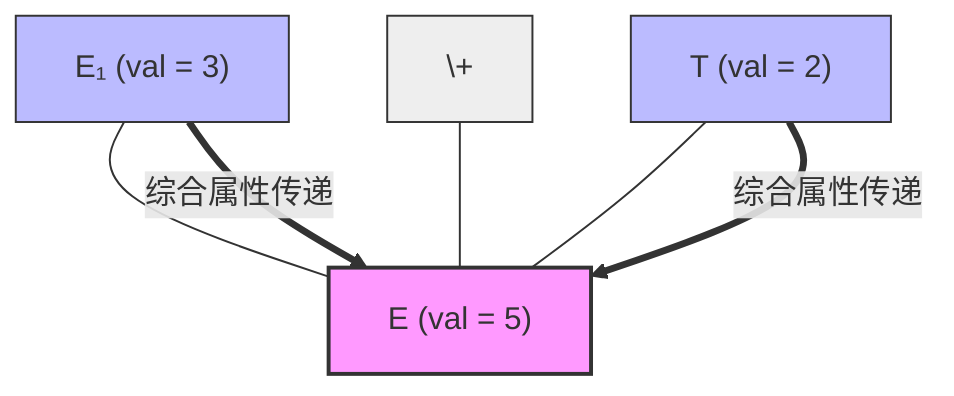

---
aliases:
- S-属性文法
- S-属性定义
- S-Attributed Definition
- S-Attributed Grammar
- S-Attribute Grammar
- S-属性文法：纯综合属性的自底向上文法
created: 2026-06-10
english: S-Attributed Grammar
source_chapter:
- 6
tags:
- 编译原理
- 语义分析
- 属性文法
- S-属性
title: S-属性文法
type: concept
used_in_chapter:
- 6
---
# S-属性文法：纯综合属性的自底向上文法

> English: **S-Attributed Definition**

**S-属性文法**是**只含[[综合属性]]、不含[[继承属性]]**的属性文法（SDD）。它是属性文法中最简单、在工程上最容易实现的一类，并且天然兼容自底向上的 LR 语法分析。

---

## 1. 🌟 大白话通俗解释 (核心直觉)

> [!NOTE]
> **众筹集资式文法的比喻**：
> *   **S 的物理含义**：S 代表 **Synthesized（综合）**。在这个文法世界里，任何一个符号节点都必须完全“自食其力”，靠它在语法树中的所有子节点众筹集资（综合）计算出来。
> *   **零继承拨款**：这里完全没有继承属性，父母节点不给子节点发任何属性拨款，兄弟之间也互不帮扶。
> *   **与 LR 分析器的天生绝配**：因为属性全部是自底向上流动的，这与自底向上的 LR 语法分析器是“灵魂伴侣”。当分析器执行归约（Reduce）动作时，子节点的值已经在栈顶排好队了。我们只要边归约、边求值，然后把新算出的父节点属性压回栈顶即可，实现极其丝滑。

*   **一句话总结**：没有任何下发指令，属性数据全部从最底层叶子节点“众筹”合成上去。

---

## 2. 📝 学术规范定义 (考试硬核)

### 形式化定义
一个语法制导定义（SDD）是 S-属性的，当且仅当：
1.  其所有非终结符的属性均为**综合属性**。
2.  文法中**没有任何继承属性**。

对于文法中所有的产生式 $X_0 \to X_1 X_2 \dots X_n$，所有的语义规则都具有如下单一形式：
$$X_0.a = f(X_1.b, X_2.c, \dots, X_n.d)$$

### 自底向上属性求值树
以产生式 $E \to E + T$（语义规则：$E.val = E_1.val + T.val$）为例，其信息流动方向完全是自底向上的：

### LR 分析器值栈物理同步
在 Bison 中，S-属性文法的求值是和语法分析物理同步进行的，甚至不需要建立真正的语法树节点：
1.  当准备归约右部符号 $X_1 \dots X_n$ 时，它们的属性值已经在值栈（Value Stack）的栈顶（用 `$1`, `$2` 引用）。
2.  执行用户动作 `$$ = f($1, $3)`。
3.  出栈右部符号，把计算结果 `$$`（父节点属性值）直接推入值栈栈顶。

---

## 3. 🎯 应试痛点与解题模板 (拿分关键)

### 证明文法是 S-属性文法
*   **作答模板**：
    1. 逐一列出文法中所有属性（如 `val`, `type`, `postfix` 等）。
    2. 指出每一条语义规则中，等式左侧的目标属性均关联的是产生式的**左部符号**。
    3. 证明文法中没有任何继承属性。
    4. 下结论：“因此该文法是 S-属性文法”。

### ⚔️ 与 L-属性文法的包容关系
$$S\text{-属性文法} \subset L\text{-属性文法}$$
所有 S-属性文法都自动属于 L-属性文法（继承属性集合为空的退化状态）。
如果考试大题让你改写一个文法，在可以使用 S-属性文法（纯自底向上）解决时，**优先设计为 S-属性文法**。因为它的工程实现比含有继承属性的 L-属性文法要简单得多，无需插入虚产生式标记。

---

## 4. 🔗 关联上下文 (双链图谱)

- **上级章节 MOC**：[[00_Chapter6_语义分析_题型总览]]
- **孪生对比概念**：[[L-属性文法]] (包容 S-属性的更宽定义)
- **前置依赖卡片**：[[综合属性]] / [[属性文法]]
- **工程实现寻址**：[[Bison值栈寻址与中置动作（传送带定位取货与临时工占位）]] / [[Bison工程落地（从设计图纸到能跑的生产线）]]
- **典型解题套路**：[[01_属性文法改写套路]] / [[Ex6.2_属性文法_表达式后缀式转换]]
