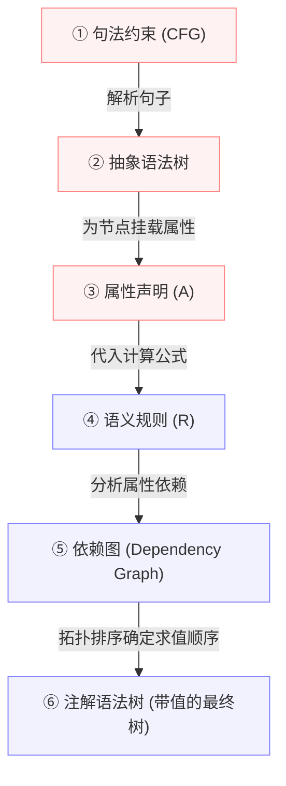

---
aliases:
- 属性文法（Attribute Grammar）
- Attribute Grammar
- 属性文法
- 语法制导定义
- 语法制导定义 (SDD)
- SDD
- 注释分析树
- 注释分析树 (Annotated Parse Tree)
- 属性文法：为语法树节点附加计算逻辑
created: 2026-06-10
english: Attribute Grammar
source_chapter:
- 6
tags:
- 编译原理
- 语法分析
- 语义分析
- 属性文法
title: 属性文法
type: concept
used_in_chapter:
- 6
---
# 属性文法：为语法树节点附加计算逻辑

> English: **Attribute Grammar (AG)** / **Syntax-Directed Definition (SDD)**

**属性文法**是在上下文无关文法（CFG）的基础上，为每个文法符号附加“**属性（Attributes）**”，并为每条产生式附加“**语义规则（Semantic Rules）**”的数学框架。它是连接“句法分析”与“语义分析/中间代码生成”的核心桥梁。

---

## 1. 🌟 大白话通俗解释 (核心直觉)

> [!TIP]
> **毛坯房与精装装修设计图的比喻**：
> 如果说 **上下文无关文法（CFG）** 是房屋的 **毛坯结构设计图**（它仅仅规定了哪里是承重墙，哪里是过道，但没有任何颜色、材质和厚度信息），那么 **属性文法** 就是一张 **精装装修设计图**：
> *   **文法符号**（如 $E$、$T$）是图纸上的毛坯构件（如客厅、主卧）。
> *   **属性**（如 `E.val` 代表数值，`E.type` 代表数据类型，`E.code` 代表生成的机器码）就是为这些构件涂上的“乳漆颜色、大理石材质、电路负载系数”。
> *   **语义规则**（如 $E_1.val = E_2.val + T.val$）就是装修预算公式（“客厅总造价 = 地板造价 + 吊顶造价”）。
> 
> 没有属性文法，编译器只能确认一句话“语法合格”（房子盖起来了没塌）；有了属性文法，编译器才能真正搞清这句话“代表什么含义”（房子装修好了能住人）。

*   **一句话总结**：CFG 规定了句子的“骨架外形”，属性文法往骨架上贴“血肉数据（属性）”并规定“运算逻辑（语义规则）”。

---

## 2. 📝 学术规范定义 (考试硬核)

### 形式化定义
一个属性文法是一个三元组：
$$AG = (G, A, R)$$

1.  **语法基础 $G$**：底层上下文无关文法 $G = (V_N, V_T, P, S)$，确定句子的推导骨架。
2.  **属性集合 $A$**：对每个文法符号 $X$，关联其属性集 $A(X)$。属性分为两类：
    *   **[[综合属性]] (Synthesized Attribute)**：信息流**自底向上**。由子节点的属性值计算当前节点属性。
    *   **[[继承属性]] (Inherited Attribute)**：信息流**自顶向下或横向交接**。由父节点或兄弟节点的属性值计算当前节点属性。

    > **💡 编译器中常用的核心属性一览**
    > 
    > | 属性名 | 属性类型 | 典型值域 / 含义 | 常见关联符号 |
    > | :--- | :--- | :--- | :--- |
    > | `val` | 综合属性 | 数值大小（如 `7`, `3.14`） | `digit`, `number`, `exp` |
    > | `type` | 综合属性 | 数据类型（如 `int`, `real`, `error`） | `exp`, `term` |
    > | `name` | 综合属性 | 标识符字面量名称（如 `"x"`, `"foo"`） | `id` |
    > | `code` | 综合属性 | 生成的中间/目标代码指令序列 | `stmt`, `exp` |
    > | `dtype` | 继承属性 | 声明段向下传播的基类型（如 `integer`, `real`） | `id`, `var-list` |
    > | `base` | 继承属性 | 进制数哨兵（如 `8`, `10`） | `digit`, `num` |
    > | `addr` | 综合/继承 | 内存偏移地址或符号表指针 | `id`, `exp` |
3.  **语义规则集合 $R$**：对每条产生式 $p: X_0 \to X_1 X_2 \dots X_n$，都有一组语义规则 $R_p$。规则形式如下：
    *   若计算的是左部 $X_0$ 的**综合属性** $X_0.a$：
        $$X_0.a = f(X_1.b, \dots, X_n.m)$$
    *   若计算的是右部某个 $X_i$ 的**继承属性** $X_i.c$：
        $$X_i.c = f(X_0.a, X_1.b, \dots, X_{i-1}.d)$$

### 编译管道中的定位
属性文法决定了如何将“抽象语法树”翻译为“带注解的语法树（Annotated Parse Tree）”，属性的流动与计算依赖关系可用**属性依赖图**进行刻画：

### ⚔️ 核心对比：SDD 与 SDT
属性文法有两个不同的工程落地范式：**语法制导定义 (SDD)** 与 **语法制导翻译 (SDT)**。

| 维度 | 语法制导定义 (SDD) | 语法制导翻译 (SDT) |
| :---: | :--- | :--- |
| **本质** | **声明式（Declarative）** | **命令式（Imperative）** |
| **书写形式** | 只写出属性计算的数学等式，不含具体执行时机。 | 在产生式中直接嵌入花括号包裹的 **C/C++ 动作代码段**。 |
| **公式表现** | $E \to E_1 + T \quad \{ E.val = E_1.val + T.val \}$ | $E \to E_1 + T \quad \{ \text{print("+");} \}$ |
| **执行特点** | 必须构建完整的语法树与依赖图，按拓扑排序求值。 | 可以在语法分析的过程中，**边分析边执行动作**，无需建树。 |
| **工程对应** | 适合生成树节点后进行的静态类型检查、代码生成。 | 适合单遍扫描编译器（如 Yacc/Bison 中直接生成后缀表达式）。 |

---

## 3. 🎯 应试痛点与解题模板 (拿分关键)

### 常见题型一：综合属性与继承属性的判断
*   **出题形式**：给定一个语义规则列表，要求划分哪些是综合属性，哪些是继承属性。
*   **秒杀秘诀**：**看等式左边的属性挂在哪个符号头上**：
    *   如果等式左侧是**产生式左部的父节点符号**（如 $X_0.a = \dots$），则 $a$ 必是**综合属性**（因为它是给爸爸合成的）。
    *   如果等式左侧是**产生式右部的子节点符号**（如 $X_i.c = \dots$），则 $c$ 必是**继承属性**（因为它是给儿子派发的）。

### 常见题型二：证明文法在 LR 分析器中的转换边界 (虚产生式引入)
*   **考场陷阱**：自底向后的 LR 分析器天然只支持**S-属性文法**（因为归约时子节点属性已经在属性栈中就绪）。但如果包含**继承属性**的 L-属性文法，必须提前计算，这需要在分析树中插入**虚产生式标记（Marker Nonterminals）**。
*   **插入原理**：
    对于产生式 $A \to B C$（语义规则为 $C.inh = f(B.val)$），为了在分析 $C$ 前算好其继承属性，我们在它们中间插入一个产生空串的虚非终结符 $M$：
    $$
    \begin{aligned}
    A &\to B M C \\
    M &\to \varepsilon \quad \{ M.val = f(B.val) \}
    \end{aligned}
    $$
    归约 $M \to \varepsilon$ 会在分析 $C$ 之前触发，计算出的结果压入值栈，供 $C$ 后续分析时通过 `$2` 相对偏移访问。
*   **边界限制**：引入 $M \to \varepsilon$ 会改写文法，可能引入新的移进-归约或归约-归约冲突。只有在改写后**文法依然是 LALR(1)** 时，L-属性文法才能在 Bison 中单遍计算。

---

## 4. 🔗 关联上下文 (双链图谱)

- **上级章节目录**：[[00_Chapter6_语义分析_题型总览]]
- **孪生 MOC/对比概念**：[[S-属性文法]] (纯综合) vs [[L-属性文法]] (温和继承)
- **前置依赖底层**：[[CFG与上下文无关文法]] / [[综合属性]] / [[继承属性]]
- **工程实现载体**：[[Bison值栈寻址与中置动作（传送带定位取货与临时工占位）]] / [[Bison工程落地（从设计图纸到能跑的生产线）]]
- **解题套路指南**：[[01_属性文法改写套路]] / [[02_属性文法设计套路]]
