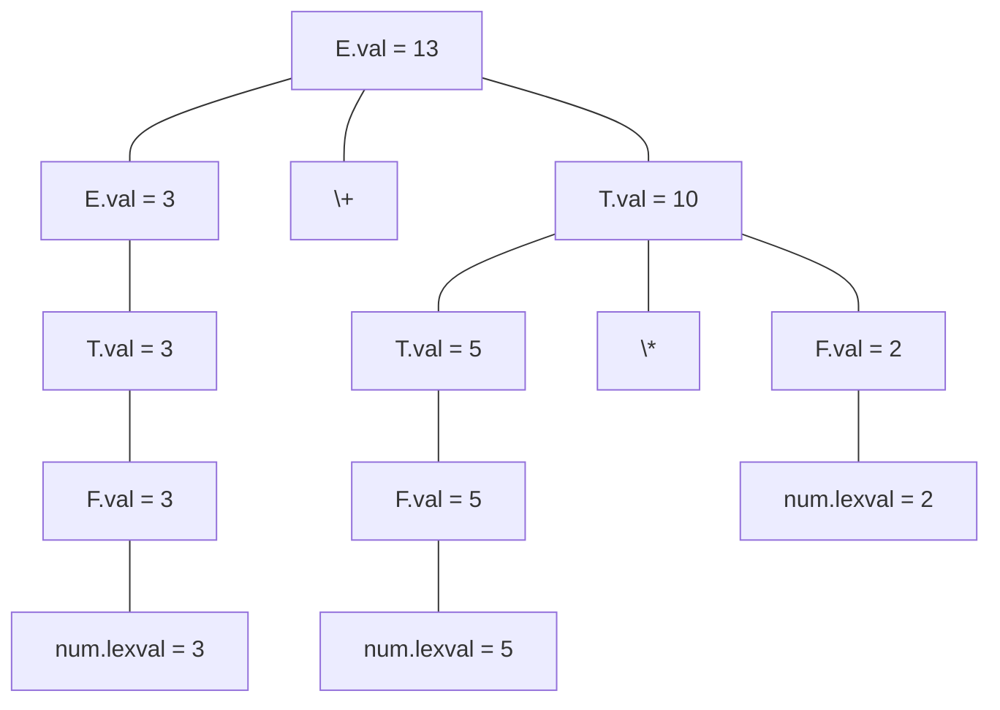

---
aliases:
- 综合属性（Synthesized Attribute）
- Synthesized Attribute
- 综合属性
- Synthesized Attributes
- 综合属性：自底向上汇聚的信息流
created: 2026-06-10
english: Synthesized Attribute
source_chapter:
- 6
tags:
- 编译原理
- 语法分析
- 语义分析
- 属性文法
title: 综合属性
type: concept
used_in_chapter:
- 6
---
# 综合属性：自底向上汇聚的信息流

> English: **Synthesized Attribute**

**综合属性**是指根据语法分析树中**子节点**的属性值，计算并赋予给**父节点**的文法属性。其核心特征是信息流在语法树中**自底向上（Bottom-Up）**传播。

---

## 1. 🌟 大白话通俗解释 (核心直觉)

> [!TIP]
> **商场营业额汇总的比喻**：
> 想象一家百货商场的财务汇总流程：
> *   每个收银终端（叶子节点）记录了各自的今日交易金额（如 `POS1.val = 100`，`POS2.val = 200`）。
> *   这些原始销售数据自下而上汇报给区域经理（中间节点），汇总成部门营业额。
> *   最终，各部门数据上报给总经理（根节点），汇总计算出商场的总营业额。
> 
> 在这一过程中，**没有哪一个上级领导能凭空编造财务数据，所有的营业额都是从最底层的收银机逐级“综合（Synthesize）”而来的**。这就是综合属性。
> 
> 在编译器中，诸如算术表达式的“求值（val）”、变量的“数据类型（type）”或生成的“目标代码（code）”均属于综合属性。

*   **一句话总结**：老子（父节点）的属性值，全靠儿子们（子节点）凑数合成。

---

## 2. 📝 学术规范定义 (考试硬核)

### 形式化描述
对于上下文无关文法产生式：
$$
p: X_0 \to X_1 X_2 \dots X_n
$$

若 $X_0$（产生式左部的父节点）的属性 $a$ 是由如下语义方程定义的：
$$
X_0.a = f(X_1.b, X_2.c, \dots, X_n.m)
$$
*(其中 $X_1 \dots X_n$ 是右部符号，即 $X_0$ 在语法树中的子节点，而 $f$ 是计算函数)*，则称属性 $a$ 是符号 $X_0$ 的一个**综合属性**。

```
       X0.a (父节点：计算得到综合属性)
       /  \
     X1    X2 (子节点：提供源数据)
    [b]    [c]
```

### 🧱 LR 语法分析中的“属性栈”模型
综合属性天然契合自底向上（LR）语法分析器的归约过程。在 LR 分析器工作时，属性不需要真的建立一棵物理语法树，而是依靠一个与状态栈平行的**属性栈（Attribute Stack）**来实现计算：

*   **移进 (Shift)**：词法分析器获取的 Token 属性值（例如 `num.val`）被推入属性栈。
*   **归约 (Reduce)**：若产生式为 $A \to X_1 X_2 X_3$：
    1. 分析器将状态栈出栈 3 个状态。
    2. 同时，分析器**直接从属性栈的顶部获取 $X_1, X_2, X_3$ 的属性值**。
    3. 执行语义规则，计算得到 $A$ 的综合属性值，压入属性栈，其位置刚好对应 $A$ 归约后的栈顶。

### Bison/Yacc 中的工程寻址
```yacc
E : E '+' T   { $$ = $1 + $3; }
```
*   **`$$`**：代表产生式左部非终结符 $E$ 的综合属性值（准备压入栈顶）。
*   **`$1`** 和 **`$3`**：分别代表右部第一个和第三个符号的属性值（通过物理属性栈相对寻址获取）。

### 经典示例：表达式 `3 + 5 * 2` 的注解语法树
以下展示了属性 `val`（综合属性）自底向上汇聚到根节点的流程：



---

## 3. 🎯 应试痛点与解题模板 (拿分关键)

### 判别秘籍
*   **判别式**：检查语义方程的等式左侧。若形如 `X.a = ...` 且 `X` 位于产生式的**左部**，则 `a` 必定是综合属性。
*   **文法分类**：如果一个属性文法中的**所有属性都是综合属性**，该文法就属于 **[[S-属性文法]]**。

### ⚠️ 字符串拼接中的空格防粘连警告
*   当在综合属性中利用字符串拼接生成后缀表达式（如 $E \to E_1 + T$）时，部分实际工程环境要求在属性值之间显式拼接空格 `" "`：
    `E.postfix = E1.postfix || " " || T.postfix || " +"`
    如果不小心漏掉空格，当翻译 `34 + 5` 时，后缀式会粘连成 `345+`，从而导致词法语义改变。
*   在理论考试中，按照标准答案书写 `E1.postfix || T.postfix || "+"` 即可，但若有实际工程（如 Bison 计算器设计）需显式考虑空格分隔以防止粘连。

---

## 4. 🔗 关联上下文 (双链图谱)

- **上级章节目录**：[[00_Chapter6_语义分析_题型总览]]
- **孪生对比概念**：[[继承属性]] (相反方向的信息流)
- **子集分类 MOC**：[[S-属性文法]] (纯综合属性文法)
- **工程实现寻址**：[[Bison值栈寻址与中置动作（传送带定位取货与临时工占位）]] / [[Bison工程落地（从设计图纸到能跑的生产线）]]
- **典型解题套路**：[[01_属性文法改写套路]] / [[Ex6.2_属性文法_表达式后缀式转换]]
