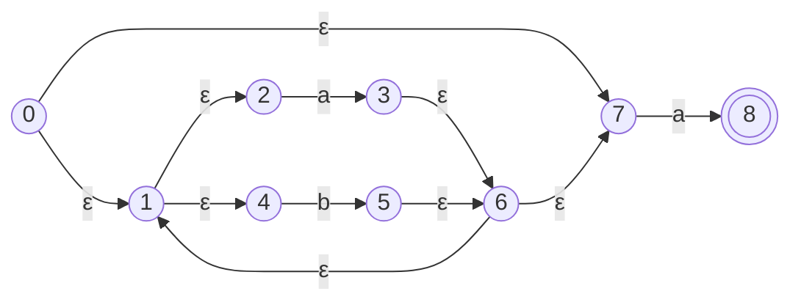
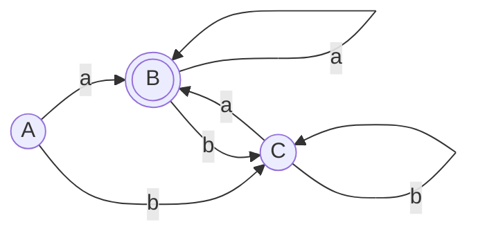

# 01_正规式转NFA与DFA套路

本套路旨在提供考场上将 **正则表达式（RE / 正规式）** 转化为 **NFA**，再利用子集构造法转化为 **DFA** 的标准三步答题步骤与模板。

> [!NOTE] 双轨直觉：从草稿到生产部署的三步跳跃
> - **RE 是“产品需求说明”**：简洁描述了我们想要匹配的文本规则。
> - **NFA 是“画满辅助线的草稿图”**：直接套用 Thompson 规则机械化生成，里面有大量的免费传送滑梯（$\varepsilon$ 状态边）和分身分支，易于手绘但计算机执行效率低下。
> - **DFA 是“精简的流水线生产图”**：我们将 NFA 中所有分身可能站立的位置合体收网，网罗成一个个确定性的“大袋子”（状态子集），使得计算机能够以极速的 $O(1)$ 查表法运行。

---

## ⚔️ 考前核心心法

*   **Thompson 构造核心**：严禁私自省去 $\varepsilon$ 有向边！哪怕看起来可以直接合并，也必须老老实实套用 Thompson 选择、闭包和连接的标准模板画出完整的状态节点（如图标 $0 \to 8$ 等），否则会直接扣掉步骤分。
*   **子集构造表核心**：
    *   第一行首项一定是 $\varepsilon\text{-closure}(0)$ （即包含 NFA 初始状态 0 的空闭包，千万不要漏掉 `0` 本身）。
    *   一定要在表格下方或右侧明确写上一句判定依据：**“DFA 状态 X 包含 NFA 的终态 Y，因此 X 被判定为 DFA 终态（双圈表示）”**。

---

## 🛠️ 三步解题标准模板

### 题目
> **例题**：请将正规式 $(a \mid b)^* a$ 转换为 NFA，然后再用子集构造法转换为 DFA。

---

### Step 1: 严格套用 Thompson 规则手绘 NFA

根据运算符优先级，将正规式拆分为基本子结构，递归连线。

对于 $(a \mid b)^* a$：
1.  首先构造选择项 $a \mid b$ 的分身岔路口（引入 $\varepsilon$ 传送门）。
2.  用闭包大轨道外层包裹它，形成 $(a \mid b)^*$（加入 0 次绕行和多次循环的滑梯）。
3.  最右连接一个字符 $a$ 的刷卡通道，连入终态。

#### 构造出的 NFA 结构图

---

### Step 2: 列表迭代计算子集构造过程（合体装袋）

建立四列跟踪表：**DFA状态**、**NFA状态子集**、**读入字符 a 转移**、**读入字符 b 转移**。

*   **初始袋子 A** = $\varepsilon\text{-closure}(0) = \{0, 1, 2, 4, 7\}$（从起点0出发，顺着免费滑梯一路溜到所有位置）。

#### 子集迭代追踪表

| DFA 状态 | NFA 状态子集 | 读入 `a` 转移 ($I_a = \varepsilon\text{-closure}(\text{move}(T, a))$) | 读入 `b` 转移 ($I_b = \varepsilon\text{-closure}(\text{move}(T, b))$) | 是否为终态 (是否包含 8) |
| :---: | :---: | :---: | :---: | :---: |
| **A (初态)** | $\{0, 1, 2, 4, 7\}$ | $\{3, 6, 1, 2, 4, 7, 8\}$ (新状态，标记为 **B**) | $\{5, 6, 1, 2, 4, 7\}$ (新状态，标记为 **C**) | 否 |
| **B** | $\{1, 2, 3, 4, 6, 7, 8\}$ | $\{3, 6, 1, 2, 4, 7, 8\}$ (即已有的袋子 **B**) | $\{5, 6, 1, 2, 4, 7\}$ (即已有的袋子 **C**) | **是** (因包含 NFA 终态 8) |
| **C** | $\{1, 2, 4, 5, 6, 7\}$ | $\{3, 6, 1, 2, 4, 7, 8\}$ (即已有的袋子 **B**) | $\{5, 6, 1, 2, 4, 7\}$ (即已有的袋子 **C**) | 否 |

---

### Step 3: 根据表格绘制最简 DFA

将表格中的 A, B, C 袋子以及它们之间的跳转路径，重构提炼为状态转换图。

*   **初始状态**：A
*   **终态（双圈）**：B（因为状态子集 B 包含了原 NFA 的终态 8）

#### 最终 DFA 状态转换图

---

## 🎯 考场常见丢分避坑指南

1. **写出核心算子定义**：建议在表格前写出一行公式证明对概念的理解：
   $$\varepsilon\text{-closure}(T) = \{ s \mid \text{从 } T \text{ 仅通过 } \varepsilon \text{ 边可达的状态 } s \}$$
2. **终态双圈标记**：考卷上或者绘图时，DFA 终态 B 必须用明显的**双圈（Mermaid 中的 `(((B)))`）**标记，初态 A 必须用箭头指向，遗漏这俩会被无情扣分。
3. **关联卡片**：如果想要对最简 DFA 进一步合并同类项以压缩表空间，请参考下一套路卡片 [[02_DFA状态最小化套路]]。
