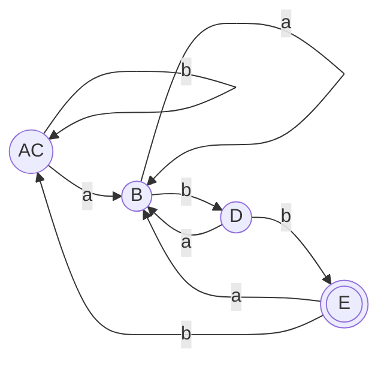

# 02_DFA状态最小化套路

本套路旨在提供考场上使用 **Hopcroft 状态分割算法** 最小化 DFA 状态的规范步骤、对照表书写格式以及画出最简 DFA 的答题模板。

> [!NOTE] 双轨直觉：考场裂分手术刀 —— 层层剥离异类
> - **DFA 状态最小化在考场上就像用一把手术刀，对状态集进行层层切片。**
> - **先切一刀（初次划分）**：粗暴地把所有状态切成两半——“能成功匹配的（终态组）”与“不能匹配的（非终态组）”。
> - **层层精细化切片（测试分裂）**：对每个组内的状态，测试它们在所有可能字符输入下的走向。一旦发现谁跟同伴的走向不在同一个大组（去向决裂），说明它是个隐藏在队伍里的“异类”，必须用手术刀将它从原有状态组中剥离出来，分裂成独立的新组。
> - **无法切片时收敛**：当所有的状态组在任何输入测试下去向都完全一致，说明手术刀再也切不动了。我们把最终留下来的各个状态组进行“强行归并”，即可得到最简 DFA！

---

## ⚔️ 考前核心心法

*   **前置排雷第一步**：拿到 DFA 后，**千万不要直接套算法**！先用肉眼扫描有无 **“从初态无法到达的状态”**（孤立节点）。如果有，第一步必须写明“排除无法到达的孤立状态 X”，将其删除后再做分割，否则直接扣步骤分。
*   **初次分裂两阵营**：永远将状态集首次划分为：终态组（双圈）与非终态组。
*   **同种终态原则**：不同类型的终态（如识别不同 Token 的终态）在词法分析中**不能**轻易合并。不过如果题目未特别指出 Token 类型，则默认所有终态可归为同组进行最小化。

---

## 🛠️ 解题步骤与答题模板

### 题目
> **例题**：请最小化以下 DFA，其状态集为 $\{A, B, C, D, E\}$，初态为 $A$，终态为 $E$，输入字母表为 $\{a, b\}$。
> 转移关系为：
> *   $A \xrightarrow{a} B$ ， $A \xrightarrow{b} C$ 
> *   $B \xrightarrow{a} B$ ， $B \xrightarrow{b} D$ 
> *   $C \xrightarrow{a} B$ ， $C \xrightarrow{b} C$ 
> *   $D \xrightarrow{a} B$ ， $D \xrightarrow{b} E$ 
> *   $E \xrightarrow{a} B$ ， $E \xrightarrow{b} C$ 

---

### Step 1: 排查孤立状态与初次划分

1. **孤立节点排查**：检查可知，所有状态从初态 $A$ 出发均可达，无孤立状态。
2. **阵营大划分**：将所有状态划分为终态组与非终态组：
   - 组 1 (非终态组)：$G_1 = \{A, B, C, D\}$
   - 组 2 (终态组)：$G_2 = \{E\}$
   - 初始划分记为：$\Pi_0 = \{ \{A, B, C, D\}, \{E\} \}$

---

### Step 2: 状态分割表追踪测试（手术刀切片）

我们建立状态组测试表，观察各组在吃入 `a` 和 `b` 后的移动走向，寻找分歧点：

#### 1. 考察 $G_1 = \{A, B, C, D\}$ 
*   **输入 `a` 转移**：
    - $\delta(A, a) = B \in G_1$
    - $\delta(B, a) = B \in G_1$
    - $\delta(C, a) = B \in G_1$
    - $\delta(D, a) = B \in G_1$
    - （全员均转移在 $G_1$ 内部，行动完全一致，无法切片）
*   **输入 `b` 转移**：
    - $\delta(A, b) = C \in G_1$
    - $\delta(B, b) = D \in G_1$
    - $\delta(C, b) = C \in G_1$
    - $\delta(D, b) = E \in G_2$ （**出现去向分歧！**）
    - **分歧分析**：在吞下 `b` 之后，$D$ 跳到了终态组 $G_2$（成功通关），而 $A, B, C$ 依然滞留在非终态组 $G_1$。说明 $D$ 与其他三位是异类。
    - **第一次裂分**：将 $D$ 从队伍里剥离。得到 $G_{1a} = \{A, B, C\}$ 和 $G_{1b} = \{D\}$。
    - 此时划分更新为：$\Pi_1 = \{ \{A, B, C\}, \{D\}, \{E\} \}$。

---

#### 2. 继续考察 $G_{1a} = \{A, B, C\}$
*   **输入 `a` 转移**：全部转移到 $B \in G_{1a}$，无分歧。
*   **输入 `b` 转移**：
    - $\delta(A, b) = C \in G_{1a}$
    - $\delta(B, b) = D \in G_{1b}$ （**再次出现去向分歧！**）
    - $\delta(C, b) = C \in G_{1a}$
    - **分歧分析**：在吞下 `b` 之后，$B$ 跳到了独立的 $G_{1b}$（状态 $D$），而 $A, C$ 依然留在 $G_{1a}$。说明 $B$ 与 $A, C$ 是异类。
    - **第二次裂分**：将 $B$ 从队伍里剥离。得到 $G_3 = \{A, C\}$ 和 $G_4 = \{B\}$。
    - 此时划分更新为：$\Pi_2 = \{ \{A, C\}, \{B\}, \{D\}, \{E\} \}$。

---

#### 3. 继续考察 $G_3 = \{A, C\}$
*   **输入 `a` 转移**：两者均转移到 $B \in G_4$，无分歧。
*   **输入 `b` 转移**：两者均转移到 $C \in G_3$，无分歧。
*   **收敛判定**：所有单元素组 $\{B\}, \{D\}, \{E\}$ 均无法再分；而多元素组 $\{A, C\}$ 在所有字符输入下的转移轨迹均完全同步。
*   最终划分收敛为：
    $$\Pi_{final} = \{ \{A, C\}, \{B\}, \{D\}, \{E\} \}$$

---

### Step 3: 合并状态并绘制最简 DFA

将等价状态 $A, C$ 合并，记为新状态 $AC$：
*   **新初态**：$AC$（由于包含原初态 $A$）
*   **新终态**：$E$ (双圈表示)

#### 最简 DFA 状态转换图

---

## 🎯 考场常见丢分避坑指南

1. **初态/终态记号丢失**：合并得到的最简 DFA 图中，初态 $AC$ 的**入口指示箭头**不能丢，终态 $E$ 的**双圈结构**必须明确画出，否则极易被扣除图表分数。
2. **死状态（垃圾状态）处理**：如果某个合并组在所有输入下都只跳向自己，且不是终态，这种状态是“死状态（Dead State）”。某些试卷中，要求将死状态和指向它的所有转移边一并抹去以简化图面，做题时需注意题目要求。
