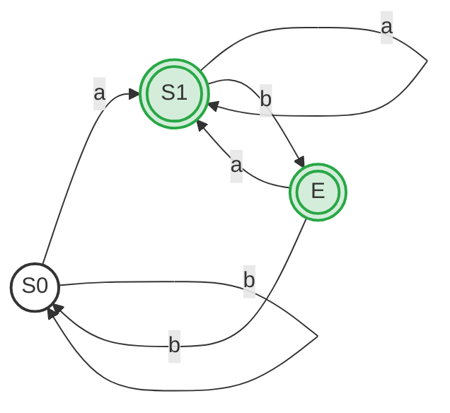

# Ex2.12 Thompson 构造法与子集构造法

## Original Question

**2.12** 
*   **a.** Use Thompson's construction to convert the regular expression **`(a|b)*a(a|b|ε)`** into an NFA.
*   **b.** Convert the NFA of part (a) into a DFA using the subset construction.

---

## 中文题意

**2.12**
*   **a.** 使用 Thompson 构造法，将正规式 **`(a|b)*a(a|b|ε)`** 转换为 NFA。
*   **b.** 使用子集构造法，将部分 (a) 中得到的 NFA 转换为 DFA。

---

## Type 题型

Thompson 算法应用 / NFA 状态机手工设计 / 子集构造算法应用 / DFA 状态化简与合并

---

## Related Concepts

- [[NFA]] / [[DFA]]
- [[子集构造法]]
- [[DFA最小化]]
- [[01_正规式转NFA与DFA套路]]

---

## Artifacts & Images / 答案与原图归档

### 1. 原题与标准答案 (扁平图片 - 纵向排布)

**原题内容 Ex2.12**

**官方标准答案**

---

### 2. 学生作作手稿 (纵向放大排布)

**我的解答手稿**

---

## ⚠️ 真实考场还原与作答深度对比

我们将 **学生作答手稿** 与 **官方标准答案** 进行逐一比对和深度学术剖析：

### 1. part (a)：NFA 构造中的克莱尼闭包遗漏 (最核心失分点 ❌)
*   **手稿问题诊断**：
    *   手稿的第三行绘制了 `(a|b)a(a|b|ε)` 的 NFA，并将其作为最终答案。
    *   **手稿完全遗漏了第一个括号 `(a|b)` 上的克莱尼星号 `*`**！
    *   在 Thompson 构造法中，克莱尼星号 `*` 对应着特定的 **自循环环路** 与 **旁路（Bypass）**。手稿中绘制的仅是一个简单的顺序连接，只能匹配以 $a$ 或 $b$ 开头，接着是 $a$，最后以 $a, b, \varepsilon$ 结尾的长度最大为 3 的字符串。
*   **Thompson 克莱尼星号标准构造规则**：
    对正规式 $P^*$ 进行 Thompson 构造，假设其 NFA 为 $N(P)$，则 $N(P^*)$ 需要：
    1.  引入新的起始状态 $s_{star}$ 与退出状态 $e_{star}$。
    2.  添加从 $s_{star} \xrightarrow{\varepsilon} \text{start}(N(P))$，和从 $\text{accept}(N(P)) \xrightarrow{\varepsilon} e_{star}$。
    3.  **反馈环（Loop）**：添加从 $\text{accept}(N(P)) \xrightarrow{\varepsilon} \text{start}(N(P))$ 的转移，代表重复匹配。
    4.  **旁路（Bypass）**：添加从 $s_{star} \xrightarrow{\varepsilon} e_{star}$ 的直连线，代表匹配 0 次（即 $\varepsilon$）。
    *   官方标准答案中，状态 $7 \to 5 \to \dots \to 6 \to 8$ 的结构正是严格遵守了上述 4 条 Thompson 闭包规则，包含回退弧 $6 \xrightarrow{\varepsilon} 5$ 与旁路弧 $7 \xrightarrow{\varepsilon} 8$。手稿此处漏画直接导致 NFA 全错。

### 2. part (b)：子集构造的缺失与补全
*   **问题诊断**：学生手稿中完全没有进行 part (b) 的子集构造计算与 DFA 绘制。这可能是由于 part (a) 绘图错误导致无法进行下推，或者是时间不足。
*   **学术价值**：我们在标准答案中，基于官方标准的 18 状态 Thompson NFA 给出最严谨的子集构造表，并给出 **DFA 状态最小化** 后的 3 状态黄金版本，帮助学生彻底吃透此题。

---

## Standard Solution 标准答案

### 1. part (a) Thompson NFA 形式描述

根据 Thompson 构造规则，我们可以依次为 `(a|b)`、`(a|b)*`、`a`、`(a|b|ε)` 建立子模块并完成顺序拼接。
官方答案给出的 NFA 含有 18 个状态（节点 1 到 18），起止点为 $7$ 和 $18$：

*   **输入 `(a|b)*` 闭包模块**：
    *   $7 \xrightarrow{\varepsilon} 5$ (入)，$6 \xrightarrow{\varepsilon} 8$ (出)，$7 \xrightarrow{\varepsilon} 8$ (旁路)，$6 \xrightarrow{\varepsilon} 5$ (反馈循环)。
    *   内部选择分支：$5 \xrightarrow{\varepsilon} 1 \xrightarrow{a} 2 \xrightarrow{\varepsilon} 6$ ； $5 \xrightarrow{\varepsilon} 3 \xrightarrow{b} 4 \xrightarrow{\varepsilon} 6$。
*   **拼接中间字符 `a`**：
    *   $8 \xrightarrow{\varepsilon} 9 \xrightarrow{a} 10 \xrightarrow{\varepsilon} 17$。
*   **输入 `(a|b|ε)` 尾部模块**：
    *   分支 1：$17 \xrightarrow{\varepsilon} 11 \xrightarrow{a} 12 \xrightarrow{\varepsilon} 18$。
    *   分支 2：$17 \xrightarrow{\varepsilon} 13 \xrightarrow{b} 14 \xrightarrow{\varepsilon} 18$。
    *   分支 3 ($\varepsilon$ 旁路)：$17 \xrightarrow{\varepsilon} 15 \xrightarrow{\varepsilon} 16 \xrightarrow{\varepsilon} 18$。

---

### 2. part (b) 子集构造法详细推导

我们对上述 18 状态 NFA 执行子集构造算法：

#### (1) 计算初态 $\varepsilon$-闭包
$$
A = \varepsilon\text{-closure}(\{7\}) = \{7, 5, 8, 9, 1, 3\}
$$
*(注：从 7 出发沿着 $\varepsilon$ 弧可达：7, 5, 8; 5 进而达 1, 3; 8 进而达 9)*

#### (2) 迭代计算转移子集
*   **从 $A$ 出发**：
    *   $\text{move}(A, a) = \{2, 10\}$
        *   $B = \varepsilon\text{-closure}(\{2, 10\}) = \{1, 2, 3, 5, 6, 8, 9, 10, 11, 13, 15, 16, 17, 18\}$（**接受态**，含 18）
    *   $\text{move}(A, b) = \{4\}$
        *   $C = \varepsilon\text{-closure}(\{4\}) = \{1, 3, 4, 5, 6, 8, 9\}$ (非接受态)
*   **从 $B$ 出发**：
    *   $\text{move}(B, a) = \{2, 10, 12\}$
        *   $D = \varepsilon\text{-closure}(\{2, 10, 12\}) = \{1, 2, 3, 5, 6, 8, 9, 10, 11, 12, 13, 15, 16, 17, 18\}$（**接受态**）
    *   $\text{move}(B, b) = \{4, 14\}$
        *   $E = \varepsilon\text{-closure}(\{4, 14\}) = \{1, 3, 4, 5, 6, 8, 9, 14, 18\}$（**接受态**）
*   **从 $C$ 出发**：
    *   $\text{move}(C, a) = \{2, 10\} \Rightarrow \varepsilon\text{-closure}(\{2, 10\}) = B$
    *   $\text{move}(C, b) = \{4\} \Rightarrow \varepsilon\text{-closure}(\{4\}) = C$
*   **从 $D$ 出发**：
    *   $\text{move}(D, a) = \{2, 10, 12\} \Rightarrow \varepsilon\text{-closure}(\{2, 10, 12\}) = D$
    *   $\text{move}(D, b) = \{4, 14\} \Rightarrow \varepsilon\text{-closure}(\{4, 14\}) = E$
*   **从 $E$ 出发**：
    *   $\text{move}(E, a) = \{2, 10\} \Rightarrow \varepsilon\text{-closure}(\{2, 10\}) = B$
    *   $\text{move}(E, b) = \{4\} \Rightarrow \varepsilon\text{-closure}(\{4\}) = C$

---

### 3. DFA 状态转换表 (原始 5 状态)

| DFA 状态 | NFA 状态子集 | 输入 `a` | 输入 `b` | 是否接受 |
| :---: | :---: | :---: | :---: | :---: |
| **`A`** (初态) | $\{1, 3, 5, 7, 8, 9\}$ | $B$ | $C$ | No |
| **`B`** | $\{1, 2, 3, 5, 6, 8, 9, 10, 11, 13, 15, 16, 17, 18\}$ | $D$ | $E$ | **Yes** |
| **`C`** | $\{1, 3, 4, 5, 6, 8, 9\}$ | $B$ | $C$ | No |
| **`D`** | $\{1, 2, 3, 5, 6, 8, 9, 10, 11, 12, 13, 15, 16, 17, 18\}$ | $D$ | $E$ | **Yes** |
| **`E`** | $\{1, 3, 4, 5, 6, 8, 9, 14, 18\}$ | $B$ | $C$ | **Yes** |

---

### 4. DFA 状态最小化 (DFA Minimization) 简化推导

我们可以发现，上面得到的 5 状态 DFA 存在极大的冗余，可以使用 **Hopcroft 算法** 进行合并化简：

1.  **初始划分**：
    *   非终态组：$P_{non} = \{A, C\}$
    *   终态组：$P_{acc} = \{B, D, E\}$
2.  **考察非终态组 $\{A, C\}$**：
    *   对输入 `a`：$A \to B$，$C \to B$，均转入相同的组。
    *   对输入 `b`：$A \to C$，$C \to C$，均留在自身组内。
    *   **结论**：$A$ 与 $C$ 完全等价，可合并为新状态 **`S0`**。
3.  **考察终态组 $\{B, D, E\}$**：
    *   比较 $B$ 与 $D$：
        *   对输入 `a`：$B \to D$，$D \to D$（属于同状态）。
        *   对输入 `b`：$B \to E$，$D \to E$（属于同状态）。
        *   **结论**：$B$ 与 $D$ 完全等价，可合并为新状态 **`S1`**。
    *   比较 $S_1$ 与 $E$：
        *   对输入 `b`：$S_1 \to E$（终态），而 $E \to C$（非终态）。状态行为分歧，不能合并。
4.  **化简后得到的最简 3 状态 DFA**：
    *   **`S0`** (初态，非接受态)
    *   **`S1`** (接受态)
    *   **`E`** (接受态)

#### 最小化 DFA 状态图：

---

## 避坑指南 与 易错点

> [!WARNING]
> **切勿丢掉 Thompson 构造中的旁路与反馈线**：
> 构造 `P*` 的 NFA 时，绝对不要直接把前后的空转移掐掉。旁路（Bypass）线是保证可以匹配“0次”的生命线，反馈线（Loop）则是保证可以匹配“多次”的通道。缺少其中任何一个，都会导致自动机失去克莱尼闭包的数学特征。
> 
> **子集构造中仔细区分空流（ε）的传递路径**：
> 像本题含有多达 18 个节点的 Thompson NFA，在手动求初态或中间状态的 $\varepsilon$-closure 时极易手抖漏掉某个边缘节点。在草稿纸上计算时，建议**顺着每个节点的 $\varepsilon$ 连线以拓扑排序的直觉走一遍**，确保闭包集合的完整性，再填入表格。
