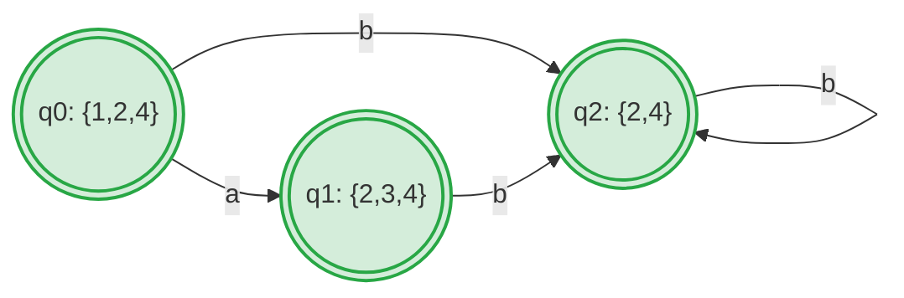

# Ex2.14 子集构造法：NFA 转 DFA

## Original Question

**2.14** Convert the NFA of Example 2.10 (Section 2.3.2) into a DFA using the subset construction.

---

## 中文题意

**2.14** 使用子集构造法 (Subset Construction)，将教材 2.3.2 节中 Example 2.10 的非确定性有限自动机 (NFA) 转换为确定性有限自动机 (DFA)。

---

## Type 题型

子集构造算法应用 / NFA 转换为等价 DFA / $\varepsilon$-闭包运算 / 自动机等价性分析

---

## Related Concepts

- [[NFA]] / [[DFA]]
- [[子集构造法]]
- [[01_正规式转NFA与DFA套路]]

---

## Artifacts & Images / 答案与原图归档

### 1. 原题与标准答案 (扁平图片 - 纵向排布)

**原题内容 Ex2.14**

**官方标准答案**

---

### 2. 学生作答手稿 (纵向放大排布)

**我的解答手稿**

---

## ⚠️ 真实考场还原与作答深度对比

我们将 **学生作答手稿** 与 **官方标准答案** 进行逐一比对和深度学术剖析：

### 1. 初态 $\varepsilon$-闭包计算遗漏 (最核心失分点 🌟)
*   **手稿做法**：学生在表格的第一行，将初态记为了单一状态 `1`。
*   **官方做法**：初态对应子集为 $\{ 1, 2, 4 \}$。
*   **学术剖析**：
    *   **手稿病因**：这是子集构造法中极易发生的 **概念性遗漏**。DFA 的初态必须是 NFA 初态的 **$\varepsilon$-闭包 ($\varepsilon$-closure)**，而不仅仅是初态编号本身。
    *   **推导细节**：观察原 NFA，初态 $1$ 拥有出发指向状态 $4$ 的空转移 $\varepsilon$，而状态 $4$ 又拥有出发指向状态 $2$ 的空转移 $\varepsilon$。因此，从初态 $1$ 出发，不消耗任何输入字符即可到达 $\{1, 2, 4\}$。
    *   **影响判定**：因为遗漏了初态中的 $2$ 和 $4$，按严格算法步骤，第一行第一列的元素应为 $\{1, 2, 4\}$，而非 `1`。虽然学生在画 DFA 图时由于直觉（知道该语言匹配空串）正确地将初态画为了接受状态（双圈），但在表格这一严谨的算法中间步骤中，写 `1` 属于 **不完整作答，考场会被酌情扣分**。

### 2. 接受状态 (Accepting States) 的判定规则
*   **官方批语**：`所有包含状态 4 的状态组合，均为接受状态 accepting state。`
*   **学术剖析**：
    *   在原 NFA 中，状态 $4$ 是唯一的接受状态。
    *   根据子集构造法规则，DFA 中的某个子集状态只要 **包含至少一个 NFA 的接受状态**，该子集就必须被标记为 DFA 的接受状态。
    *   在本题求出的三个可达子集 $\{1, 2, 4\}$、$\{2, 3, 4\}$、$\{2, 4\}$ 中，每一个都包含了状态 $4$。因此，**该 DFA 的所有可达状态全部都是接受状态**（这与该语言 $(a \mid \varepsilon)b^*$ 能够接受空串及任何符合规则的局部串高度吻合）。

---

## Standard Solution 标准答案

### 1. 子集构造法详细计算步骤

#### (1) 计算初态的 $\varepsilon$-闭包
$$
q_0 = \text{val\_start} = \varepsilon\text{-closure}(\{1\}) = \{1, 2, 4\}
$$
由于包含 $4$，为 **接受状态**。

#### (2) 从 $q_0 = \{1, 2, 4\}$ 出发进行转移
*   **输入 `a`**：
    *   $\text{move}(\{1, 2, 4\}, a) = \{2, 3\}$（由状态 $1$ 沿 $a$ 弧到达 $2$ 和 $3$）
    *   $\varepsilon\text{-closure}(\{2, 3\}) = \{2, 3, 4\}$（状态 $3$ 沿 $\varepsilon$ 到达 $4$，状态 $4$ 沿 $\varepsilon$ 到达 $2$）
    *   生成新状态 $q_1 = \{2, 3, 4\}$（接受状态）
*   **输入 `b`**：
    *   $\text{move}(\{1, 2, 4\}, b) = \{4\}$（由状态 $2$ 沿 $b$ 弧到达 $4$）
    *   $\varepsilon\text{-closure}(\{4\}) = \{2, 4\}$（状态 $4$ 沿 $\varepsilon$ 到达 $2$）
    *   生成新状态 $q_2 = \{2, 4\}$（接受状态）

#### (3) 从 $q_1 = \{2, 3, 4\}$ 出发进行转移
*   **输入 `a`**：$\text{move}(\{2, 3, 4\}, a) = \emptyset$（死状态，通常在 DFA 图中省略）
*   **输入 `b`**：
    *   $\text{move}(\{2, 3, 4\}, b) = \{4\}$（由状态 $2$ 沿 $b$ 弧到达 $4$）
    *   $\varepsilon\text{-closure}(\{4\}) = \{2, 4\} = q_2$

#### (4) 从 $q_2 = \{2, 4\}$ 出发进行转移
*   **输入 `a`**：$\text{move}(\{2, 4\}, a) = \emptyset$
*   **输入 `b`**：
    *   $\text{move}(\{2, 4\}, b) = \{4\}$
    *   $\varepsilon\text{-closure}(\{4\}) = \{2, 4\} = q_2$（自循环）

---

### 2. 正确的状态转换表 (DFA Transition Table)

| DFA 状态 | 对应 NFA 状态集 | 输入 `a` | 输入 `b` | 是否接受 |
| :---: | :---: | :---: | :---: | :---: |
| **`q0`** (初态) | $\{1, 2, 4\}$ | $q_1$ | $q_2$ | **Yes** (含 4) |
| **`q1`** | $\{2, 3, 4\}$ | $\emptyset$ | $q_2$ | **Yes** (含 4) |
| **`q2`** | $\{2, 4\}$ | $\emptyset$ | $q_2$ | **Yes** (含 4) |

---

### 3. 生成的 DFA 状态图

---

## 避坑指南 与 易错点

> [!WARNING]
> **绝对不可遗漏起始状态的 $\varepsilon$-闭包计算**：
> 很多同学做题时习惯直观地把 NFA 的状态 $1$ 直接作为 DFA 的初始状态。这种偷懒的做法虽然可能在画最终状态图时歪打正着，但一旦面临考查中间步骤的**子集构造表格填空题**，将会导致第一行的数据全错。
> 
> *   **标准动作**：写下第一行前，先算 $\varepsilon\text{-closure}(s_0)$，将结果作为第一行的左侧表头。
> *   **接受态通则**：凡是子集大括号内包含了原 NFA 接受状态（双圈节点）的，在 DFA 中全部要画为双圈（接受状态）。
