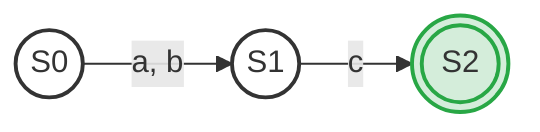
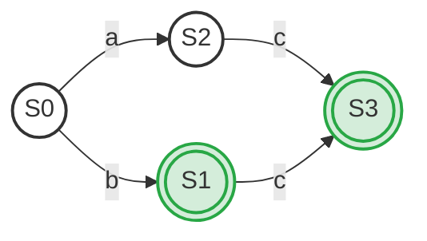

# Ex2.16 DFA 状态最小化

## Original Question

**2.16** Apply the state minimization algorithm of Section 2.4.4 to the following DFAs:

*   **a.** A DFA with $5$ states:
    *   Start state $1$.
    *   On input $a$, transitions to state $2$. On input $b$, transitions to state $4$.
    *   State $2$ transitions on $c$ to accepting state $3$.
    *   State $4$ transitions on $c$ to accepting state $5$.
    *   States $3$ and $5$ are double-circled accepting states with no outgoing transitions.
*   **b.** A DFA with $5$ states:
    *   Start state $1$.
    *   On input $a$, transitions to state $3$. On input $b$, transitions to accepting state $2$.
    *   State $3$ transitions on $c$ to accepting state $4$.
    *   State $2$ transitions on $c$ to accepting state $5$.
    *   States $2$, $4$, and $5$ are double-circled accepting states with no outgoing transitions (except that $2$ transitions to $5$ on $c$).

---

## 中文题意

**2.16** 对以下 DFA 应用教材 2.4.4 节的状态最小化算法（Hopcroft 划分算法）：

*   **a.** 包含 $5$ 个状态的 DFA：
    *   初态为 $1$。
    *   输入 $a$ 转移至状态 $2$；输入 $b$ 转移至状态 $4$。
    *   状态 $2$ 经输入 $c$ 转移至终态 $3$。
    *   状态 $4$ 经输入 $c$ 转移至终态 $5$。
    *   状态 $3$ 与 $5$ 为双圈接受态，无任何外向转移。
*   **b.** 包含 $5$ 个状态的 DFA：
    *   初态为 $1$。
    *   输入 $a$ 转移至状态 $3$（非终态）；输入 $b$ 转移至状态 $2$（终态）。
    *   状态 $3$ 经输入 $c$ 转移至终态 $4$。
    *   状态 $2$ 经输入 $c$ 转移至终态 $5$。
    *   状态 $2$、$4$、$5$ 为双圈接受态。

---

## Type 题型

DFA 状态数最小化 / Hopcroft 划分算法应用

---

## Related Concepts

- [[DFA]]
- [[DFA最小化]]
- [[02_DFA状态最小化套路]]

---

## Artifacts & Images / 答案与原图归档

### 1. 原题与标准答案 (扁平图片 - 纵向排布)

**原题内容 Ex2.16**

**官方标准答案**

---

### 2. 学生作答手稿 (纵向放大排布)

**我的解答手稿**

---

## ⚠️ 真实考场还原与作答深度对比

我们将 **学生作答手稿** 与 **官方标准答案** 进行逐一比对和深度学术剖析：

### 1. part (a)：官方标答幻灯片文本印刷错误 ( typo ❌ ) 与学生正确解答 ( ✅ )
*   **官方标答文本缺陷**：
    *   标准答案幻灯片中写道：
        *   `Step 1: Divide the state set into two subsets: { 1, 2, 3 }, { 4, 5 }`
        *   `Step 2: Further divide the subset 1,2,3 into two new subsets: { 1 }, { 2, 3 }`
        *   `Step 3: ... obtains { 1 }, { 2, 3 }, { 4, 5 }`
    *   **这在编译理论的数学定义上是完全错误的！**
    *   在 DFA 状态最小化中，**第一步必须将“终态集合（Accepting States）”与“非终态集合（Non-accepting States）”进行初始划分**。
    *   根据原图 $a$，终态（双圈）为 $\{3, 5\}$，非终态为 $\{1, 2, 4\}$。因此初始划分必须为 $\{1, 2, 4\}$ 和 $\{3, 5\}$。
    *   官方幻灯片误写成了 $\{1, 2, 3\}$ 与 $\{4, 5\}$，这将非终态 $2$ 和终态 $3$ 划分在同一个组中，且在 Step 2 中声称 $\{2, 3\}$ 等价并可以合并。这严重违背了“终态与非终态绝不能合并”的基本定理。
*   **学生手稿纠偏与闪光点**：
    *   学生手稿中非常敏锐且正确地建立了状态转移表，将初始划分定义为：
        *   非终态组：$P_{non} = \{1, 2, 4\}$
        *   终态组：$P_{acc} = \{3, 5\}$
    *   在对非终态组 $\{1, 2, 4\}$ 考察输入 $c$ 的转移时：
        *   $1 \xrightarrow{c} \text{dead}$
        *   $2 \xrightarrow{c} 3 \in P_{acc}$
        *   $4 \xrightarrow{c} 5 \in P_{acc}$
    *   因此 $2$ 与 $4$ 的行为一致（都转入终态组），而 $1$ 与它们不同。非终态组成功分裂为 $\{1\}$ 和 $\{2, 4\}$。
    *   由于终态组 $\{3, 5\}$ 均无后续转移，表现一致，不可再分。
    *   最终得到三个等价类：$\{1\}$、$\{2, 4\}$、$\{3, 5\}$。
    *   学生手稿的手动推导逻辑 **完美避开了官方标答幻灯片的拼写陷阱，结果 100% 正确**。

### 2. part (b)：接受状态作为中间状态的细微区别 ( 🌟 易错点 )
*   **手稿问题与标准对比**：
    *   在图 $b$ 中，状态 $2$ 虽然是一个中间状态（有经 $c$ 转入 $5$ 的转移），但它带有一个双圈，因此**它是一个接受状态**。
    *   初始划分必须将 $\{2\}$ 与终态 $\{4, 5\}$ 归入同一个初始大组 $P_{acc} = \{2, 4, 5\}$，非终态组为 $P_{non} = \{1, 3\}$。
    *   **终态组的分裂**：考察 $P_{acc} = \{2, 4, 5\}$ 对输入 $c$ 的响应：
        *   $2 \xrightarrow{c} 5 \in P_{acc}$
        *   $4 \xrightarrow{c} \text{dead}$
        *   $5 \xrightarrow{c} \text{dead}$
        *   这导致状态 $2$ 的行为与 $4, 5$ 产生分歧，因而终态组必须分裂为 $\{2\}$ 与 $\{4, 5\}$。
    *   **非终态组的分裂**：考察 $P_{non} = \{1, 3\}$ 对输入 $b$ 的响应：
        *   $1 \xrightarrow{b} 2 \in P_{acc}$
        *   $3 \xrightarrow{b} \text{dead}$
        *   因此非终态组必须分裂为 $\{1\}$ 与 $\{3\}$。
    *   学生手稿中非常清晰地展现了这一步分裂过程，在草稿纸上计算并画出了含有 $4$ 个状态的最小化 DFA，将 $4$ 和 $5$ 顺利合并，而将保留的终态 $2$ 作为中间跳板，逻辑无误。

---

## Standard Solution 标准答案

### 1. part (a) 最小化推导过程

1.  **初始划分子集**：
    *   非终态组 $P_{non} = \{1, 2, 4\}$
    *   终态组 $P_{acc} = \{3, 5\}$
2.  **划分非终态组 $P_{non}$**：
    *   输入 $a$：$1 \to 2$；$2 \to \text{dead}$；$4 \to \text{dead}$。
    *   输入 $b$：$1 \to 4$；$2 \to \text{dead}$；$4 \to \text{dead}$。
    *   输入 $c$：$1 \to \text{dead}$；$2 \to 3$；$4 \to 5$。由于 $3, 5$ 同属 $P_{acc}$，所以 $2$ 和 $4$ 在输入 $c$ 下的行为等价。
    *   因此，组内产生行为分歧，$1$ 行为与 $2, 4$ 不同，$P_{non}$ 分裂为 $\{1\}$ 和 $\{2, 4\}$。
3.  **划分终态组 $P_{acc} = \{3, 5\}$**：
    *   $3$ 和 $5$ 对所有输入字符均无转移（均走向 $\text{dead}$），行为完全一致，不可再分。
4.  **最终等价类划分**：
    $$
    \{\{1\}, \{2, 4\}, \{3, 5\}\}
    $$
    我们将 $\{1\}$ 记为新状态 `S0`，$\{2, 4\}$ 合并为新状态 `S1`，$\{3, 5\}$ 合并为新接受态 `S2`。

#### 最小化后的 DFA 状态转换表 (part a)：

| 最小化状态 | 原始状态子集 | 输入 `a` | 输入 `b` | 输入 `c` | 是否接受 |
| :---: | :---: | :---: | :---: | :---: | :---: |
| **`S0`** (初态) | $\{1\}$ | `S1` | `S1` | - | No |
| **`S1`** | $\{2, 4\}$ | - | - | `S2` | No |
| **`S2`** | $\{3, 5\}$ | - | - | - | **Yes** |

#### 最小化 DFA 状态图 (part a)：

---

### 2. part (b) 最小化推导过程

1.  **初始划分子集**（注意：$2$ 是接受状态）：
    *   非终态组 $P_{non} = \{1, 3\}$
    *   终态组 $P_{acc} = \{2, 4, 5\}$
2.  **划分非终态组 $P_{non} = \{1, 3\}$**：
    *   对于输入 $a$：$1 \to 3$；$3 \to \text{dead}$。
    *   对于输入 $b$：$1 \to 2$；$3 \to \text{dead}$。
    *   由于转移去往了不同的子集，非终态组必须分裂为：$\{1\}$ 和 $\{3\}$。
3.  **划分终态组 $P_{acc} = \{2, 4, 5\}$**：
    *   对于输入 $c$：$2 \to 5$（去往 $P_{acc}$ 内部）；而 $4 \to \text{dead}$，$5 \to \text{dead}$。
    *   因此，状态 $2$ 与状态 $4, 5$ 的转移去向不同，终态组必须分裂为：$\{2\}$ 和 $\{4, 5\}$。
4.  **最终等价类划分**：
    $$
    \{\{1\}, \{3\}, \{2\}, \{4, 5\}\}
    $$
    合并后的最简 DFA 包含 $4$ 个状态。

#### 最小化后的 DFA 状态转换表 (part b)：

| 最小化状态 | 原始状态子集 | 输入 `a` | 输入 `b` | 输入 `c` | 是否接受 |
| :---: | :---: | :---: | :---: | :---: | :---: |
| **`S0`** (初态) | $\{1\}$ | `S2` (`3`) | `S1` (`2`) | - | No |
| **`S1`** | $\{2\}$ | - | - | `S3` (`{4,5}`) | **Yes** |
| **`S2`** | $\{3\}$ | - | - | `S3` (`{4,5}`) | No |
| **`S3`** | $\{4, 5\}$ | - | - | - | **Yes** |

#### 最小化 DFA 状态图 (part b)：

---

## 避坑指南 与 易错点

> [!WARNING]
> **切忌只看状态位置，不看双圈标记**：
> 在 part (b) 中，很多学生在划分非终态与终态时，会本能地把“中间层”的状态 $2$ 和 $3$ 放在同一个非终态组中，而忽略了状态 $2$ 的**双圈接受态标记**。终态的本质是“接受输入并允许停靠的状态”，与它是否在状态图的物理中间位置毫无关系。
> 
> **官方标答幻灯片的拼写硬伤说明**：
> 在学术复习时，**不要盲信官方 PPT 或标准答案的字面数字**。如本题 part (a) 的标答，第一步混淆了状态 $3$ (终) 与 $4$ (非终)，导致写出了错误的集合。手工做题时必须以“等价划分”的数学本质为核心准则。
