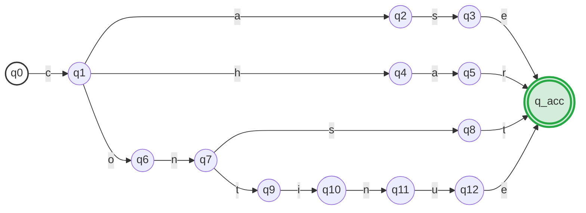

# Ex2.9 DFA 构造：C 语言关键字

## Original Question

**2.9** Draw a DFA that accepts the four reserved words **case**, **char**, **const**, and **continue** from the C language.

---

## 中文题意

**2.9** 绘制一个确定性有限自动机 (DFA)，使其能够且仅能够识别以下四个 C 语言保留字（关键字）：
**case**、**char**、**const** 和 **continue**。

---

## Type 题型

DFA 状态机手工设计 / 词法分析器保留字匹配机制 / 状态转换与合并

---

## Related Concepts

- [[NFA]] / [[DFA]]
- [[Chomsky文法层级]]
- [[01_正规式转NFA与DFA套路]]

---

## Artifacts & Images / 答案与原图归档

### 1. 原题与标准答案 (扁平图片 - 纵向排布)

**原题内容 Ex2.9**

**官方标准答案**

---

### 2. 学生作答手稿 (纵向放大排布)

**我的解答手稿**

---

## ⚠️ 真实考场还原与作答深度对比

我们将 **学生作答手稿** 与 **官方标准答案** 进行逐一比对和深度学术剖析：

### 1. 概念性错误：状态标签与转换符号的归属 (最核心考点 🌟)
*   **官方批语**：`每个 label 只能放一个字符，有同学 “char” 写在一起是不对的，因为无法进行状态分析了。跟 input 的 token 有关的是 label 而不是状态，有同学把字符标在状态上，是概念性错误。`
*   **手稿病因分析**：
    *   在手稿中，学生在最终的状态节点后面写上了 `case`、`char`、`const` 以及 `continue` 单词。虽然在图纸上是为了标明接受状态的含义，但容易产生**“状态代表字符”**的误区。
    *   在有限自动机中，**状态本身没有任何输入符号的含义**，它们仅表示系统当前的“记忆阶段”。所有的输入字符必须标记在 **转移弧（Transition Arrow）的标签上**，且每次转移只能读入 **单个字符**。

### 2. 状态机的物理结构：接受态合并
*   **手稿结构**：手稿中为每个保留字分别设置了一个独立的双圈接受状态（即 4 个接受状态）。
*   **官方结构**：官方答案将四个保留字的终点 **全部指向了同一个接受状态**。
*   **学术剖析**：
    *   **两者均属于正确的 DFA**，因为它们识别的语言完全等价（均为 $\{ \text{case}, \text{char}, \text{const}, \text{continue} \}$）。
    *   但官方答案的做法更加紧凑（DFA 状态数更少），这是经过状态等价性归并后的最简形态。在实际编译器开发中，这四个终态由于动作（Action）都是“返回关键字 Token”，因此在最小化后会被自然合并为一个物理终态。

### 3. 书写拼写低级错误
*   **手稿问题**：在底部 `continue` 路径中，手稿在状态转移线上写出的字符序列依次为 `t -> i -> n -> n -> e`。
*   **诊断**：多写了一个 `n`，漏写了字母 `u`，拼写成了 `continne`。这种考场上的低级手抖失误，在严谨的词法分析题中会导致整条路径的分数全扣，务必十分警惕拼写精度。

---

## Standard Solution 标准答案

### 1. 关键字前缀共享树 (Trie 树) DFA 构建

根据官方答案，该自动机的核心设计思想是：**提取公共前缀，在分歧点进行分支跳转**，所有合法串共享同一个终态。

#### DFA 状态转移图：

---

### 2. 状态转移表 (State Transition Table)

若要完全形式化地给出该 DFA，其状态转移表展示如下（空项代表转移至死状态/陷阱状态 `trap`）：

| 状态 (State) | `a` | `c` | `e` | `h` | `i` | `n` | `o` | `r` | `s` | `t` | `u` | 判定 (Action) |
| :---: | :---: | :---: | :---: | :---: | :---: | :---: | :---: | :---: | :---: | :---: | :---: | :---: |
| **`q0`** (初态) | | `q1` | | | | | | | | | | |
| **`q1`** | `q2` | | | `q4` | | | `q6` | | | | | |
| **`q2`** | | | | | | | | | `q3` | | | |
| **`q3`** | | | `q_acc` | | | | | | | | | |
| **`q4`** | `q5` | | | | | | | | | | | |
| **`q5`** | | | | | | | | `q_acc` | | | | |
| **`q6`** | | | | | | `q7` | | | | | | |
| **`q7`** | | | | | | | | | `q8` | `q9` | | |
| **`q8`** | | | | | | | | | | `q_acc` | | |
| **`q9`** | | | | | `q10` | | | | | | | |
| **`q10`** | | | | | | `q11` | | | | | | |
| **`q11`** | | | | | | | | | | | `q12` | |
| **`q12`** | | | `q_acc` | | | | | | | | | |
| **`q_acc`** (终态) | | | | | | | | | | | | **Accept** |

---

## 避坑指南 与 易错点

> [!WARNING]
> **切忌把输入符号写在状态圈内**：
> 在自动机的国家标准图形规范中，圆圈只代表“状态”（可以为空，也可以写如 `q0, q1` 的状态编号），**转移线（弧线）上的字符**才是真正的输入动作。部分同学在卷面上画图时为了方便直观，把字母写在圈圈里，这是典型的“不合规范”，会导致全题被扣除格式分。
> 
> **单转移线禁止合并多个字符**：
> 每一条转移线代表一次字符读入，每次必须是 **单个字符/Token**（例如从 $q_4 \to q_5$ 只能标注 `a`，不能把 `ar` 一起画在一条线上）。如果需要输入多个字符，必须老老实实地画出中间的状态转换节点。
