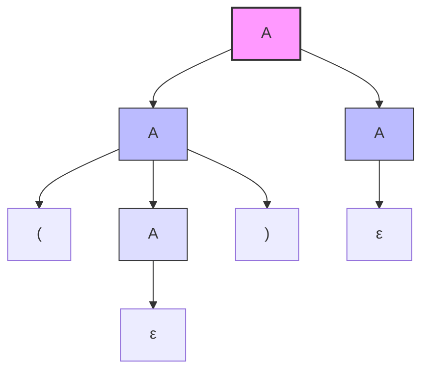
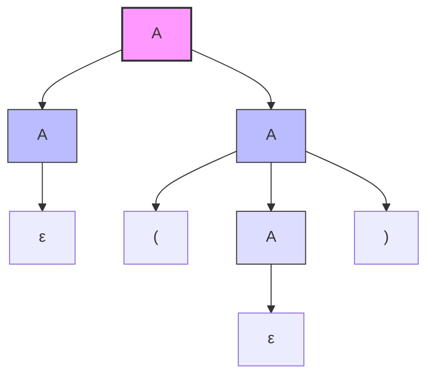

# Ex3.2 二义性判定

## Original Question

**3.2** Given the grammar:
$$
A \rightarrow AA \mid (A) \mid \varepsilon
$$
*   **(a)** Describe the language it generates.
*   **(b)** Show that it is ambiguous.

---

## 中文题意

**3.2** 给定文法：
$$
A \rightarrow AA \mid (A) \mid \varepsilon
$$
*   **(a)** 描述该文法所生成的语言。
*   **(b)** 证明该文法是二义性的。

---

## Type 题型

文法生成语言描述 / 二义性文法判定与证明 / 句柄与多重分析树构造

---

## Related Concepts

- [[CFG与上下文无关文法]] / [[二义性文法]]
- [[01_重写二义性文法套路]]

---

## Artifacts & Images / 答案与原图归档

### 1. 原题与标准答案 (扁平图片 - 纵向排布)

**原题内容 Ex3.2**

**官方标准答案**

---

### 2. 学生作答手稿 (纵向放大排布)

**我的解答手稿**

---

## ⚠️ 真实考场还原与作答深度对比

我们将 **学生作答手稿** 与 **官方标准答案** 进行逐一比对和深度学术剖析：

### 1. 题 a：语言描述的准确性
*   **学生手稿**：`The language contains balanced parentheses or the empty string.` （**完全正确 ✅**）
*   **官方答案**：描述为“所有嵌套且匹配的括号对集合（包括空串）”。
*   **学术剖析**：
    *   文法中的 $A \rightarrow (A)$ 提供了括号的**嵌套**能力（如 `(())`）；
    *   $A \rightarrow AA$ 提供了括号的**并列拼接**能力（如 `()()`）；
    *   $A \rightarrow \varepsilon$ 提供了产生**空串**以及终结递归的能力。
    *   综合起来，该文法生成的正是经典的 **括号匹配语言（Dyck 语言 $D_1$）**，且包含空串。学生手稿的表述用词精确，完全切中要害。

### 2. 题 b：二义性的证明方法（优秀范例 🌟）
*   **学生手稿做法**：
    通过为最简非空合法串 `()` 构造了**两条不同的最左推导**：
    1.  $A \Rightarrow (A) \Rightarrow ()$ （利用产生式 $A \rightarrow (A)$ 和 $A \rightarrow \varepsilon$）
    2.  $A \Rightarrow AA \Rightarrow (A)A \Rightarrow ()A \Rightarrow ()$ （利用产生式 $A \rightarrow AA$ 展开，再逐个消去）
*   **官方答案做法**：
    为同一个目标串 `()` 绘制了**两棵不同的语法分析树（Derivation Trees）**：
    *   **分析树 (a)**：根节点 $A$ 先展开为 $AA$，左侧 $A$ 嵌套展开为 $(A) \Rightarrow ( \varepsilon )$，右侧 $A$ 展开为 $\varepsilon$。
    *   **分析树 (b)**：根节点 $A$ 先展开为 $AA$，左侧 $A$ 展开为 $\varepsilon$，右侧 $A$ 嵌套展开为 $(A) \Rightarrow ( \varepsilon )$。
*   **学术剖析**：
    *   **二义性的定义**：若一个文法对某个句子存在两棵或多棵不同的语法分析树（或等价地，存在两个或多个不同的最左推导/最右推导），则该文法是二义性的。
    *   学生手稿通过给出一个极简的反例 `()` 并写出其**两种不同的最左推导**，在数学证明上与官方的“双分析树”法完全等价，且在考场上书写速度更快、步骤更严谨，属于**应试的满分示范**。

---

## Standard Solution 标准答案

### 1. 3.2(a) 语言语义描述

该文法生成的语言是：**所有格式正确的括号匹配（嵌套与并列）字符串的集合，包含空串 $\varepsilon$。**（即 Dyck 语言 $D_1$）

---

### 2. 3.2(b) 二义性证明

选择字符串 `()` 作为反例，其拥有以下两棵不同的语法分析树：

### 分析树 A

### 分析树 B

由于对同一个句子 `()` 存在两棵不同的分析树，故文法是二义性的。

---

## 避坑指南 与 易错点

> [!TIP]
> **二义性证明的最简反例法则**：
> 证明一个文法具有二义性，**最省时省力且不易出错的方法就是“找最简反例”**。
> 
> **避免复杂字符串**：
> 不要选择过于复杂的字符串（如 `()()()`），因为这会使你的推导步骤或分析树变得极其庞大，增加考场绘图出错的风险。
> 
> **寻找极简反例**：
> 在本题中，`()` 是最完美的极简反例，仅需 2 到 3 步推导即可分流出不同的语法路径。
> 
> **最左推导的规范性**：
> 书写最左推导时，每一步只能且必须替换当前句型中**最左边**的非终结符，注意保持符号顺序，切忌跳步。
