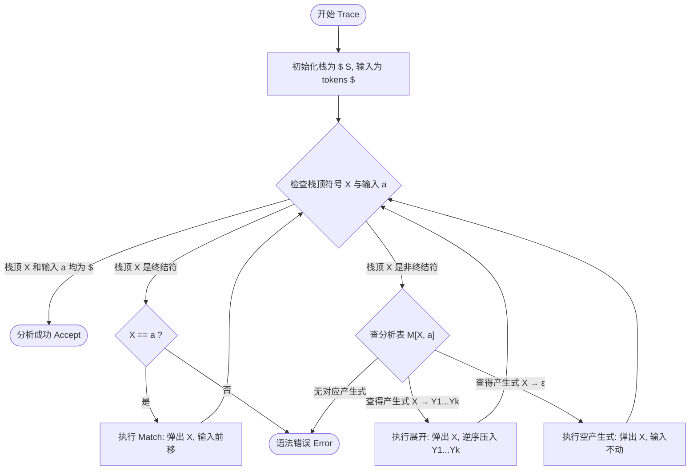

# LL(1) 分析过程追踪（Parser Trace）求解套路

> [!NOTE] 戏说套路：提线木偶与剧本对照戏
> * **提线木偶 (分析栈)**：木偶自己没有脑子，只会盯着自己最上头（栈顶）的符号动弹。
> * **演员排队 (输入流)**：手里拿着戏票（Token），排队等出场。
> * **剧本 (分析表)**：规定了木偶看到什么符号该怎么动。
> * **演戏规则**：
>   * 栈顶是非终结符 $\to$ 翻剧本，按动作要求**逆序展开压栈**（输入不动）；
>   * 栈顶是终结符 $\to$ 找排最前的演员比对，对上了就一起退场（**match**，输入右移）；
>   * 栈顶和演员都退场完毕（**$ $**） $\to$ 完美谢幕（**accept**）。

---

## 求解状态表的标准结构

LL(1) 状态追踪通常以三列表格呈现（注意：输入流必须在末尾补上 `$` 代表结束）：

| 步骤 | 状态栈 (Parsing Stack) | 当前剩余输入 (Input) | 所做动作 (Action) |
| :---: | :--- | :--- | :--- |
| 1 | `$ S` | `tokens $` | `S → ...` |

---

## 状态追踪的核心查表法则

设当前**栈顶符号为 $X$**，**当前输入 Token 为 $a$**：

1. **若 $X$ 是终结符（Terminal）**：
   * 必须满足 $X == a$，此时执行 **match** 动作：
     * 将栈顶终结符 $X$ 弹出；
     * 将输入符号串的指针向后移动一位（消耗当前 Token $a$）；
     * Action 记为：`match`（或 `match a`）。
   * 若 $X \neq a$，说明发生语法错误，Action 记为：`error`。
2. **若 $X$ 是非终结符（Nonterminal）**：
   * 查分析表 $M[X, a]$：
     * 若 $M[X, a] = X \to Y_1 Y_2 \dots Y_k$：
       * 将栈顶的 $X$ 弹出；
       * 将右部符号串 $Y_1 Y_2 \dots Y_k$ **逆序**压入状态栈中（使左侧第一个符号 $Y_1$ 处于栈顶，以便下一步处理）；
       * 输入指针**保持不动**；
       * Action 记为该产生式：`X → Y1 Y2 ... Yk`。
     * 若 $M[X, a] = X \to \varepsilon$：
       * 直接将栈顶的 $X$ 弹出；
       * **不压入**任何符号到栈中，且输入指针**保持不动**；
       * Action 记为：`X → ε`。
3. **若栈顶和输入均为 `$`**：
   * 执行结束动作，Action 记为：`accept`。

---

## 🚨 深度辨析与评分警示

### 1. 原子动作原则（老师课堂警示扣分点）
> **“一列不止执行一个 Action 是严重的概念错误！”**
许多同学为了省纸张或图省事，会在一行里同时做 `exp → term exp'` 以及紧接着的 `term → factor term'`。
在 LL(1) 分析模型中，分析器每一次读栈顶和看 Lookahead 只能做**一步原子操作**。**必须严格分行写，一行只允许做一个产生式展开或 match 匹配。**

### 2. Token 视角 vs 纯符号视角
* **官方答案（Token 级匹配）**：在真实编译器实现中，`number`、`addop`、`mulop` 已经由词法分析器打包为了 Token 类。因此，在分析栈里它们被视作“终结符”。栈顶为 `addop` 且输入为 `+` 时，直接执行 `match` 匹配，**省略**了 `addop → +` 这种极其细微的符号展开步骤。
* **教学纸面答案（严格展开）**：如果教学大纲中严格将 `addop` 视为非终结符，则必须先进行一步 `addop → +` 展开，下一行再执行 `match`。
* *考试时建议先确认该门课程采用的抽象级别。若是采用 Louden 课本体系，优先采用 Token 级直接 match 的简化方式（如 Ex4.5）。*

### 3. 语义分析值栈（Value Stack）的跨章节扩展
如果大题要求在语法追踪时**同步进行算术求值**，则需要引入第四列 `Value Stack`（属性栈）：
* 遇到数字 `match` 时，数值压入属性栈；
* 遇到 $\varepsilon$-产生式时，通常代表一个计算单元归约结束，弹出属性栈顶部的操作数进行运算，并将计算结果压回属性栈顶。
* *详细的值栈累加与乘法优先值合并过程，可参阅：* [[Ex4.5_LL1分析过程追踪#跨章节超链接：Value Stack (值栈/属性栈) 评估机制深剖|Value Stack 评估过程]]。

---

## 📝 代表例题推荐

* [[Ex4.5_LL1分析过程追踪]] — 经典复杂的算术括号表达式求值分析追踪过程。
