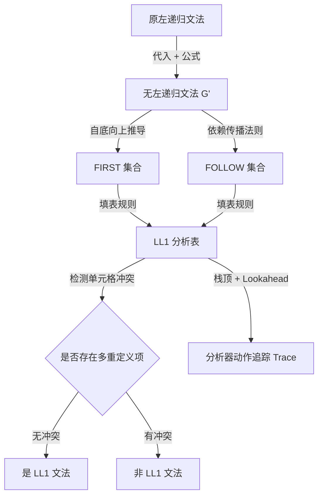

# LL(1) 综合题求解套路

> [!NOTE] 戏说套路：文法的“整容通关一条龙流水线”
> 解决一整道 LL(1) 综合大题，就像拉着一个“不及格文法”进行全身美容手术以期通关：
> 1. **削骨（消除左递归）**：把会导致分析器无限死循环的左递归大骨削掉，改造成顺畅的右递归。
> 2. **开眼角（提取左因子）**：把导致首符冲突的相同前缀合并，解决分岔路口的选择困难。
> 3. **体检（求 FIRST/FOLLOW 集）**：体检出每个非终结符首部能接什么（FIRST），尾部要防备什么（FOLLOW）。
> 4. **发驾照（画分析表）**：将体检结果整理成一张路口导航表。
> 5. **路考（追踪 Parser Trace）**：开着分析栈在导航表上跑一遍测试，顺利 accept 即为满分通关。
> *注意：由于是流水线作业，第一步的微小偏差（如算错一个 FOLLOW 元素）会排山倒海般地折射到后面的步骤中，引发整张表的灾难性坍塌。*

---

## 适用题型与知识网络

在期末考试或考研中，本套路适用于要求**完整推导 LL(1) 分析流程**的大题：
* **消除左递归** (Remove left recursion) $\to$ **计算 FIRST/FOLLOW 集** (Compute sets) $\to$ **判定 LL(1) 文法** (Prove LL(1)) $\to$ **构造分析表** (Construct table) $\to$ **追踪分析动作** (Parser trace)。

---

## 规范求解流程与算法实现

### 第一步：文法预处理 — 消除左递归 (Eliminate Left Recursion)
自顶向下分析必须确保文法不含左递归，否则分析器会陷入无限循环。
1. **检查间接左递归**：若存在 $A \Rightarrow^+ A\alpha$，先通过**产生式代入消元（Substitution）**将其转化为直接左递归。
2. **消除直接左递归**：若有产生式 $A \to A\alpha_1 \mid A\alpha_2 \mid \beta_1 \mid \beta_2$，引入辅助新符号 $A'$，改写为：
   $$
   \begin{aligned}
   A &\to \beta_1 A' \mid \beta_2 A' \\
   A' &\to \alpha_1 A' \mid \alpha_2 A' \mid \varepsilon
   \end{aligned}
   $$
   
> [!CAUTION] 格式警告：不同产生式分行写
> 老师重点批改反馈：不同产生式在写答案时**必须分行书写，绝不能使用逗号 `,` 分隔在同一行**！因为逗号在很多语言中是合法的 Token（如参数分隔符），用逗号作排版分隔会引入严重文法歧义。

---

### 第二步：计算 FIRST 集合 (FIRST Sets)
$\text{FIRST}(\alpha)$ 是由文法符号串 $\alpha$ 推导出的所有终结符首字符集合（若可空，则包含 $\varepsilon$）。
* **终结符**：$\text{FIRST}(a) = \{a\}$
* **空产生式**：若 $X \to \varepsilon$，则 $\varepsilon \in \text{FIRST}(X)$。
* **非终结符串**：若 $X \to Y_1 Y_2 \dots Y_k$，从 $Y_1$ 开始向后扫描：
  * 将 $\text{FIRST}(Y_1) \setminus \{\varepsilon\}$ 加入 $\text{FIRST}(X)$；
  * 若 $Y_1$ 可空（$\varepsilon \in \text{FIRST}(Y_1)$），则继续将 $\text{FIRST}(Y_2) \setminus \{\varepsilon\}$ 加入，以此类推；
  * 若所有 $Y_1 \dots Y_k$ 均可空，则将 $\varepsilon$ 加入 $\text{FIRST}(X)$。

---

### 第三步：计算 FOLLOW 集合 (FOLLOW Sets)
$\text{FOLLOW}(A)$ 是指在某些句型中紧跟在非终结符 $A$ 右侧的终结符集合（包含结束标记 $\text{＄}$）。
* **初始条件**：将结束符 $\text{＄}$ 放入开始符号 $S$ 的 FOLLOW 集中：$\{\text{＄}\} \subseteq \text{FOLLOW}(S)$。
* **右侧包含非空项**：若有产生式 $A \to \alpha B \beta$，则将 $\text{FIRST}(\beta) \setminus \{\varepsilon\}$ 加入 $\text{FOLLOW}(B)$。
* **右侧可空/处于末尾（FOLLOW的传播）**：若有产生式 $A \to \alpha B \beta$，且 $\beta \Rightarrow^* \varepsilon$（或 $\beta$ 不存在，即 $A \to \alpha B$），则将整个 $\text{FOLLOW}(A)$ 加入 $\text{FOLLOW}(B)$ 中。

> [!TIP] 计算心法
> 非终结符的 $\text{FOLLOW}$ 集合取决于它**在所有产生式右部出现的位置**，千万不要查它左侧的产生式。

---

### 第四步：构造 LL(1) 分析表 (Parsing Table)
分析表 $M[A, a]$ 是非终结符 $A$ 在面临输入符号 $a$ 时决策的依据。对文法中每个产生式 $A \to \alpha$：
1. 对所有的 $a \in \text{FIRST}(\alpha) \setminus \{\varepsilon\}$，填入：
   $$
   M[A, a] \leftarrow A \to \alpha
   $$
2. 若 $\varepsilon \in \text{FIRST}(\alpha)$（即 $\alpha \Rightarrow^* \varepsilon$），则对所有的 $b \in \text{FOLLOW}(A)$（包含 $\text{＄}$），填入：
   $$
   M[A, b] \leftarrow A \to \alpha
   $$

---

### 第五步：判定 LL(1) 性质 (Check LL(1))
* **表判法（最直接）**：若构造出来的分析表 $M$ 的**每一个单元格中至多只有一个产生式**，则该文法是 LL(1) 文法。
* **冲突判定**：如果某个单元格 $M[A, a]$ 中同时存在两个或以上产生式，说明存在 **FIRST/FIRST 冲突** 或 **FIRST/FOLLOW 冲突**，文法不是 LL(1)。

---

### 第六步：模拟分析器动作追踪 (Parser Trace)
根据分析表机械化执行栈的操作，要求三列表格：

| 步骤 | 状态栈 (Parsing Stack) | 输入符号串 (Input) | 所做动作 (Action) |
| :---: | :--- | :--- | :--- |

* **规则 1**：栈底初始化为 `$`，上面压入文法开始符 $S$（栈呈现为 `$ S`）。输入串末尾加上 `$`。
* **规则 2 (查表)**：若栈顶为非终结符 $A$，且当前输入为 $a$，查表 $M[A, a]$：
  * 若为 $A \to X_1 X_2 \dots X_k$，则将 $A$ 弹出，将右部符号**逆序**压入栈中（$X_k$ 先入，$X_1$ 后入，使 $X_1$ 处于栈顶）。Action 记录为 `A → X1 X2 ... Xk`。
* **规则 3 (匹配)**：若栈顶为终结符 $a$，且当前输入为 $a$，则执行匹配：栈弹出 $a$，输入指针前移一位。Action 记录为 `match`。
* **规则 4 (空动作)**：若查表结果为 $A \to \varepsilon$，则直接将 $A$ 弹出，输入指针**不动**。Action 记录为 `A → ε`。
* **规则 5 (结束)**：若栈顶和输入均只剩 `$`，Action 记录为 `accept`，分析成功。

---

## 🚨 避坑宝典与老师课堂警示

在综合大题中，以下 4 点是阅卷老师的**重点扣分区**：

1. **FOLLOW 集合必须用花括号 `{ }`**：
   * ✗ $\text{FOLLOW}(A) = )$
   * ✓ $\text{FOLLOW}(A) = \{ ) \}$ (集合形式，不带括号扣步骤分)
2. **分析表必须有 `$` 列，绝不能有 $\varepsilon$ 列**：
   * `$` 代表输入流结束，没有它分析器无法处理结束匹配；
   * $\varepsilon$ 不是输入符号，不能作为分析表的列首。
3. **$\varepsilon$-产生式不能随便填入 `$` 列**：
   * 只有当 $\$$ 存在于该非终结符的 $\text{FOLLOW}$ 集合中时，才能在 `$` 列下填入 $A \to \varepsilon$。
4. **分析动作每行只能执行一个，保持原子性**：
   * 绝对不能一行内做多次产生式展开。必须是一步查表、一步压栈、一步匹配。

---

## 📝 典型代表例题推荐

* [[Ex4.8_LL1综合题]] — 包含左递归消除、FIRST/FOLLOW、分析表及完整 40 步追踪 Trace。
* [[Ex4.9_LL1分析表_左递归与Nullable]] — 重点展示 Nullable 可空符号在 FIRST 和 FOLLOW 中的**连锁反应传播算法**。
* [[Ex4.21_判断文法不是LL1]] — 规范演示如何通过分析表定位冲突（$M[A, a]$）并进行严格的 FIRST/FOLLOW 冲突判定。
