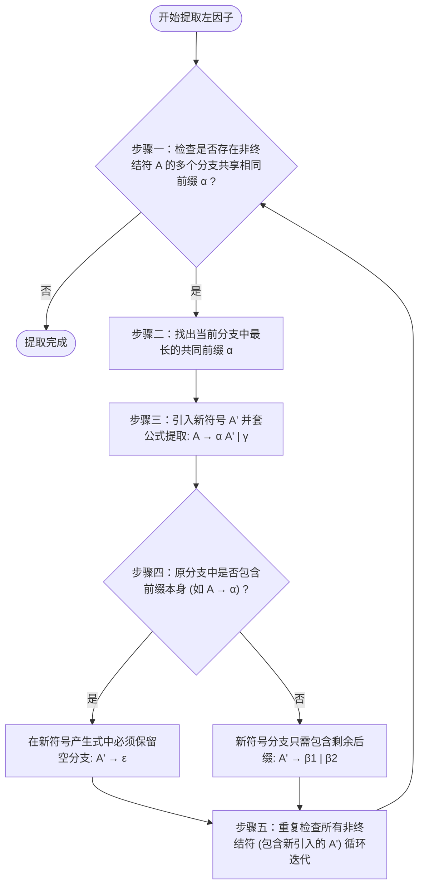

# 提取左因子（Left Factoring）求解套路

> [!NOTE] 戏说套路：高架桥合并通道与“延迟决策”
> 提取左因子就像是做代数题里的**“提取公因式”**，或者城市规划里的**“高架桥并道”**。
> * **路口的卡死纠结**：如果文法里有 $A \to \alpha\beta \mid \alpha\gamma$，两个分支都以相同的前缀 $\alpha$ 开头。分析器因为近视（只能看 1 个符号），看到 $\alpha$ 直接懵圈，不知道该往哪条分支开。
> * **并道改造（延迟决策）**：我们强行把一模一样的公共前缀 $\alpha$ 提取出来，修成一条单行主干道 $A \to \alpha A'$。把后面有差异的后缀小尾巴（$\beta$ 和 $\gamma$）打包丢给分叉路口代理人 $A'$。这样，分析器不用做任何选择，遇到 $\alpha$ 直接往前开，等开过主干道之后，到了 $A'$ 路口再根据下一个符号来做决定。这也就是**“延迟决策”**。

---

## 提取左因子的迭代决策流

---

## 识别条件 (Identification)

当文法中存在如下形式的产生式：
$$A \to \alpha\beta_1 \mid \alpha\beta_2 \mid \dots \mid \alpha\beta_n \mid \gamma$$
其中：
* $\alpha$ 是非空的**最长共同前缀**（$\alpha \neq \varepsilon$）；
* $\beta_i$ 是前缀之后的不同后缀部分；
* $\gamma$ 代表不以 $\alpha$ 开头的其他候选分支。

由于 $\text{FIRST}(\alpha\beta_1) \cap \text{FIRST}(\alpha\beta_2) \neq \varnothing$，这直接导致了 **FIRST/FIRST 冲突**，该文法不可能是 LL(1) 的。

---

## 改写规则 (Rewriting Rules)

引入全新的辅助非终结符 $A'$，将原产生式等价改写为：
$$
\begin{aligned}
A &\to \alpha A' \mid \gamma \\
A' &\to \beta_1 \mid \beta_2 \mid \dots \mid \beta_n
\end{aligned}
$$

> [!IMPORTANT] 极易忽略的临界点：$\varepsilon$ 分支的保留
> 如果某个原候选分支就是共同前缀自身（例如原产生式为 $A \to \alpha \mid \alpha\beta$），此时后缀 $\beta_1 = \varepsilon$。
> 在提取左因子时，**绝对不能漏掉空产生式分支**！改写后必须写为：
> $$A' \to \beta \mid \varepsilon$$

---

## 🚨 避坑指南与书写规范

> [!WARNING] 产生式分行规范（考点红线）
> 提取左因子会引入很多新的 $A', A''$ 辅助符号。写出改写后的产生式时，**每一个产生式必须占一行，决不能用逗号 `,` 连接在同一行**！
> * ✗ $S \to I S', S' \to - J \mid + K \mid \varepsilon$
> * ✓ 正确分行写法：
>   $$S \to I S'$$
>   $$S' \to - J \mid + K \mid \varepsilon$$
> 因为逗号 `,` 在很多高级语言文法中是终结符，连写会带来严重的文法歧义，导致步骤分全扣。

---

## 规范答题英文句式 (English Answer Patterns)

> Left factoring is required when two or more productions for a nonterminal share a common prefix, which violates the LL(1) grammar condition.
>
> We factor out the common prefix $\alpha$ and introduce a helper nonterminal $A'$ to represent the remaining suffixes.
>
> The alternative $\varepsilon$ is introduced in the new production to account for the case where the prefix itself is a valid alternative.
>
> Different productions must be written on separate lines to avoid ambiguity caused by comma separators.

---

## 📝 代表例题推荐

* [[Practice_提取左因子]] — 包含多重嵌套提取（如 $S, I, J$ 分别提取）以及终结符与非终结符边界核对。
