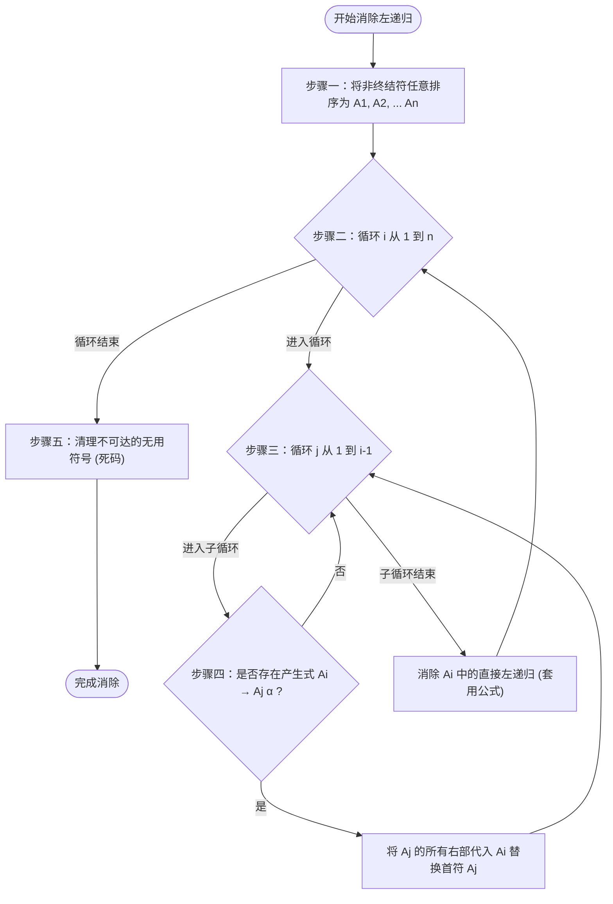

# 消除左递归（Left Recursion Elimination）求解套路

> [!NOTE] 戏说套路：拆除死循环的“定时炸弹”
> 左递归是自顶向下分析器（LL(1)）的**绝对死穴**。
> * **无限套娃（死循环爆栈炸弹）**：文法中如果存在 $A \to A \alpha$，相当于在用 $A$ 本身定义 $A$。分析器在解密时就像陷入死循环的复读机，原地反复套娃，一个字符都读不进去，系统调用栈却被无限撑大，直至溢出崩溃。
> * **暴力拆除（消除左递归）**：
>   * **直接左递归（套娃蛇）**：直接套公式改写，引入一个尾部代理人 $A'$，把原地打转的死循环改成向右单向延伸的流水线，最后以选配料 $\varepsilon$ 作为出口。
>   * **间接左递归（推锅环，如张三推李四，李四推王五，王五推张三）**：需要像公司里抓扯皮一样，规定好排队顺序，把推锅关系链**强行代入拍扁**，将间接左递归强制暴露出直接左递归的特征，然后再施展“直接消除公式”彻底根治。

---

## 消除左递归的算法决策流

---

## 一、直接左递归 (Direct Left Recursion)

### 1. 识别条件
非终结符 $A$ 的候选产生式右侧直接以 $A$ 自身开头：
$$A \to A\alpha \mid \beta$$
其中：
* $\alpha$ 是非空符号串（$\alpha \neq \varepsilon$）；
* $\beta$ 是不以 $A$ 开头的符号串。

### 2. 公式改写规则
引入辅助新符号 $A'$，改写为等价的右递归形式：
$$
\begin{aligned}
A &\to \beta A' \\
A' &\to \alpha A' \mid \varepsilon
\end{aligned}
$$
如果有多个左递归项和非左递归项，即 $A \to A\alpha_1 \mid A\alpha_2 \mid \beta_1 \mid \beta_2$，同理改写为：
$$
\begin{aligned}
A &\to \beta_1 A' \mid \beta_2 A' \\
A' &\to \alpha_1 A' \mid \alpha_2 A' \mid \varepsilon
\end{aligned}
$$

> [!TIP] 物理意义直观化
> 原文法 $A \to A\alpha \mid \beta$ 表示非终结符 $A$ 可以生成“以一个 $\beta$ 开头，后面跟着零个或多个 $\alpha$”的符号串（正则表达式为 $\beta\alpha^*$）。
> 改写后的 $A \to \beta A'$ 和 $A' \to \alpha A' \mid \varepsilon$ 同样表示生成 $\beta\alpha^*$，但在语法树上变为了向右下倾斜的结构，消除了左端无限展开的问题。

---

## 二、间接左递归 (Indirect Left Recursion)

### 1. 识别条件
非终结符 $A$ 并不直接推导出以 $A$ 开头的右部，而是经过多步推导后绕回自身（例如 $A \Rightarrow B\alpha \Rightarrow A\beta\alpha$）。
例如：
$$
\begin{aligned}
S &\to A a \mid b \\
A &\to S d \mid c
\end{aligned}
$$
此处 $S \to A a \to S d a$，形成了间接左递归。

### 2. 标准消除算法（代入消元法）
核心思想是通过**产生式代入（Substitution）**将间接左递归转化为直接左递归，再套公式消除：

1. **排列非终结符**：给所有非终结符任意规定一个顺序，如 $A_1, A_2, \dots, A_n$。
2. **两重循环代入**：
   * 对 $i$ 从 1 到 $n$：
     * 对 $j$ 从 1 到 $i-1$：
       * 若存在产生式 $A_i \to A_j \gamma$，把所有 $A_j \to \delta$ 代入到该产生式中，消去开头的 $A_j$。
     * 消除此时 $A_i$ 产生式中可能出现的**直接左递归**。
3. **清理死码**：代入消除后，有些非终结符（如原先的 $U$ 或 $A_j$）可能从文法开始符出发变得不可达。可以直接将其作为无用符号擦除。

---

## 🚨 避坑指南与书写规范

> [!WARNING] 产生式分行规范（考点红线）
> 消除左递归后引入的 $\varepsilon$ 产生式以及辅助非终结符很多。在书写答案时，**所有的产生式必须分行书写，绝不能使用逗号 `,` 分隔在一行**！
> * ✗ $T \to c T', T' \to a T' \mid b T' \mid \varepsilon$
> * ✓ 正确分行写法：
>   $$T \to c T'$$
>   $$T' \to a T' \mid b T' \mid \varepsilon$$
> 因为逗号 `,` 极易与文法终结符混淆，用逗号连接会导致分析语义歧义，步骤分全扣。

---

## 规范答题英文句式 (English Answer Patterns)

> The grammar contains left recursion, which causes the LL(1) parser to enter an infinite loop.
>
> To eliminate direct left recursion of the form $A \to A\alpha \mid \beta$, we introduce a new nonterminal $A'$ and rewrite it as $A \to \beta A'$ and $A' \to \alpha A' \mid \varepsilon$.
>
> To eliminate indirect left recursion between $T$ and $U$, we substitute the productions of $U$ into the production for $T$.
>
> This transforms the indirect left recursion into direct left recursion, which can then be eliminated using the standard rule.
>
> Unreachable nonterminals (dead codes) after substitution are removed to simplify the grammar.

---

## 📝 代表例题推荐

* [[Ex4.8_LL1综合题]] — 直接左递归消除在综合大题第一步的应用。
* [[Practice_消除左递归]] — 包含间接左递归（$T \to U$ 与 $U \to T$）的**代入消元过程**、自循环项 $T \to T$ 的吸收逻辑，以及死码消除。
