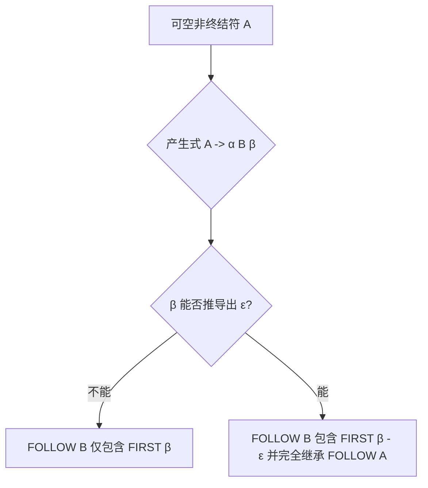

# Ex4.9 LL(1) 分析表 (左递归消除与 Nullable 综合题)

## Original Question

*   **a.** Calculate `nullable`, `FIRST`, and `FOLLOW` sets for the nonterminals of the following grammar $G[S]$:
    $$
    \begin{aligned}
    S &\to u B D z \\
    B &\to B r \mid w \\
    D &\to E F \\
    E &\to y \mid \varepsilon \\
    F &\to x \mid \varepsilon
    \end{aligned}
    $$
*   **b.** Construct the LL(1) parsing table for the grammar.

---

## 中文题意

给定一个带有直接左递归和多个可空产生式的文法，要求完成以下分析：

*   **a.** 计算文法 $G[S]$ 的 `nullable` 属性、`FIRST` 集合和 `FOLLOW` 集合。
*   **b.** 消除左递归，并构造改写后等价文法 $G'$ 的 LL(1) 分析表。

---

## Type 题型

DFA/LL(1) 分析表构造 / 直接左递归消除 / 可空符号 (Nullable) 判定与集合传播机制

---

## Related Concepts

- [[LL(1)文法]]
- [[FIRST集合]]
- [[FOLLOW集合]]
- [[LL(1)预测分析表（自顶向下分析的方向指示牌）|LL(1)分析表]]
- [[左递归]]
- [[02_LL1综合题套路]]
- [[05_消除左递归套路]]

---

## Artifacts & Images / 答案与原图归档

| 原题图片 | 我的手写解答 |
| :---: | :---: |
|  |  |

---

## ⚠️ 真实考场还原与作答深度对比

我们将 **学生作答手稿** 与 **官方规范解答** 进行逐一比对和深度学术剖析，发现在涉及多个 **可空符号（Nullable Symbols）** 连环推导的题目中，以下 4 个边界条件极其容易漏算：

### 1. $\text{FIRST}(D)$ 漏算可空的连带项 $\text{FIRST}(F)$
*   **手稿问题**：写成 $\text{FIRST}(D) = \text{FIRST}(E) \setminus \{\varepsilon\} = \{y\}$。
*   **病因剖析**：由于 $D \to E F$，非终结符 $E$ 可空（$E \to \varepsilon$）。这意味着当 $E$ 被推导为空串时，非终结符 $D$ 的首个终结符将由紧随其后的 $F$ 决定。
*   **正解规范**：$\text{FIRST}(D)$ 必须包含 $\text{FIRST}(E) \setminus \{\varepsilon\}$ 并并入 $\text{FIRST}(F)$。因为 $E, F$ 均可空，所以 $D$ 亦可空（即 $\varepsilon \in \text{FIRST}(D)$）。正确结果为 $\text{FIRST}(D) = \{x, y, \varepsilon\}$。

### 2. $\text{FOLLOW}(B)$ 计算漏掉了左递归终结符 $r$ 与后续可空传播的终结符 $z$
*   **手稿问题**：写成 $\text{FOLLOW}(B) = \text{FIRST}(D) = \{y\}$。
*   **病因剖析**：
    *   在原句 $S \to u B D z$ 中，因为 $D$ 可空，所以 $B$ 后继可能直接跟 $z$（即 $z \in \text{FOLLOW}(B)$）。
    *   此外，在原左递归产生式 $B \to B r$ 中，终结符 $r$ 紧跟在 $B$ 之后，因此 $r$ 同样在原未改写文法的 $\text{FOLLOW}(B)$ 中。
*   **正解规范**：
    *   **原未改写文法**下：$\text{FOLLOW}(B) = \{r, x, y, z\}$。
    *   **消除左递归后**（引入 $B'$）：$\text{FOLLOW}(B) = \text{FOLLOW}(B') = \{x, y, z\}$（因为左递归终结符 $r$ 被移到了 $B'$ 的转移弧上）。

### 3. $\text{FOLLOW}(E)$ 漏掉了继承 $\text{FOLLOW}(D)$ 的右边界成员 $z$
*   **手稿问题**：写成 $\text{FOLLOW}(E) = \{x\}$。
*   **病因剖析**：在 $D \to E F$ 中，因为 $F \to \varepsilon$ 可空，当 $F$ 展开为 $\varepsilon$ 时，非终结符 $E$ 实际上变成了 $D$ 产生式的末尾符号，必须**继承** $\text{FOLLOW}(D)$。
*   **正解规范**：$\text{FOLLOW}(E)$ 不仅包含 $\text{FIRST}(F) \setminus \{\varepsilon\} = \{x\}$，还必须并入 $\text{FOLLOW}(D) = \{z\}$。正确结果为 $\text{FOLLOW}(E) = \{x, z\}$。

### 4. $\text{FOLLOW}(F)$ 笔误写成了 $x$
*   **手稿问题**：写成 $\text{FOLLOW}(F) = \{x\}$。
*   **病因剖析**：在 $D \to E F$ 中，$F$ 始终处于产生式末尾，无条件继承左部 $\text{FOLLOW}(D)$。而 $\text{FOLLOW}(D) = \{z\}$，因此 $\text{FOLLOW}(F)$ 只能是 $\{z\}$，手稿中将其误写为 $x$。

---

## Standard Solution 标准答案

### 1. part (a) 消除直接左递归

原文法中，产生式 $B \to B r \mid w$ 存在直接左递归。
利用公式 $A \to A\alpha \mid \beta \Longrightarrow A \to \beta A', A' \to \alpha A' \mid \varepsilon$ 改写：
$$
\begin{aligned}
B &\to w B' \\
B' &\to r B' \mid \varepsilon
\end{aligned}
$$

消除左递归后的**等价文法 $G'[S]$** 为：
$$
\begin{aligned}
S &\to u B D z \\
B &\to w B' \\
B' &\to r B' \mid \varepsilon \\
D &\to E F \\
E &\to y \mid \varepsilon \\
F &\to x \mid \varepsilon
\end{aligned}
$$

---

### 2. part (b) 计算 Nullable、FIRST 与 FOLLOW 集合

#### 1. 原文法 $G$ 的集合计算（未消除左递归，用于手稿校对）

| 非终结符 | Nullable | FIRST | FOLLOW |
| :---: | :---: | :--- | :--- |
| **S** | False | $\{u\}$ | $\{\$\}$ |
| **B** | False | $\{w\}$ | $\{r, x, y, z\}$ |
| **D** | True | $\{x, y, \varepsilon\}$ | $\{z\}$ |
| **E** | True | $\{y, \varepsilon\}$ | $\{x, z\}$ |
| **F** | True | $\{x, \varepsilon\}$ | $\{z\}$ |

#### 2. 改写后等价文法 $G'$ 的集合计算（用于构造分析表）

| 非终结符 | Nullable | FIRST | FOLLOW |
| :---: | :---: | :--- | :--- |
| **S** | False | $\{u\}$ | $\{\$\}$ |
| **B** | False | $\{w\}$ | $\{x, y, z\}$ |
| **B'** | True | $\{r, \varepsilon\}$ | $\{x, y, z\}$ |
| **D** | True | $\{x, y, \varepsilon\}$ | $\{z\}$ |
| **E** | True | $\{y, \varepsilon\}$ | $\{x, z\}$ |
| **F** | True | $\{x, \varepsilon\}$ | $\{z\}$ |

---

### 3. part (c) 构造 LL(1) 分析表

根据改写后的文法 $G'$，其 LL(1) 分析表如下（列首仅能包含终结符和 `$`，绝不能列出 $\varepsilon$）：

| 非终结符 | $u$ | $w$ | $r$ | $y$ | $x$ | $z$ | $\$$ |
| :---: | :--- | :--- | :--- | :--- | :--- | :--- | :--- |
| **$S$** | $S \to u B D z$ | | | | | | |
| **$B$** | | $B \to w B'$ | | | | | |
| **$B'$** | | | $B' \to r B'$ | $B' \to \varepsilon$ | $B' \to \varepsilon$ | $B' \to \varepsilon$ | |
| **$D$** | | | | $D \to E F$ | $D \to E F$ | $D \to E F$ | |
| **$E$** | | | | $E \to y$ | $E \to \varepsilon$ | $E \to \varepsilon$ | |
| **$F$** | | | | | $F \to x$ | $F \to \varepsilon$ | |

> [!NOTE] 核心格子填表详解
> *   **$B' \to \varepsilon$**：由于 $B'$ 可空且 $\text{FOLLOW}(B') = \{x, y, z\}$，故在 $x, y, z$ 列均填入 $B' \to \varepsilon$。
> *   **$D \to E F$**：由于 $\text{FIRST}(E F) = \{x, y, \varepsilon\}$，故先在 $x, y$ 列填入该产生式；又因为 $D$ 可空且 $\text{FOLLOW}(D) = \{z\}$，故在 $z$ 列亦需填入 $D \to E F$。
> *   **$E \to \varepsilon$**：由于 $E$ 可空且 $\text{FOLLOW}(E) = \{x, z\}$，故在 $x, z$ 列填入 $E \to \varepsilon$。
> *   **$F \to \varepsilon$**：由于 $F$ 可空且 $\text{FOLLOW}(F) = \{z\}$，故在 $z$ 列填入 $F \to \varepsilon$。

---

### 4. part (d) LL(1) 文法严格判定证明

由于构造出的 LL(1) 分析表中的每个单元格至多只包含一个产生式（无任何多重定义冲突），因此改写后的文法 $G'$ 是 **LL(1) 文法**。

---

## 避坑指南 与 易错点

> [!WARNING]
> **可空符号的 FOLLOW 传播链千万别漏掉左部**：
> 在计算 $D \to E F$ 中 $E$ 的 `FOLLOW` 集合时，绝对不要漏掉继承其产生式左部 $D$ 的后续符号。因为当 $F$ 走向空串推导时，$E$ 的右侧没有任何字符保护，它将直接面对 $D$ 后面会出现的所有终结符。这种“可空后继导致左部继承”是自顶向下分析中最隐蔽的扣分重灾区。
