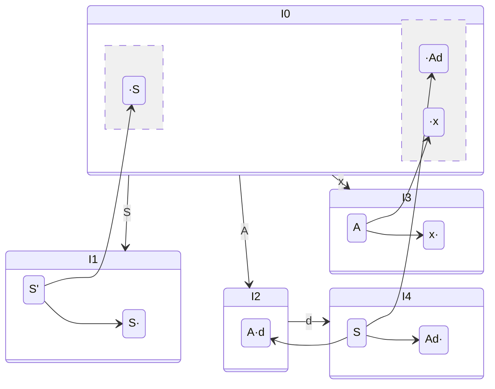
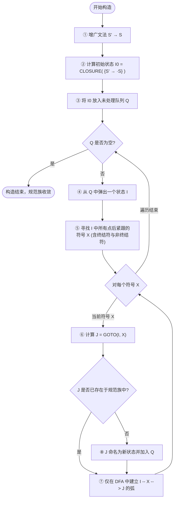

# LR(0) 项目集规范族与 DFA 构造套路

> [!NOTE] 戏说套路：画地铁线路网的“全城测绘四步法”
> 构造项目集规范族（DFA状态图）说白了就是**画出我们开地铁时用的全城地铁大图纸**：
> 1. **第一步：拉出只准冲一次的“一次性冲线带”（写增广文法）**：原起点 $S$ 容易自循环，裁判在外面专门拉一个新起点 $S' \to S$（编号为 0），冲过这条红线就直接判赢（acc）。
> 2. **第二步：把规则背在身上（亮出公式）**：在纸上写出大门钥匙的数学依据——“群演召集令（CLOSURE）”和“刷卡开门（GOTO）”，向改卷老师证明咱们是正规测绘员。
> 3. **第三步：顺藤摸瓜找房间（分步计算状态）**：从 0 号大厅（$I_0$）出发，看看主演是谁，摇来所有预备群演（求闭包）。然后拿着终结符/非终结符去刷卡开门（求 GOTO），开出门后如果发现跟已建的换乘大厅一模一样，直接连线指过去，别重复盖大楼。
> 4. **第四步：绘制全城地铁总图（画 DFA 状态图）**：把刚才建的所有房间和门用线条连成一张漂亮的网络图。每个房间（状态）里，把元老创始人（核心项）和临时工（闭包项）用横线隔开，一目了然。

---

## 🛠️ 求解规范步骤与书写规范

在试卷或作业上，完整的解答步骤应由以下四部分组成：

### 第一步：写出增广文法（Augmented Grammar）
必须显式引入新起始符号 $S'$，并在最上方增加 **0 号产生式** ：
$$S' \to S$$
然后给所有产生式进行 **编号** （$0, 1, \dots, n$），这在后续填表与追踪中极度重要。

### 第二步：写出闭包（CLOSURE）与跳转（GOTO）的计算公式
写出以下核心公式以表明逻辑链条完整性：
- **`CLOSURE(I)` 定义** ：
  1. 若 $A \to \alpha \cdot B \beta \in I$，则对任意产生式 $B \to \gamma$，均有 $B \to \cdot \gamma \in \text{CLOSURE}(I)$。
  2. 重复此过程直至闭包集不再扩大。
- **`GOTO(I, X)` 定义** ：
  $$\text{GOTO}(I, X) = \text{CLOSURE}(\{ A \to \alpha X \cdot \beta \mid A \to \alpha \cdot X \beta \in I \})$$

### 第三步：分步骤迭代计算项目集（无遗漏推导）
从初始状态 $I_0$ 开始，依次计算每个状态在面临文法符号 $X \in (V_N \cup V_T)$ 时的转移，并为每个新状态赋予唯一编号（$I_0, I_1, \dots, I_m$）。

*   **若计算出与已有状态完全相同的项目集，必须指向已存在的状态编号，禁止重复建号！**

### 第四步：绘制 DFA 状态转移图
使用圆圈或方框表示状态 $I_i$，在框内列出其包含的所有项目（区分 **基项目 Basis** 与 **闭包项目 Closure** 最佳，可用横线隔开），用有向边表示状态转移，边上标明转移符号 $X$。

---

## 📐 经典可视化例题推导 (Visual Walkthrough)

我们使用一个最简经典文法演示上述“套路”的运行：
$$\text{文法 } G: \quad (1) S \to A \textbf{ d} \quad (2) A \to \textbf{x}$$

### 1. 增广文法：
$$(0) S' \to S \quad (1) S \to A \textbf{ d} \quad (2) A \to \textbf{x}$$

### 2. 规范推导计算过程：

*   **状态 $I_0$ (起点状态)**:
    $$I_0 = \text{CLOSURE}(\{ S' \to \cdot S \})$$
    *   **Basis**: $S' \to \cdot S$
    *   **Closure** (由于点在 $S$ 前，引入 $S \to \cdot A \textbf{d}$；又点在 $A$ 前，引入 $A \to \cdot \textbf{x}$):
        $$S \to \cdot A \textbf{ d}$$
        $$A \to \cdot \textbf{x}$$
*   **状态 $I_1 = \text{GOTO}(I_0, S)$**:
    *   **Basis**: $S' \to S \cdot$
*   **状态 $I_2 = \text{GOTO}(I_0, A)$**:
    *   **Basis**: $S \to A \cdot \textbf{d}$
*   **状态 $I_3 = \text{GOTO}(I_0, \textbf{x})$**:
    *   **Basis**: $A \to \textbf{x} \cdot$
*   **状态 $I_4 = \text{GOTO}(I_2, \textbf{d})$**:
    *   **Basis**: $S \to A \textbf{d} \cdot$

### 3. 可视化 DFA 状态转移图：

---

## 🧠 核心算法数学模型 (Mermaid 逻辑流)

---

## 🚨 避坑清单与评分警示

> [!CAUTION] 1. 空产生式（Epsilon Production）的闭包遗漏
> 若文法中存在空产生式 $A \to \varepsilon$，其在项目集中的初始形式为 **$A \to \cdot$** （这是一个 **完全归约项目** ）。
> - **易错** ：在计算 $I_0$ 或其他包含 $A \to \cdot B \beta$ 的状态闭包时，若点后非终结符 $B$ 可以推导出 $\varepsilon$，必须在闭包中塞入 $B \to \cdot$。
> - **后果** ：漏写 $B \to \cdot$ 会直接导致分析表缺少相应的归约行，追踪过程在起点就会卡死。

> [!WARNING] 2. 区分“移进”与“归约”项目状态，严防收敛死循环
> 计算 `GOTO(I, X)` 时，点 `·` **必须右移一位** 变为新的基项目。
> - **移进项目** ：$A \to \alpha \cdot X \beta \implies \text{GOTO}(I, X)$ 的基项目为 $A \to \alpha X \cdot \beta$。
> - **归约项目** ：$A \to \alpha \cdot$ （点已经在最右侧），其没有下一步的 GOTO 转移，千万不要在转移符号中给它拉线。

---

## 📝 实战演练推荐

*   [[Ex5_SLR综合题_括号文法]] —— 经典的不含空产生式的括号与列表文法规范族构造。
*   [[Ex5.2_SLR分析与LR0冲突_空产生式文法]] —— 包含 $S \to \varepsilon$ 的高难状态闭包展开实战。