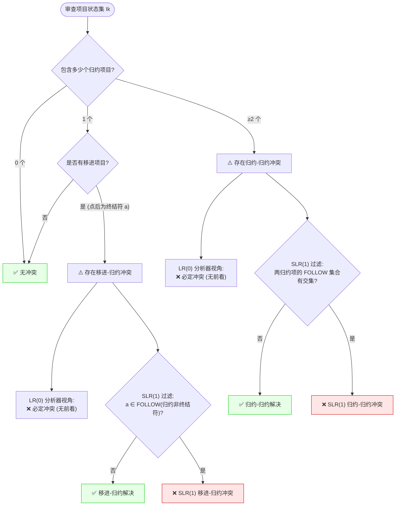

# 证明文法不是 LR(0) 或 SLR(1) 的标准做题套路

> [!NOTE] 戏说套路：抓取 LR0 或 SLR1 冲突的“私家侦探断案口诀”
> 证明一个文法不是某类型非常简单，你只要扮演私家侦探，抓到它在某个特定状态 $I_k$ 下犯规的**任意一个案发现场**就行：
> 1. **侦破 LR(0) 案发现场**（直接搜大厅项目）：
>    - **移归现场**：发现状态大厅里，同时有人等着用终结符小零件推进（$A \to \alpha \cdot a \beta$），又有人已经凑齐了零件准备封箱打包（$B \to \gamma \cdot$）。面临 $a$ 时两路都行，当场宣判 **LR(0)移归冲突！**
>    - **归归现场**：发现大厅里同时有两个人凑齐了不同的零件，大喊着准备打包不同的箱子（$A \to \alpha \cdot$ 和 $B \to \beta \cdot$），当场宣判 **LR(0)归归冲突！**
> 2. **侦破 SLR(1) 案发现场**（大一统广播安检失效）：
>    - 如果上述冲突在 LR(0) 漏网了，我们就要拿出后继广播（FOLLOW集）核对。
>    - **移归安检失效**：那个等零件的人要的符号 $a$，**居然出现在了准备打包的人的后继名单 $\text{FOLLOW}(B)$ 里**。这意味着安检大喇叭没能把两边分离开，判定 **SLR(1)移归冲突！**
>    - **归归安检失效**：两个同时准备打包的人，他们的后继名单居然有交集（$\text{FOLLOW}(A) \cap \text{FOLLOW}(B) \neq \varnothing$），说明在交集符号下分析器又会懵圈，判定 **SLR(1)归归冲突！**

---

## ⚖️ 冲突判定决策树 (Conflict Diagnostics Tree)

我们用一个直观的决策树表示判断 LR(0) 与 SLR(1) 冲突的逻辑推理流：

---

## ⚖️ 冲突判定的形式化数学模型

### 1. LR(0) 冲突判定准则
设 DFA 状态机中存在一个状态 $I_k$：

-   **移进-归约 (Shift-Reduce) 冲突** ：
    若 $I_k$ 中同时包含以下两类项目：
    -   $A \to \alpha \cdot a \beta$ （期望移进终结符 $a$）
    -   $B \to \gamma \cdot$ （期望无条件归约）
-   **归约-归约 (Reduce-Reduce) 冲突** ：
    若 $I_k$ 中同时包含两个不同的归约项目：
    -   $A \to \alpha \cdot$
    -   $B \to \beta \cdot$

---

### 2. SLR(1) 冲突判定准则
SLR(1) 引入了 $Follow$ 集合来进行归约限制过滤。但在以下情况下，过滤失效，仍然存在冲突：

-   **SLR(1) 移进-归约冲突** ：
    若 $I_k$ 中同时包含：
    -   $A \to \alpha \cdot a \beta$ （其中 $a \in V_T$）
    -   $B \to \gamma \cdot$
    且满足：
    $$a \in \text{FOLLOW}(B)$$

-   **SLR(1) 归约-归约冲突** ：
    若 $I_k$ 中同时包含归约项目 $A \to \alpha \cdot$ 与 $B \to \beta \cdot$，且它们的 $Follow$ 集合存在交集：
    $$\text{FOLLOW}(A) \cap \text{FOLLOW}(B) \neq \varnothing$$

---

## 📝 考场得分标准答题模板

当题目要求“证明文法不是 LR(0) / SLR(1) 文法”时，请严格套用以下模板书写，确保逻辑无懈可击：

### 证明文法不是 LR(0) 模板：
> 1. 构造该文法的增广文法，并建立 LR(0) 项目集 DFA。
> 2. 观察可知，在 **状态 $I_k$** 中存在项目：
>    - $A \to \alpha \cdot a \beta$
>    - $B \to \gamma \cdot$
> 3. 前者为移进项目，后者为归约项目。由于 LR(0) 分析器在状态 $I_k$ 下面临输入 $a$（或任何符号）时，无法决定是执行移进还是按 $B \to \gamma$ 归约，从而构成了 **移进-归约冲突** 。
> 4. 因此，该文法 **不是** LR(0) 文法。

---

### 证明文法不是 SLR(1) 模板：
> 1. 构造该文法的增广文法与 LR(0) DFA。
> 2. 计算相关非终结符的 FOLLOW 集合：
>    - $\text{FOLLOW}(B) = \{ \dots, a, \dots \}$
> 3. 在 **状态 $I_k$** 中，同时存在：
>    - 移进项目：$A \to \alpha \cdot a \beta$ （当输入为 $a$ 时移进）
>    - 归约项目：$B \to \gamma \cdot$ （当输入为 $b \in \text{FOLLOW}(B)$ 时归约）
> 4. 由于 **$a \in \text{FOLLOW}(B)$** ，当分析器运行到状态 $I_k$ 且面临输入符号 **`a`** 时，既可以移进 $a$ 并跳转，也可以按 $B \to \gamma$ 进行归约。这构成了 SLR(1) 的 **移进-归约冲突** （在分析表第 $k$ 行、`a` 列格子中同时出现了 $s_j$ 和 $r_p$）。
> 5. 因此，该文法 **不是** SLR(1) 文法。

---

## 🚨 避坑清单与评分警示

> [!CAUTION] 1. 漏写具体冲突状态与具体冲突符号
> - **错误示范** ：“该文法存在移进-归约冲突，所以不是 SLR(1)。” —— **直接扣除大半步骤分** 。
> - **正确做法** ：必须指明 **“在状态 $I_k$ 中”** ，以及 **“当面临输入符号 $a$ 时”** 。必须把状态编号和导致冲突的符号具体写出来。

> [!WARNING] 2. 误将 LR(0) 的冲突直接作为不是 SLR(1) 的证据
> - **核心概念** ：一个文法如果不是 LR(0) 的，它 **很有可能** 是 SLR(1) 的（因为 SLR(1) 的 $Follow$ 集合过滤常常能成功消解 LR(0) 冲突）。
> - **答题规范** ：要证明它不是 SLR(1)，必须计算出 $Follow$ 集合，并证明移进符号在 $Follow$ 集合中，或者两个 $Follow$ 集合交集不为空。只写出 LR(0) 项目冲突而不做 $Follow$ 集交集运算，证明是不成立的。

---

## 📝 实战演练推荐

*   [[Ex5.2_SLR分析与LR0冲突_空产生式文法]] —— 经典展示了 State 1 中存在 LR(0) 移进-归约冲突，但通过 $\text{FOLLOW}(S') \cap \{(\} = \varnothing$ 被 SLR(1) 成功消解的对比实战。
*   [[Ex4.21_判断文法不是LL1]] —— 自顶向下分析中对应的非 LL(1) 冲突判定对比，体会 FIRST/FOLLOW 碰撞的共通数学本质。