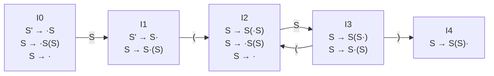

# Ex5.2 SLR 分析与 LR(0) 冲突：空产生式文法

## Original Question

Consider the following grammar:

$$S \to S ( S ) \mid \varepsilon$$

Construct the SLR parsing tables for the grammar. In particular, show the following:
1. The augmented grammar
2. The DFA to recognize viable prefixes, including the set of items for each state.
3. The FIRST and FOLLOW sets for all the non-terminals
4. The action and goto tables
5. Show the parsing stack and the actions of an SLR(1) parser for the input string **`(()())`**. (Additionally trace **`()()`** for validation)
6. Is this grammar an LR(0) grammar? If not, describe the LR(0) conflict. If so, construct the LR(0) parsing table, and describe how a parse might differ from an SLR(1) parse.

---

## 中文题意

对于含有空产生式的括号嵌套文法 $S \to S ( S ) \mid \varepsilon$，要求构造其：
1. 增广文法
2. 活前缀 DFA 状态机及项目集规范族
3. FIRST 与 FOLLOW 集合
4. ACTION / GOTO 分析表
5. 双栈追踪输入串 `(()())`（以及辅助验证串 `()()`）的分析步骤
6. 判断是否为 LR(0) 文法，说明冲突原因，并对比 LR(0) 与 SLR(1) 的行为差异。

---

## Type 题型

SLR 综合题 / $\varepsilon$-产生式项目集闭包 / 移进-归约冲突分析 / 分析过程双栈追踪

---

## Related Concepts

- [[自底向上语法分析]]
- [[增广文法]]
- [[LR(0)项目|LR(0) 项目]]
- [[闭包运算]]
- [[跳转函数]]
- [[项目集规范族]]
- [[ACTION表]] / [[GOTO表]]
- [[SLR(1)分析算法|SLR(1)]]
- [[LR(0)分析算法|LR(0)]]
- [[移进-归约冲突]]
- [[FOLLOW集合|FOLLOW 集合]]

---

## Related Recipes

- [[01_LR0项目集规范族构造套路]]
- [[02_SLR分析表构造套路]]
- [[03_SLR分析过程追踪套路]]
- [[04_判断文法不是LR0或SLR1套路]]

---

## Standard Solution 标准答案

### 1. 增广文法 (Augmented Grammar)

引入新的起始符号 $S'$，将 $\varepsilon$ 产生式显式写出：

```text
(0) S' → S
(1) S  → S ( S )
(2) S  → ε
```

> [!NOTE]
> 在 LR/SLR 分析中，空产生式 $S \to \varepsilon$ 对应的项目为 $S \to \cdot$。这是一个 **完全归约项目** ，一旦在闭包中展开，就意味着当前位置可以立刻尝试按 $S \to \varepsilon$ 进行归约。

---

### 2. FIRST 与 FOLLOW 集合

*   **FIRST 集合**：
    *   $\text{FIRST}(S) = \{ (, \varepsilon \}$
        *   *推导*：由于有产生式 $S \to \varepsilon$，因此 $\varepsilon \in \text{FIRST}(S)$；由产生式 $S \to S ( S )$，由于第一个符号是 $S$，若其推导出 $\varepsilon$，则暴露出其后的终结符 `(`，故 `(` $\in \text{FIRST}(S)$。
    *   $\text{FIRST}(S') = \text{FIRST}(S) = \{ (, \varepsilon \}$
*   **FOLLOW 集合**：
    *   $\text{FOLLOW}(S') = \{ \$ \}$
    *   $\text{FOLLOW}(S) = \{ \$, (, ) \}$
        *   *推导*：
            1.  作为起始符号，有 $\$ \in \text{FOLLOW}(S)$；
            2.  在产生式 $S \to S ( S )$ 中：
                - 第一处 $S$ 后面紧跟终结符 `(`，故 `(` $\in \text{FOLLOW}(S)$；
                - 第二处 $S$ 后面紧跟终结符 `)`，故 `)` $\in \text{FOLLOW}(S)$。

---

### 3. 活前缀 DFA 与项目集规范族

#### 项目集状态定义

*   **State 0** (初始状态)：
    *   基 (Basis)：
        $$S' \to \cdot S$$
    *   闭包项 (Closure)：
        $$S \to \cdot S ( S )$$
        $$S \to \cdot \quad \text{(r2, 归约项目)}$$
*   **State 1** ($Goto(I_0, S)$)：
    *   基：
        $$S' \to S \cdot$$
        $$S \to S \cdot ( S )$$
*   **State 2** ($Goto(I_1, ()$ 或 $Goto(I_3, ()$)：
    *   基：
        $$S \to S ( \cdot S )$$
    *   闭包项：
        $$S \to \cdot S ( S )$$
        $$S \to \cdot \quad \text{(r2, 归约项目)}$$
*   **State 3** ($Goto(I_2, S)$)：
    *   基：
        $$S \to S ( S \cdot )$$
        $$S \to S \cdot ( S )$$
*   **State 4** ($Goto(I_3, ))$)：
    *   基：
        $$S \to S ( S ) \cdot \quad \text{(r1, 归约项目)}$$

#### DFA 状态转移图 (Mermaid)



> [!WARNING]
> **易错点拨** ：在 $I_0$ 和 $I_2$ 中，当计算 $\text{CLOSURE}$ 时，由于 $S \to \cdot$ 的存在，状态内已经包含了 **可立刻进行归约的项目** （r2）。因此，在 $I_0$ 和 $I_2$ 状态中就会直接触发归约动作！

---

### 4. ACTION / GOTO 分析表

利用 $\text{FOLLOW}(S) = \{ \$, (, ) \}$ 集合，将归约动作填入对应列：

| 状态 | ACTION `(` | ACTION `)` | ACTION `$` | GOTO `S` |
|:---:|:---:|:---:|:---:|:---:|
| **0** | r2 | r2 | r2 | 1 |
| **1** | s2 | | acc | |
| **2** | r2 | r2 | r2 | 3 |
| **3** | s2 | s4 | | |
| **4** | r1 | r1 | r1 | |

*   **r1** 对应归约产生式：$S \to S(S)$
*   **r2** 对应归约产生式：$S \to \varepsilon$

---

### 5. SLR(1) 分析过程追踪 (Parser Trace)

#### A. 主追踪输入串 `(()())`

输入句子为：`( ( ) ( ) ) $`

| 步骤 | 状态栈 | 符号栈 | 剩余输入 | 动作 (Action) |
|:---:|:---|:---|:---|:---|
| **1** | `0` | `$` | `( ( ) ( ) ) $` | Reduce by $S \to \varepsilon$ (r2) |
| **2** | `0 1` | `$ S` | `( ( ) ( ) ) $` | Shift 2 |
| **3** | `0 1 2` | `$ S (` | `( ) ( ) ) $` | Reduce by $S \to \varepsilon$ (r2) |
| **4** | `0 1 2 3` | `$ S ( S` | `( ) ( ) ) $` | Shift 2 |
| **5** | `0 1 2 3 2` | `$ S ( S (` | `) ( ) ) $` | Reduce by $S \to \varepsilon$ (r2) |
| **6** | `0 1 2 3 2 3` | `$ S ( S ( S` | `) ( ) ) $` | Shift 4 |
| **7** | `0 1 2 3 2 3 4` | `$ S ( S ( S )` | `( ) ) $` | Reduce by $S \to S ( S )$ (r1) |
| **8** | `0 1 2 3` | `$ S ( S` | `( ) ) $` | Shift 2 |
| **9** | `0 1 2 3 2` | `$ S ( S (` | `) ) $` | Reduce by $S \to \varepsilon$ (r2) |
| **10** | `0 1 2 3 2 3` | `$ S ( S ( S` | `) ) $` | Shift 4 |
| **11** | `0 1 2 3 2 3 4` | `$ S ( S ( S )` | `) $` | Reduce by $S \to S ( S )$ (r1) |
| **12** | `0 1 2 3` | `$ S ( S` | `) $` | Shift 4 |
| **13** | `0 1 2 3 4` | `$ S ( S )` | `$` | Reduce by $S \to S ( S )$ (r1) |
| **14** | `0 1` | `$ S` | `$` | **Accept (成功接收)** |

#### B. 辅助追踪输入串 `()()`

输入句子为：`( ) ( ) $`

| 步骤 | 状态栈 | 符号栈 | 剩余输入 | 动作 (Action) |
|:---:|:---|:---|:---|:---|
| **1** | `0` | `$` | `( ) ( ) $` | Reduce by $S \to \varepsilon$ (r2) |
| **2** | `0 1` | `$ S` | `( ) ( ) $` | Shift 2 |
| **3** | `0 1 2` | `$ S (` | `) ( ) $` | Reduce by $S \to \varepsilon$ (r2) |
| **4** | `0 1 2 3` | `$ S ( S` | `) ( ) $` | Shift 4 |
| **5** | `0 1 2 3 4` | `$ S ( S )` | `( ) $` | Reduce by $S \to S ( S )$ (r1) |
| **6** | `0 1` | `$ S` | `( ) $` | Shift 2 |
| **7** | `0 1 2` | `$ S (` | `) $` | Reduce by $S \to \varepsilon$ (r2) |
| **8** | `0 1 2 3` | `$ S ( S` | `) $` | Shift 4 |
| **9** | `0 1 2 3 4` | `$ S ( S )` | `$` | Reduce by $S \to S ( S )$ (r1) |
| **10** | `0 1` | `$ S` | `$` | **Accept (成功接收)** |

---

### 6. LR(0) 冲突分析与对比

#### A. 该文法是否为 LR(0) 文法？

**不是。**

#### B. 冲突的详细描述

在活前缀 DFA 的 **State 1** 中存在冲突：
*   **移进项目** ：$S \to S \cdot ( S )$ （期望在下一个输入为 `(` 时将其移进）
*   **归约/接受项目** ：$S' \to S \cdot$ （在输入结束时进行接收，由于是 $S'$，等价于对增广文法起始状态的归约）

由于 LR(0) 并不查看任何展望符号（Lookahead），当分析器运行到 **State 1** 且下一个输入字符为 **`(`** 时，它无法决定是执行 **移进** （Shift `(` 并跳转到 State 2）还是执行 **归约/接受** （Reduce $S' \to S$）。这构成了典型的 **移进-归约冲突 (Shift-Reduce Conflict)**。

#### C. SLR(1) 如何解决冲突，其分析有何不同？

*   **SLR(1) 解决机制** ：
    SLR(1) 引入了 $Follow$ 集合的过滤。
    *   对于归约项目 $S' \to S \cdot$，只有下一个输入符号在 $\text{FOLLOW}(S') = \{ \$ \}$ 中时，才允许执行归约/接受。
    *   对于移进项目 $S \to S \cdot ( S )$，只有下一个输入符号在移进字符集 $\{ ( \}$ 中时，才执行移进.
    *   由于 $\{ \$ \} \cap \{ ( \} = \varnothing$，当面临输入 `(` 时，SLR(1) 明确知道应该进行 **移进 (s2)**；当面临输入 `$` 时，SLR(1) 明确知道应该进行 **接受 (acc)**。因此，SLR(1) 分析表中该冲突被成功消除。

*   **分析行为的差异** ：
    如果使用 LR(0) 分析表，在 State 1 面临 `(` 时的冲突会导致语法分析表在同一格内包含两个动作（例如 `s2 / acc` 或 `s2 / r0`），使分析器产生 **不确定性（Non-determinism）** 。而 SLR(1) 分析器则能极其顺畅地做出唯一正确的决定，避免了分析的回溯或报错。

---

## ⚠️ 真实考场还原与评分细节

本题是一道非常经典的期末与考研真题。以下结合 **真实学生作答手稿中的典型错误** 、 **教师批改评语** 以及 **官方阅卷标准** 进行深度剖析，帮助你在考场上避开隐蔽的扣分点：

### 1. 教师批改评语与错因深度剖析

> [!CAUTION] 教师评语：“状态图第一步就错了。items中的产生式也写得不对。”
*   **手稿错因 ①：基础产生式抄写错误（DFA 的第一步崩溃）**
    *   在手写稿的状态 $I_0$ 中，学生将文法中的产生式 $S \to S(S)$ 错误地写成了 $S \to \cdot(S)$（漏掉了点后首个非终结符 $S$）。这直接导致后续所有状态的项目集展开全部偏离。
*   **手稿错因 ②：跳转逻辑不合逻辑（NFA 与 DFA 概念混淆）**
    *   正因为错写成了 $S \to \cdot(S)$，学生认为在 $I_0$ 状态下面临左括号 `(` 时可以发生转移，因而在图中画了一条 **从 $I_0$ 经过 `(` 转移到 $I_2$** 的弧。
    *   *正确原理*：在 $I_0$ 中，所有项目的点后面要么是 $S$，要么为空。因此 $I_0$ **只可能通过非终结符 $S$ 跳转到 $I_1$**。而终结符 `(` 只能在进入 $I_1$ 遇到 $S \to S \cdot (S)$ 项目后，由面临 `(` 的跳转引向 $I_2$。从 $I_0$ 连线到 $I_2$ 是完全违背活前缀 DFA 构建规则的。
*   **手稿错因 ③：FOLLOW 集合符号计算失误**
    *   学生手写 FOLLOW 集合时，把 $S$ 后继的 `(`、`)` 和 `$` 符号写得十分混乱，导致其第四小题填表中对归约项目 $S \to \varepsilon$（$r_2$ 动作）的定位发生了错位，分析表无法收敛。

---

### 2. 官方阅卷标准与得分关键

根据期末与考研阅卷大纲，本题的六个小题有着极其严格的合规性要求：

*   **第 1 问：增广文法（Augmented Grammar）必须书写完整**
    *   **阅卷标准**：不能只写新增加的产生式 $S' \to S$，必须把 **整套改造后的文法全部完整写出**（即包含 0, 1, 2 号产生式的完整文法）。只写新引入产生式会被酌情扣除步骤分。
*   **第 2 问：DFA 表达方式必须严格符合“确定性”要求**
    *   **阅卷标准**：题目要求绘制 DFA。可以使用任何准确描述 DFA 状态及项目集的表达方式（如用圆圈、方框画出转移关系），但 **绝对不能写成 NFA**（例如带有 $\varepsilon$ 空转移弧或非确定跳转的状态图）。
*   **第 4 问：必须填制 SLR(1) 分析表**
    *   **阅卷标准**：由于题干明确说明为“Construct the SLR parsing tables”，因此第 (4) 小题必须基于 FOLLOW 集合来填制具有过滤动作的 **SLR(1) 分析表**，不能画成粗糙的 LR(0) 表。
*   **第 6 问：LR(0) 冲突描述必须明确具体**
    *   **阅卷标准**：证明该文法不是 LR(0) 时，可以画出整个 LR(0) 分析表来圈出冲突，也可以直接在 SLR(1) 表或 DFA 图中指明。但 **无论使用哪种形式，都必须用文字明确说明：在哪个具体状态（State 1），哪两个项目（$S' \to S \cdot$ 与 $S \to S \cdot ( S )$）之间，在面临什么符号（`(`）时，产生了什么类型（移进-归约冲突）的冲突**。含糊概括而没有指明状态和项目的，无法拿全分。

---

### 3. 考场手稿与标准答案对照图谱

以下为本题的 **学生真实手写解答手稿** 与 **官方标准答案解析** 对照图，方便直观比对，加深印象：

#### 📌 考生手写解答手稿（含错因）

| 第一页 (增广文法与手绘 DFA 错误图) | 第二页 (手绘 FIRST/FOLLOW 与双栈追踪) | 第三页 (手写冲突分析) |
| :---: | :---: | :---: |
|  |  |  |

#### 🔑 官方标准答案解析

| 第一页 (标准 DFA、FIRST/FOLLOW 与 SLR 分析表) | 第二页 (标准双栈追踪与 LR(0) 冲突表) |
| :---: | :---: |
|  |  |

---

## 📝 核心易错点避坑清单

1.  **空产生式项目集的 CLOSURE 展开**：在计算 $I_0$ 和 $I_2$ 时，千万不要遗漏被 $\varepsilon$ 引入的归约项目 **$S \to \cdot$**。这是后续所有归约动作的“源头”。
2.  **符号栈归约的物理退栈长度**：当按照产生式 $S \to S(S)$ 进行归约（$r_1$ 动作）时，因为其右部符号串长度为 **4**（包含 $S$, `(`, $S$, `)`），因此必须连续从状态栈中弹出 **4 个状态**，从符号栈中弹出 **4 个符号**。之后利用暴露出的状态和非终结符 $S$ 查 GOTO 表。
3.  **空产生式归约的“零长度”特殊性**：当按照产生式 $S \to \varepsilon$ 进行归约（$r_2$ 动作）时，因为右部长度为 **0**，**不进行任何弹栈操作**，直接在当前栈顶状态的 GOTO 列中查询跳转状态进行压栈。这是追踪最容易出错的物理细节。
