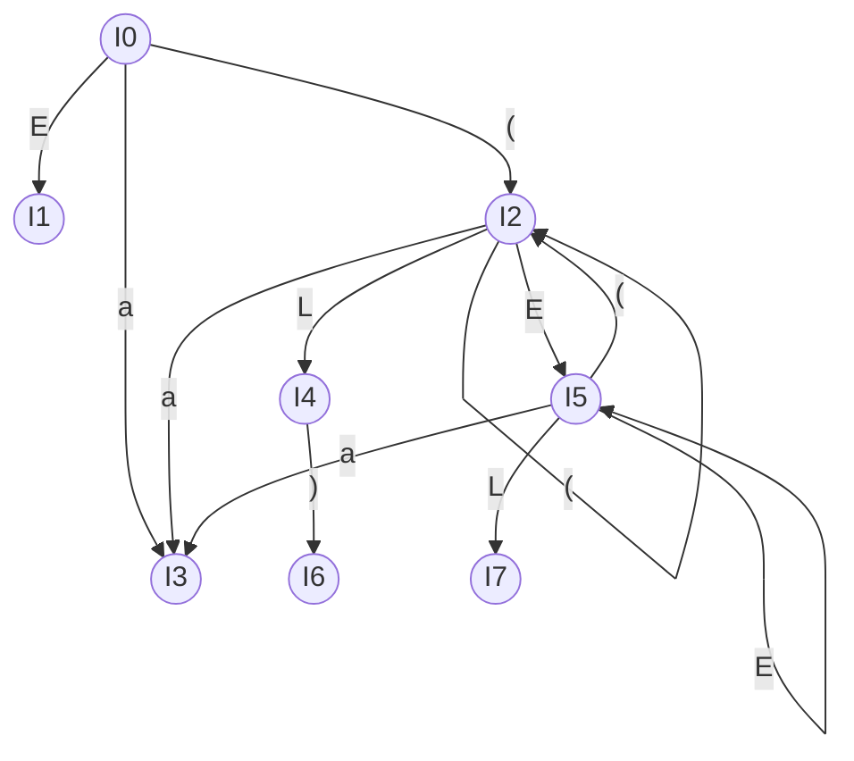

# Ex5 SLR综合题：括号/列表文法

## Original Question

Consider the following grammar:

```text
E → ( L ) | a
L → E L | E
```

Construct the SLR parsing tables for the grammar. In particular, show:

1. The augmented grammar
2. The FIRST and FOLLOW sets for all the non-terminals
3. The DFA to recognize viable prefixes, including the set of items for each state
4. The ACTION and GOTO tables
5. The parsing stack and actions of an SLR(1) parser for the input string `(a(a))` (Note: `(()())` is not a valid sentence in this grammar as empty parentheses are not allowed)
6. Whether this grammar is an LR(0) grammar; if not, describe the LR(0) conflict

## 中文题意

给定括号/列表文法，完整构造 SLR 分析所需的增广文法、FIRST/FOLLOW 集、LR(0) 项目集 DFA、ACTION/GOTO 表、SLR 分析过程，并判断是否为 LR(0) 文法。

## Type 题型

SLR 综合题 / LR(0) DFA / SLR parsing table / parser trace / conflict 判断

## Related Concepts

- [[自底向上语法分析]]
- [[增广文法]]
- [[LR(0)项目|LR(0) 项目]]
- [[闭包运算]]
- [[跳转函数]]
- [[项目集规范族]]
- [[ACTION表]] / [[GOTO表]]
- [[SLR(1)分析算法|SLR(1)]]
- [[LR(0)分析算法|LR(0)]]
- [[移进]] / [[归约]]
- [[移进-归约冲突]]
- [[FOLLOW集合|FOLLOW 集合]]

## Related Recipes

- [[01_LR0项目集规范族构造套路]]
- [[02_SLR分析表构造套路]]
- [[03_SLR分析过程追踪套路]]
- [[04_判断文法不是LR0或SLR1套路]]

---

## Standard Solution 标准答案

### 1. 增广文法 (Augmented Grammar)

引入新的起始符号 $E'$：

```text
(0) E' → E
(1) E  → ( L )
(2) E  → a
(3) L  → E L
(4) L  → E
```

---

### 2. FIRST 与 FOLLOW 集合

*   **FIRST 集合**：
    *   $First(E) = \{ (, a \}$
    *   $First(L) = First(E) = \{ (, a \}$
*   **FOLLOW 集合**：
    *   $Follow(E') = \{ \$ \}$
    *   $Follow(E) = \{ \$, (, a, ) \}$
        *   *解析*：
            1.  根据 $E' \to E$，有 $\$ \in Follow(E)$；
            2.  根据 $L \to E L$，有 $First(L) \setminus \{\varepsilon\} = \{ (, a \} \subseteq Follow(E)$；
            3.  根据 $L \to E$，有 $Follow(L) \subseteq Follow(E)$；
    *   $Follow(L) = \{ ) \}$
        *   *解析*：
            1.  根据 $E \to ( L )$，有 $) \in Follow(L)$。
            2.  根据 $L \to E L$，末尾的 $L$ 传播 $Follow(L)$ 仅为自传播。

---

### 3. LR(0) 项目集规范族与 DFA (DFA & Item Sets)

#### 项目集状态定义

*   **State 0** (初始状态)：
    $$E' \to \cdot E$$
    $$E \to \cdot ( L )$$
    $$E \to \cdot a$$
*   **State 1** ($Goto(I_0, E)$，接受状态)：
    $$E' \to E \cdot$$
*   **State 2** ($Goto(I_0, ($)：
    $$E \to ( \cdot L )$$
    $$L \to \cdot E L$$
    $$L \to \cdot E$$
    $$E \to \cdot ( L )$$
    $$E \to \cdot a$$
*   **State 3** ($Goto(I_0, a)$)：
    $$E \to a \cdot$$
*   **State 4** ($Goto(I_2, L)$)：
    $$E \to ( L \cdot )$$
*   **State 5** ($Goto(I_2, E)$ 或 $Goto(I_5, E)$)：
    $$L \to E \cdot L$$
    $$L \to E \cdot$$
    $$L \to \cdot E L$$
    $$L \to \cdot E$$
    $$E \to \cdot ( L )$$
    $$E \to \cdot a$$
*   **State 6** ($Goto(I_4, )$)$)：
    $$E \to ( L ) \cdot$$
*   **State 7** ($Goto(I_5, L)$)：
    $$L \to E L \cdot$$

#### DFA 状态转移图 (Mermaid)



> **🎉 纠错校验**：你的手绘 DFA 状态转移图与各状态内部项目集**完全正确，没有任何逻辑或转移错误！**

---

### 4. ACTION / GOTO 分析表

| 状态 | ACTION `a` | ACTION `(` | ACTION `)` | ACTION `$` | GOTO `E` | GOTO `L` |
|:---:|:---:|:---:|:---:|:---:|:---:|:---:|
| **0** | s3 | s2 | | | 1 | |
| **1** | | | | acc | | |
| **2** | s3 | s2 | | | 5 | 4 |
| **3** | r2 | r2 | r2 | r2 | | |
| **4** | | | s6 | | | |
| **5** | s3 | s2 | r4 | | 5 | 7 |
| **6** | r1 | r1 | r1 | r1 | | |
| **7** | | | r3 | | | |

> **🎉 纠错校验**：你的手绘 SLR 分析表**完全正确**！

---

### 5. 输入 `(a(a))` 的 SLR(1) 分析过程 (Parser Trace)

输入句子为：`( a ( a ) ) $`

| 步骤 | 状态栈 | 符号栈 | 剩余输入 | 动作 (Action) |
|:---:|:---|:---|:---|:---|
| **1** | `0` | `$` | `( a ( a ) ) $` | Shift 2 |
| **2** | `0 2` | `$ (` | `a ( a ) ) $` | Shift 3 |
| **3** | `0 2 3` | `$ ( a` | `( a ) ) $` | Reduce by $E \to a$ (r2) |
| **4** | `0 2 5` | `$ ( E` | `( a ) ) $` | Shift 2 |
| **5** | `0 2 5 2` | `$ ( E (` | `a ) ) $` | Shift 3 |
| **6** | `0 2 5 2 3` | `$ ( E ( a` | `) ) $` | Reduce by $E \to a$ (r2) |
| **7** | `0 2 5 2 5` | `$ ( E ( E` | `) ) $` | Reduce by $L \to E$ (r4) |
| **8** | `0 2 5 2 4` | `$ ( E ( L` | `) ) $` | Shift 6 |
| **9** | `0 2 5 2 4 6` | `$ ( E ( L )` | `) $` | Reduce by $E \to ( L )$ (r1) |
| **10** | `0 2 5 5` | `$ ( E E` | `) $` | Reduce by $L \to E$ (r4) |
| **11** | `0 2 5 7` | `$ ( E L` | `) $` | Reduce by $L \to E L$ (r3) |
| **12** | `0 2 4` | `$ ( L` | `) $` | Shift 6 |
| **13** | `0 2 4 6` | `$ ( L )` | `$` | Reduce by $E \to ( L )$ (r1) |
| **14** | `0 1` | `$ E` | `$` | **Accept (成功接收)** |

---

### 6. LR(0) 冲突分析

该文法 **不是** LR(0) 文法。

*   **冲突状态** ： **State 5**
*   **冲突项目** ：
    *   `L -> E . L` (Shift 项目，期望读入非终结符 `L` / 终结符 `(`, `a`)
    *   `L -> E .` (Reduce 项目，期望进行归约)
*   **LR(0) 中的表现** ：由于 LR(0) 不看展望符，在 State 5 面对输入符号 `a` 或 `(` 时，分析器无法决定是移进（`s3`/`s2`）还是归约（按 `L -> E` 归约），这构成了 **移进-归约冲突 (Shift-Reduce Conflict)** 。
*   **SLR(1) 的解决** ：
    SLR(1) 引入了 $Follow$ 集合来进行归约拦截。
    *   归约项目 `L -> E .` 仅当下一个输入符号属于 $Follow(L) = \{ ) \}$ 时才允许归约。
    *   移进项目 `E -> . ( L )` 和 `E -> . a` 的移进字符集合为 $\{ (, a \}$。
    *   由于 $\{ ) \} \cap \{ (, a \} = \emptyset$，两类动作的输入符号完全不重叠。因此在 SLR(1) 中冲突被完美化解。

---

## Artifacts & Images / 答案与原图归档

### 1. 我的手写解答草稿

| DFA 手绘图 | 分析表手绘图 |
| :---: | :---: |
|  |  |

### 2. 教材官方标准答案

| 标准答案 (Ex5.7) |
| :---: |
|  |

## 错因归类

- [ ] $Follow(E)$ 的计算中是否漏掉了由 $L \to E$ 传播来的 $Follow(L)$？
- [ ] State 5 的闭包计算中是否漏掉了由 $L \to \cdot E L$ 中 $E$ 的闭包项？
- [ ] 归约时状态栈弹栈的元素个数是否与产生式右部符号数 $\times 2$ 对应？

---

## Common Mistakes

- [[99_Chapter5_自底向上分析_易错点|Chapter 5 易错点]]

## Reflection

记录关于 State 5 闭包以及多非终结符 FIRST/FOLLOW 集合计算的直觉逻辑。