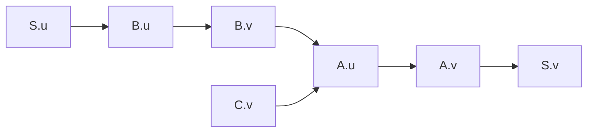
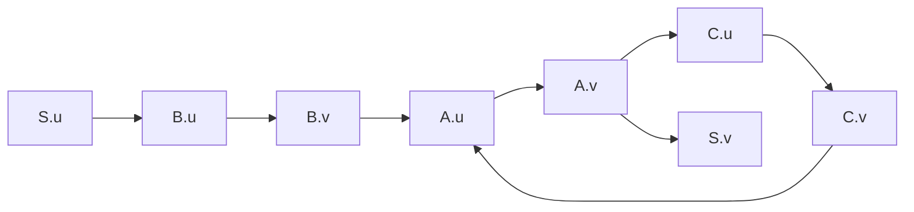

# 依赖图与计算顺序套路

> [!NOTE] **🌟 大白话通俗解释：派单依赖链与死锁塞车**
> 属性依赖图，就像是快递公司的**派单依赖链**。
> - 快递员 $A$ 说：“我必须等 $B$ 把箱子送过来我才能送（$B \to A$）”；
> - 快递员 $B$ 说：“我必须等 $C$ 算好运单我才能装箱（$C \to B$）”。
> 
> 只要把这些“谁依赖谁”的指向连成箭头，就得到了**依赖图**。
> 1. **顺畅派单（拓扑排序）**：如果图中没有环，我们就可以排出一个先后顺序（比如先通知 $C$，再通知 $B$，最后通知 $A$）。这个顺序就是**属性求值顺序（拓扑排序）**。
> 2. **环形死锁（循环依赖）**：如果 $A$ 等 $B$，$B$ 等 $C$，而 $C$ 又反过来等 $A$。三个人大眼瞪小眼，谁也无法动弹。这就是**环（Cycle）**。
> 
> 考试大题最喜欢让你给一段规则画图、找死锁，或者写出派单顺序。

---

## 📐 依赖图画法与求值顺序三步法

在考场上，面对“画出依赖图并写出求值顺序”的大题，按照以下步骤规范作答：

### 步骤一：画语法树骨架，并在各节点旁标出“属性气球”
*   先用虚线或细线画出普通的语法树结构。
*   在每个语法树节点旁边，写出该节点关联的全部属性实例（如根节点写 $S.u, S.v$，子节点写 $A.u, A.v$ 等）。

### 步骤二：绘制属性依赖有向边 (箭头指向“计算结果”)
根据每条产生式对应的语义规则画箭头。
*   **画法核心**：若规则为 `Y.b = f(X.a)`，说明 `Y.b` 依赖于 `X.a`，应画一条**从 `X.a` 指向 `Y.b`** 的有向箭头：
    $$X.a \longrightarrow Y.b$$
*   **流向直觉**：
    *   **综合属性**：箭头通常**自底向上**流动（子节点 $\to$ 父节点）。
    *   **继承属性**：箭头通常**自顶向下**（父节点 $\to$ 子节点）或**横向交接**（左兄弟 $\to$ 右兄弟）。

### 步骤三：拓扑排序 (写出求值顺序)
*   **找零前驱**：在画好的有向无环图（DAG）中，寻找**没有任何箭头指入**（或指入它的节点属性值已确定，如常数）的属性节点。
*   **消去并记录**：记录该属性，并假想在图中擦除这个节点及其引出的所有箭头。
*   **重复迭代**：在剩下的图里继续寻找零指入节点，直到所有属性节点都被记录下来。
*   **写出序列**：用 $\to$ 连接各个属性，写出合法的求值顺序序列。

---

## 🎯 经典真题解题演示 (以 [[Ex6.13_属性文法依赖图]] 为例)

### 📌 题型一：无环 DAG 拓扑排序

#### 产生式与语义规则
*   $S \to A B C$ 且 $B.u = S.u, A.u = B.v + C.v, S.v = A.v$
*   $A \to a$ 且 $A.v = 2 \times A.u$
*   $B \to b$ 且 $B.v = B.u$
*   $C \to c$ 且 $C.v = 1$

#### 考场绘图 (Mermaid 拓扑表示)
我们把属性画成节点，依赖关系连成箭头：

#### 求值顺序答案书写
寻找没有任何指入的节点（$S.u$ 是已知的初始输入，常数 $C.v$ 也是确定的）：
1. 提取 $C.v$ 和 $S.u$；
2. $S.u$ 确定后，可以算 $B.u$；
3. $B.u$ 确定后，可以算 $B.v$；
4. $B.v$ 和 $C.v$ 都算好后，可以算 $A.u$；
5. $A.u$ 算好后，算 $A.v$；
6. 最后算 $S.v$。

> **标准答案写法**：
> $$\text{A correct evaluation order is: } \{ C.v, S.u \} \to B.u \to B.v \to A.u \to A.v \to S.v$$

---

### 📌 题型二：有环依赖的“双轨制”巧妙作答

当遇到包含环路的规则时（如修改后的规则引入了 $A.u \to A.v \to C.u \to C.v \to A.u$ 环），考场千万不要只丢下一句“有环无法计算”，应进行**双轨回答**拿满步骤分：

> **考场双轨标准解答示范**：
> 
> **1. 编译理论维度 (Topological Evaluation)**:
> Since there is a cycle $A.u \to A.v \to C.u \to C.v \to A.u$ in the dependency graph, the attribute grammar is **circular**. It does not belong to L-attributed grammar, and we **cannot** obtain a topological sort. Therefore, standard attribute evaluation **fails/is undefined** in a compiler implementation.
> 
> **2. 代数求解维度 (Algebraic Solution)**:
> If we treat the semantic rules as a system of simultaneous algebraic equations, we can solve for the values:
> *   $B.v = B.u = S.u = 3$
> *   $A.u = B.v + C.v = 3 + C.v$
> *   $C.v = C.u - 2 = A.v - 2$
> *   $A.v = 2 \times A.u$
> 
> Substituting these equations:
> $$C.v = 2 \times A.u - 2$$
> $$A.u = 3 + (2 \times A.u - 2) = 2 \times A.u + 1 \implies A.u = -1$$
> $$S.v = A.v = 2 \times A.u = -2$$
> Thus, by algebra, the value of $S.v$ is **$-2$**.

---

## ⚠️ 考场避坑指南

> [!WARNING] **1. 区分箭头流向**
> 属性依赖图的箭头是**数据依赖流向**（由计算自变量指向计算结果），**不是推导流向**。比如 $A.v = 2 \times A.u$，箭头是从 $A.u \to A.v$，切勿画反。
> 
> **2. 继承属性与左兄弟规则**
> 检查一个文法是不是 L-属性文法时，仔细看它的每个继承属性。如果出现右兄弟属性作为参数（如 $B.u = C.v$，其中 $C$ 在 $B$ 的右侧），它就不是 L-属性，必须指出“B 的继承属性依赖了其右侧兄弟 C”。

---

## 🔗 关联上下文

- **上级题型总览**：[[00_Chapter6_语义分析_题型总览]]
- **配套代表例题**：[[Ex6.13_属性文法依赖图]]
- **核心概念笔记**：[[L-属性文法]] / [[依赖图与属性求值顺序（谁依赖谁、谁先算的排队图）]]
