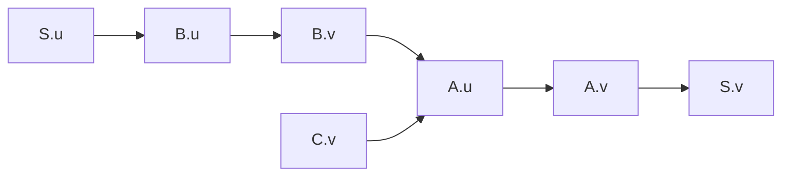
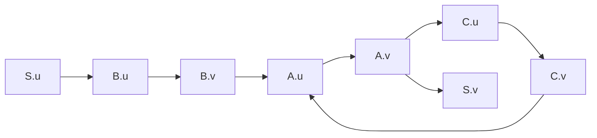

# Ex6.13 属性文法与依赖图

## Original Question

Consider the following attribute grammar:

| Grammar Rule | Semantic Rules |
| :--- | :--- |
| $S \to A B C$ | $B.u = S.u$<br>$A.u = B.v + C.v$<br>$S.v = A.v$ |
| $A \to a$ | $A.v = 2 \times A.u$ |
| $B \to b$ | $B.v = B.u$ |
| $C \to c$ | $C.v = 1$ |

*   **a.** Draw the parse tree for the string $abc$ (the only string in the language), and draw the dependency graph for the associated attributes. Describe a correct order for the evaluation of the attributes.
*   **b.** Suppose that $S.u$ is assigned the value $3$ before attribute evaluation begins. What is the value of $S.v$ when evaluation has finished?
*   **c.** Suppose the attribute equations are modified as follows:

| Grammar Rule | Semantic Rules |
| :--- | :--- |
| $S \to A B C$ | $B.u = S.u$<br>$C.u = A.v$<br>$A.u = B.v + C.v$<br>$S.v = A.v$ |
| $A \to a$ | $A.v = 2 \times A.u$ |
| $B \to b$ | $B.v = B.u$ |
| $C \to c$ | $C.v = C.u - 2$ |

What value does $S.v$ have after attribute evaluation, if $S.u = 3$ before evaluation begins?

---

## Standard Solution 标准答案

### a. 语法树、依赖图与计算顺序

#### 1. 语法分析树 (Parse Tree for $abc$)

```text
       S
    /  |  \
   A   B   C
   |   |   |
   a   b   c
```

#### 2. 属性依赖图 (Dependency Graph)

根据语义规则，各节点属性的计算依赖关系为：
1.  $B.u = S.u \implies S.u \to B.u$
2.  $B.v = B.u \implies B.u \to B.v$
3.  $C.v = 1 \implies$ 常数，无前驱依赖
4.  $A.u = B.v + C.v \implies B.v \to A.u$ 且 $C.v \to A.u$
5.  $A.v = 2 \times A.u \implies A.u \to A.v$
6.  $S.v = A.v \implies A.v \to S.v$

**Mermaid 依赖图可视化** ：



#### 3. 合法的求值顺序 (Evaluation Order)

对此有向无环图 (DAG) 进行拓扑排序，可以得到一个合法的属性计算顺序（其中之一）：
$$
\{ C.v, S.u \} \to B.u \to B.v \to A.u \to A.v \to S.v
$$

---

### b. 当 $S.u = 3$ 时的求值过程

按上述拓扑顺序依次代入计算：
1.  $C.v = 1$
2.  $B.u = S.u = 3$
3.  $B.v = B.u = 3$
4.  $A.u = B.v + C.v = 3 + 1 = 4$
5.  $A.v = 2 \times A.u = 2 \times 4 = 8$
6.  $S.v = A.v = 8$

**计算结果** ：$S.v = 8$

---

### c. 修改语义规则后的求值分析

#### 1. 依赖图中的环 (Cycle / Circular Dependency)

修改后的语义规则引入了如下依赖链：
*   $C.u = A.v \implies A.v \to C.u$
*   $C.v = C.u - 2 \implies C.u \to C.v$
*   $A.u = B.v + C.v \implies C.v \to A.u$
*   $A.v = 2 \times A.u \implies A.u \to A.v$

这将形成一个 **环路 (Cycle)**：
$$
A.u \to A.v \to C.u \to C.v \to A.u
$$

**Mermaid 依赖图可视化**：



#### 2. 双重审阅与结论

在面对这类包含环路的属性文法时，存在两种维度的标准学术回答：

##### 维度 1：编译原理理论（拓扑求值失败）
由于依赖图中存在环路 $A.u \to A.v \to C.u \to C.v \to A.u$，该属性文法是 **循环的 (Circular Attribute Grammar)** ， **不属于 L-属性文法** 。在标准的编译器实现中， **无法** 通过遍历语法树（Top-down 或 Bottom-up）来确定拓扑排序，因此 **无法进行常规的属性计算（Evaluation fails / Undefined）** 。

##### 维度 2：代数联立方程（代数定解）
如果我们把语义规则视为一组**联立方程组**，则可以通过代数化简求得唯一的数学解。
已知初始条件：
*   $S.u = 3 \implies B.u = S.u = 3 \implies B.v = B.u = 3$

联立环路方程：
1.  $A.u = B.v + C.v = 3 + C.v$
2.  $C.v = C.u - 2 = A.v - 2$
3.  $A.v = 2 \times A.u$

将上述方程代入：
$$
C.v = 2 \times A.u - 2
$$
$$
A.u = 3 + (2 \times A.u - 2)
$$
$$
A.u = 2 \times A.u + 1
$$
$$
A.u - 2 \times A.u = 1 \implies A.u = -1
$$

从而求得：
$$
S.v = A.v = 2 \times A.u = 2 \times (-1) = -2
$$

**计算结果** ：$S.v = -2$

---

## 我的答案

### 课堂手绘分析图


## 错因归类与反思

*   **编译原理理论 vs. 代数求解** ：做题时，如果题目指出是“Attribute Evaluation”（属性求值），应当主动指明 **“由于依赖图含环路，属性文法为循环文法，在编译器中无法通过拓扑排序求值”** ；然后提供 **“如果联立代数方程，可以算出解为 -2”** 。两手准备最为稳妥。
*   **继承属性的判断** ：$C.u$ 和 $B.u$ 属于继承属性（自上而下或兄弟间流向），而 $A.v, B.v, C.v$ 属于综合属性（自底向上流向）。
