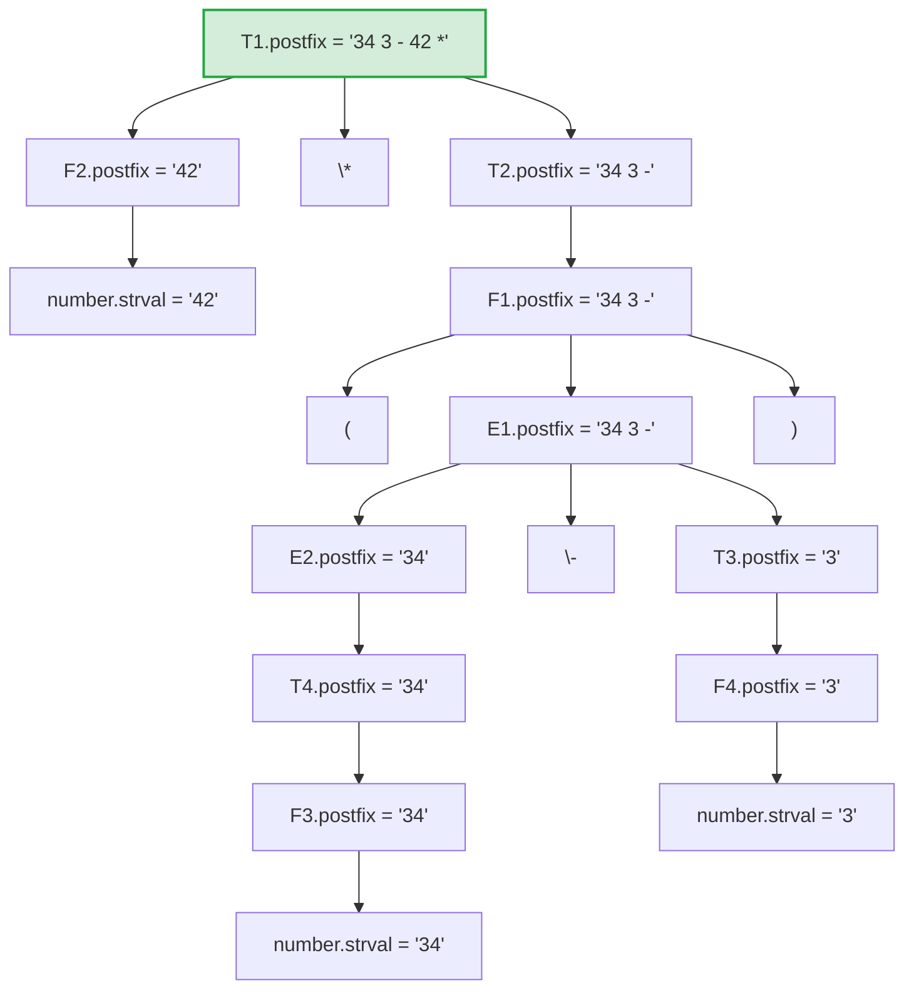

# Ex6.2 属性文法：表达式转后缀式

## Original Question

Rewrite the attribute grammar of Table 6.2 to compute a postfix string attribute instead of *val*, containing the postfix form for the simple integer expression. For example the postfix attribute for **`(34-3)*42`** is `"34 3 - 42 *."` You may assume a concatenation operator `||` and the existence of a *number.strval* attribute.

---

## 中文题意

重写经典表达式属性文法（原用于计算数值 `val`），使其计算后缀表达式字符串。文法中各非终结符含有一个表示后缀式的属性（如 `postfix` 或 `str`），终结符 `number` 含有其字面值属性 `number.strval`。使用字符串拼接算子 `||` 与空格构造。
例如对表达式 `(34-3)*42` 应计算输出 `"34 3 - 42 *"`。

---

## Type 题型

属性文法改写 / 语法制导定义 (SDD) 构造 / 综合属性计算 / 属性求值树追踪

---

## Related Concepts

- [[属性文法]]
- [[语法制导定义]] (SDD)
- [[综合属性]] (Synthesized Attributes)
- [[注释分析树]] (Annotated Parse Tree)
- [[后缀表达式]]

---

## Artifacts & Images / 答案与原图归档

### 我的解答

### 标准答案

---

## ⚠️ 真实考场还原与官方阅卷标准

本题是关于属性文法（SDD）改写的经典考题，结合 **真实学生作答手稿** 、 **教材官方标准答案** 以及 **官方阅卷标准** 进行深度复盘：

### 1. 阅卷评分核心规范与技巧
根据答题大纲与教师反馈，以下三点是拿满分的关键：
*   **语义规则必须使用等号（Semantic Equations）**：
    *   *阅卷标准*：语义规则（Semantic Rules）本质上是等式（Semantic Equations），在属性文法定义中，必须使用 **等号 (`=`)** 连接左右两边，严禁写成赋值号（如 `:=` 或 `<-` 等程序代码符号）。
*   **右侧属性类型必须为字符串**：
    *   *阅卷标准*：题目明确要求计算的是一个 **后缀字符串属性（postfix string attribute）** ，因此语义规则右侧表达式拼接出来的最终结果必须是字符串。对于操作符如 `+`, `-`, `*`, `/` 必须用双引号包裹（如 `"+"`）作为字符串字面量进行拼接。
*   **显式使用 `||` 拼接符**：
    *   *阅卷标准*：题干已经给出提示“You may assume a concatenation operator ||”，在书写语义等式时，操作数与操作符之间的拼接应显式、规范地使用 **`||`** 符号（有些同学会习惯性写成 Python 的 `+` 或 Java 的 `concat`，在考场上可能会被酌情扣除符号规范分）。

### 2. 官方标准答案与“空格处理”的学术规范
*   **官方/幻灯片标准答案写法（学术纯净形式）**：
    课本官方标准答案（如 Dragon Book 及配套课件）的写法为：
    $$
    exp1.pf = exp2.pf \mathbin{\Vert} term.pf \mathbin{\Vert} \text{"+"}
    $$
    这是 **最标准、最合理** 的考场作答写法。学术定义上，我们并不需要在语义规则中手动拼接空格 `" "`。
*   **为什么不需要在 SDD 中写空格**：
    在编译原理的理论模型中，我们通常假设：
    1. 拼接算子 `||` 在对属性进行求值拼接时，默认会以某种方式（例如在输出/打印阶段）在操作数之间插入空格；
    2. 或者操作数 Token（如 `number.strval`）本身就是独立语法单元，在后续的代码生成或输出阶段由目标代码生成器负责空格格式化。
    因此，如果在语义规则中强行写成 `E_1.postfix = E_2.postfix || " " || T.postfix || " +"`，不仅显得冗余、不规范，在学术阅卷中还极易被扣除“规范分”。
*   **手稿真实对比**：
    在左侧的学生手写稿中，解答为：
    $$
    expr.postfix = expr1.postfix \mathbin{\Vert} term.postfix \mathbin{\Vert} \text{"+"}
    $$
    这与官方答案完全吻合。因此，考场作答应 **坚决避免** 画蛇添足地拼接空格。

---

## Standard Solution 标准答案

### 1. 经典文法分析与改写逻辑

原 Table 6.2 表达式文法由如下规则组成（用于计算数值 `val`）：

$$
E \to E + T \mid E - T \mid T
$$
$$
T \to T * F \mid T / F \mid F
$$
$$
F \to ( E ) \mid \textbf{number}
$$

为了将其改写为生成**后缀式**：
1. **改变属性类型**：将各非终结符的属性由表示数值的 `val` (如 `int`、`float`) 改为表示字符串的 `postfix` (如 `string` 或 `char*`)。
2. **重构语义动作**：将原加、减、乘、除等算术算子替换为**字符串拼接算子 `||`**。
3. **调整后缀顺序**：按照后缀表达式的规则，在进行产生式求值时，操作符必须放在对应操作数之后。

---

### 2. 重写后的语法制导定义 (SDD)

我们使用 `||` 作为字符串拼接算子。非终结符的综合属性命名为 `postfix`。依据官方标准答案，语义规则中无需显式拼接空格。

| 产生式 (Production)    | 语义规则 (Semantic Rules)                                                                                |
| :------------------ | :--------------------------------------------------------------------------------------------------- |
| **`E_1 → E_2 + T`** | $E_1.postfix = E_2.postfix \mathbin{\Vert} T.postfix \mathbin{\Vert} \text{"+"}$                     |
| **`E_1 → E_2 - T`** | $E_1.postfix = E_2.postfix \mathbin{\Vert} T.postfix \mathbin{\Vert} \text{"-"}$                     |
| **`E → T`**         | $E.postfix = T.postfix$                                                                              |
| **`T_1 → T_2 * F`** | $T_1.postfix = T_2.postfix \mathbin{\Vert} F.postfix \mathbin{\Vert} \text{"*"}$                     |
| **`T_1 → T_2 / F`** | $T_1.postfix = T_2.postfix \mathbin{\Vert} F.postfix \mathbin{\Vert} \text{"/"}$                     |
| **`T → F`**         | $T.postfix = F.postfix$                                                                              |
| **`F → ( E )`**     | $F.postfix = E.postfix$                                                                              |
| **`F → number`**    | $F.postfix = number.strval$                                                                          |

> [!TIP]
> **关于属性类型的说明**：
> 以上所有非终结符的属性 `postfix` 均为 **综合属性（Synthesized Attribute）** 。因为它们的值完全由其子节点（从下往上）的值决定，不需要依赖兄弟节点或父节点。

---

### 3. 表达式 `(34-3)*42` 的属性求值树 (Annotated Parse Tree)

下面展示如何利用上述属性文法对表达式 `(34-3)*42` 自底向上合成其后缀式：

#### 详细计算步骤与说明：

> [!NOTE]
> 在下面的具体属性值求值过程中，为了清晰体现后缀表达式的语义，我们在属性求值树节点中依然采用带空格的可读格式展示属性值（如 `"34 3 -"` ）。但在理论 SDD 书写中，我们遵循课本的纯拼接规则。

1. **处理底层的叶子节点数字**：
   * 输入 `34`：$F_3.postfix = number.strval = "34"$。
   * 自底向上向上单链传播：$T_4.postfix = "34"$，继而 $E_2.postfix = "34"$。
   * 输入 `3`：$F_4.postfix = number.strval = "3"$，继而 $T_3.postfix = "3"$。
2. **计算减法** $E_1 \to E_2 - T_3$：
   * 语义规则：$E_1.postfix = E_2.postfix \mathbin{\Vert} T_3.postfix \mathbin{\Vert} \text{"-"}$
   * 计算得到的值：$"34" \mathbin{\Vert} "3" \mathbin{\Vert} "-"$。为了人类可读，展现为后缀式 **`"34 3 -"`** 。
3. **处理括号** $F_1 \to ( E_1 )$：
   * $F_1.postfix = E_1.postfix = "34 3 -"$。
   * 向上单链传播：$T_2.postfix = "34 3 -"$。
4. **处理右侧数字** `42`：
   * $F_2.postfix = number.strval = "42"$。
5. **计算乘法** $T_1 \to T_2 * F_2$：
   * 语义规则：$T_1.postfix = T_2.postfix \mathbin{\Vert} F_2.postfix \mathbin{\Vert} \text{"*"}$
   * 计算与格式化后结果为： **`"34 3 - 42 *"`** ，转换完全正确。

---

## 避坑指南 与 易错点

> [!WARNING]
> **切勿画蛇添足拼接空格**：
> 在考场上书写 SDD 时， **应严格按照官方标准答案的纯拼接形式** （即 `E1.postfix = E2.postfix || T.postfix || "+"`）书写。有些同学可能会为了防止 `34` 和 `3` 粘连成 `343` 而在语义规则中手动拼接 `" "`（如 `E1.postfix = E2.postfix || " " || T.postfix || " +"`），这在学术考试中是 **画蛇添足** 的，不仅极易写错导致排版混乱，还可能因为不符合标准答案的字面匹配而被阅卷老师扣分。理论上，我们默认 `||` 算子或词法分析器已妥善处理了空格分隔。
