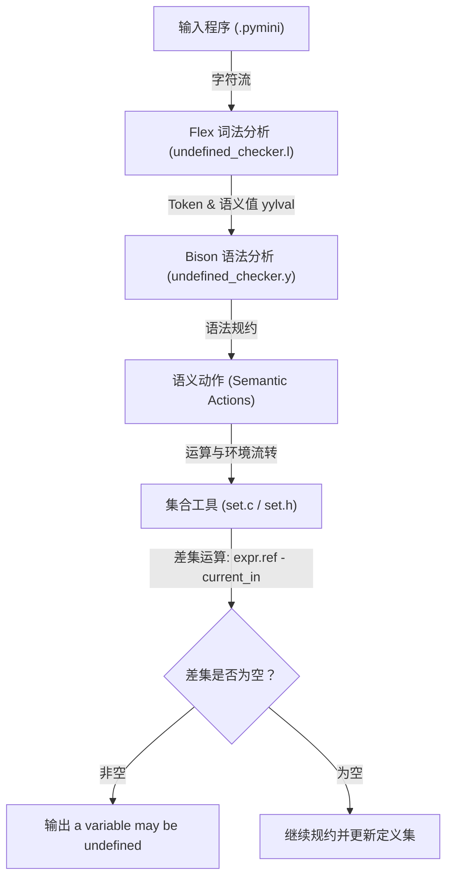

---
aliases:
- Lab 4 源码详解
- 未定义变量检查器源码剖析
- Lab4 Code Analysis
created: 2026-06-15
tags:
- 编译原理
- Flex
- Bison
- 语义分析
- 属性文法
title: Lab 4 源码详细讲解
type: concept
---

# Lab 4 源码详细讲解：未定义变量检查器

本篇笔记对 **Lab 4 (未定义变量检查器)** 系统的 4 个核心手写源码文件进行模块化、深度的剖析。

---

## 0. 🌟 整体架构与核心数据流

本实验的目标是实现一个小型的类 Python 语言的静态语义检查器。其核心任务是：**静态检测变量是否在赋值（定义）前被引用**。

整个编译与静态检查的数据流如下图所示：



在语法制导翻译中，非终结符与终结符对应的属性在代码中被建模为：
*   `expr.ref`：表达式引用的变量名集合，在代码中对应各级表达式规约返回的 `Set *`。
*   `stmt.in`：进入语句前已定义变量的集合，在代码中对应全局环境集合 `current_in`。
*   `stmt.out`：语句执行后已定义变量的集合，在代码中对应语句规约返回的 `Set *`，并被写回 `current_in`。

---

## 1. 🛠️ Set 变量集合工具 (`set.h` / `set.c`)

由于 C 语言没有标准集合库，项目手写了一个动态数组形式的字符串集合 `Set`。

### 1.1 数据结构定义
在 `set.h` 中，通过不透明指针（Opaque Pointer）隐藏了实现细节：
```c
typedef struct Set Set;
```
在 `set.c` 中定义了其实际的内部结构：
```c
struct Set {
    char **items;   /* 动态字符串数组，存储变量名 */
    int count;      /* 当前集合中元素个数 */
    int capacity;   /* 动态数组的当前容量 */
};
```

### 1.2 核心接口与语义对应关系

| 接口函数 | 核心功能 | 对应属性文法 / 语义规则 |
| :--- | :--- | :--- |
| `set_create()` | 创建空集合 $\emptyset$ | $\text{expr} \to \text{int\_const} \quad \{ \text{expr.ref} = \emptyset \}$ |
| `set_singleton(name)` | 创建单例集合 $\{ \text{name} \}$ | $\text{expr} \to \text{var} \quad \{ \text{expr.ref} = \{ \text{var.sname} \} \}$ |
| `set_clone(set)` | 深拷贝集合 | 用于保存进入分支前的环境状态，防止分支破坏性修改。 |
| `set_add(set, name)` | 向集合添加元素（去重） | $\text{stmt} \to \text{var} = \text{expr} \quad \{ \text{stmt.out} = \text{stmt.in} \cup \{ \text{var.sname} \} \}$ |
| `set_union_new(L, R)` | 求并集，返回新集合 | 用于表达式综合属性合并（如 $E_1 + E_2$）和分支合并（`then` ∪ `else`）。 |
| `set_difference_new(L, R)` | 求差集 $L - R$，返回新集合 | 检查未定义变量的核心：$\text{expr.ref} - \text{stmt.in}$ |
| `set_is_empty(set)` | 判断集合是否为空 | 对应该差集是否为 ∅ |
| `set_free(set)` | 递归释放集合及内部字符串 | C 语言手动内存管理，避免解析过程中的内存泄露。 |

---

## 2. 🔍 词法分析器 (`undefined_checker.l`)

词法分析器负责将源码切分为 Token，并利用全局变量 `yylval` 传递符号的**综合属性（语义值）**。

### 2.1 词法规则与属性绑定
```lex
"if"                       { return IF; }
"then"                     { return THEN; }
"else"                     { return ELSE; }
"fi"                       { return FI; }
{DIGIT}+                   { yylval.number = atoi(yytext); return INT_CONST; }
{ID_START}{ID_CHAR}*       { yylval.text = copy_text(yytext); return VAR; }
"+"|"<"|"="|";"|"("|")"    { return yytext[0]; }
[ \t\r\n]+                 ; /* 过滤空白 */
.                          { fprintf(stderr, "Lexical error...\n"); }
```

*   **关键字与操作符**：直接返回对应的 Token 类型（如 `IF`）或字符本身（如 `'+'`）。它们不携带语义值。
*   **字面量常量 `INT_CONST`**：将字面值转换为整型，挂载至 `yylval.number`（对应 `%union` 中的 `number` 字段）。
*   **标识符 `VAR`**：使用 `copy_text` 函数在堆中动态申请内存并拷贝变量名，挂载至 `yylval.text`（对应 `%union` 中的 `text` 字段）。这个变量名就是 `var.sname` 综合属性。

---

## 3. 🧠 语法与语义分析器 (`undefined_checker.y`)

这是整个静态语义检查器的中枢，负责处理语法推导并执行绑定的语义动作。

### 3.1 语义值通道 `%union` 与类型声明
```yacc
%union {
    char *text;     /* 对应 VAR 的变量名指针 */
    int number;     /* 对应 INT_CONST 的字面值 */
    Set *set;       /* 对应非终结符综合属性的集合指针 */
}

%token <text> VAR
%token <number> INT_CONST
%token IF THEN ELSE FI

%type <set> program stmt_list stmt expr rel_expr add_expr atom
```
通过 `%type <set>`，Bison 知道当它在值栈上操作 `expr` 或 `stmt` 时，其对应的值是一个指向 `Set` 的指针。

### 3.2 作用域与环境栈控制
解析器内部定义了以下全局状态：
```c
static Set *current_in = NULL;  /* 当前语句的 stmt.in 变量集 */
static Set *env_stack[64];      /* 环境栈，用于保存 if-else 入口状态 */
static int env_top = 0;         /* 环境栈顶指针 */
```

#### ① 顺序语句流转（继承属性的自左向右流动）
```yacc
stmt_list:
    stmt                         { $$ = $1; }
  | stmt_list ';'                { restore_env($1); } /* 中导动作 */
    stmt                         { $$ = seq_stmt($1, $4); }
  ;
```
*   **中导动作 `{ restore_env($1); }`**：在解析分号后的下一条语句前触发。它将前一个语句的输出集 `$1` 克隆给全局环境 `current_in`，实现了 $\text{stmt}_2.\text{in} = \text{stmt}_1.\text{out}$ 的继承属性流转。
*   **`seq_stmt($1, $4)`**：整个序列的输出等于最后一条语句的输出 `$4`（即 `$4` 规约后的 `stmt.out`）。

#### ② 分支语句合并（控制流分支的并集运算）
```yacc
stmt:
    VAR '=' expr                 { $$ = assign_stmt($1, $3); }
  | IF expr THEN                 { check_refs($2); push_env(current_in); } /* 中导动作 1 */
    stmt_list ELSE               { Set *saved = pop_env(); push_env(saved); restore_env(saved); set_free(saved); } /* 中导动作 2 */
    stmt_list FI                 { $$ = if_stmt($2, $5, $8); }
  ;
```
由于自底向上的分析器在规约 `IF` 时，分支语句已经解析完毕。因此必须通过中导动作在分支切换时操纵环境：
1.  **中导动作 1**：在解析条件 `expr` 后，检查 `expr` 的引用。此时 `then` 分支即将开始，我们调用 `push_env(current_in)` 将进入 `if` 前的初始定义集合存入栈中。
2.  **中导动作 2**：在 `then` 分支解析完、进入 `else` 分支前触发。由于 `then` 规约完后 `current_in` 已经变为了 `then` 分支的输出，我们必须将刚才压栈的初始环境取出（`pop_env`），重新复制回 `current_in`，确保 `else` 分支在一个干净的、未受 `then` 污染的环境下开始解析。
3.  **最终规约 `if_stmt($2, $5, $8)`**：
    ```c
    static Set *if_stmt(Set *cond_refs, Set *then_out, Set *else_out) {
        Set *base = pop_env(); /* 弹出 if 入口的初始定义集 */
        Set *branches = set_union_new(then_out, else_out); /* then.out ∪ else.out */
        Set *merged = set_union_new(base, branches);
        restore_env(merged); /* 更新全局 current_in */
        // ... 释放分支临时集合的内存
        return merged;
    }
    ```
    合并时计算：$\text{stmt.out} = \text{stmt.in} \cup \text{then.out} \cup \text{else.out}$，保证分支定义变量的顺利传播。

### 3.3 严密的内存释放（C 语言下的防御性编程）
由于没有垃圾回收，每个规约动作都必须妥善处理值栈上传递的指针。例如表达式规约：
```yacc
add_expr:
    atom                         { $$ = $1; }
  | add_expr '+' atom            { $$ = set_union_new($1, $3); set_free($1); set_free($3); }
  ;
```
*   `set_union_new($1, $3)` 会申请一个新的集合空间。
*   在把新指针赋给 `$$` 传给父节点后，子节点的旧集合 `$1` 和 `$3` 必须立即调用 `set_free` 释放，否则会造成严重的内存泄露。

---

## 4. 📝 典型执行追踪实例

以下以输入程序 `x = y + 1` 为例，追踪编译器内部的工作状态：

1.  **初始状态**：`current_in = ∅`
2.  **解析表达式 `y + 1`**：
    *   `VAR` 匹配到 `y`，综合属性为 `yylval.text = "y"`。
    *   `atom: VAR` 规约：创建单例集合 `expr.ref = {y}`，并释放字符串占用的内存。
    *   `INT_CONST` 匹配到 `1`，规约 `atom: INT_CONST`：创建空集 `expr.ref = ∅`。
    *   `add_expr '+' atom` 规约：计算 `{y} ∪ ∅ = {y}`。释放子节点集合。表达式最终返回语义值：`$3 = {y}`。
3.  **解析赋值 `x = expr`**：
    *   调用 `assign_stmt("x", {y})`。
    *   **语义检查**：计算差集 `refs - current_in` $\implies \{y\} - \emptyset = \{y\}$。
    *   **结果处理**：由于差集非空，控制台输出：
        `a variable may be undefined`
    *   **环境更新**：将 `"x"` 加入 `current_in`，更新后 `current_in = {x}`。
    *   释放 `$3` 的集合指针与左值字面量 `"x"`。
4.  **程序结束**：打印 `final defined variables = {x}`。
