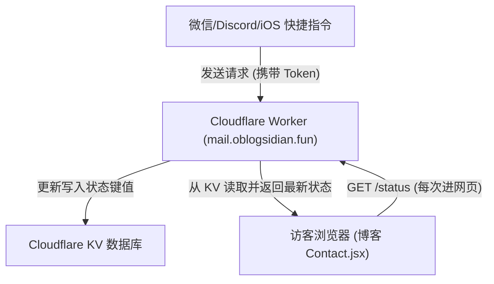

# 小屋运行天数纠偏与修仙风格实时状态管理方案

我们将调整小屋的起止日期与天数计算逻辑，并为小屋看板添加“修仙风格”的状态词典。同时，我们将设计并实现一个**完全免费、无服务器且安全的实时状态推送架构**，允许你通过 Discord / 微信 / iOS 快捷指令随时更新你的实时状态。

---

## 1. 天数与起源日期纠偏

我们将把起源日期与运行天数在代码中重新标定：
*   **想法起源于**：`2025 年 3 月`（在看板小字或说明中体现，尊重最初的创意起点）。
*   **正式重构运行起算点**：`2025 年 5 月 4 日`（五一假期重构方案的正式运行点）。
*   **运行天数**：根据 `2025-05-04` 动态计算到当前本地时间。

---

## 2. “修仙风格”状态词汇设计

我们将预设一套高人气的修仙题材动作字典。当前端拉取到对应的简写键（Key）时，会自动映射成精美且带有 emoji 的修仙文案：

| 动作简写 (Key) | 对应修仙状态文案 (Value) | 适用场景 |
| :--- | :--- | :--- |
| `coding` | `⚡ 天雷淬体，玩命修筑阵法中...` | 敲代码 / 修复Bug |
| `slacking` | `🐟 潜水摸鱼，躲避天劫中...` | 闲逛 / 摸鱼 |
| `studying` | `📜 翻阅天书，参悟大道玄机中...` | 回顾笔记 / 研读Obsidian |
| `gaming` | `⚔️ 秘境试炼，斩妖除魔中...` | 打游戏 / 娱乐 |
| `eating` | `🍵 畅饮灵茶，吞食仙果补充灵力中...` | 吃饭 / 喝茶休息 |
| `wandering` | `🚶 游历红尘，寻觅道缘中...` | 外出 / 暂离 |
| `resting` | `💤 闭关打盹，元神出窍中...` | 睡觉 / 休息 |

> [!NOTE]
> 前端将采用**“双重解析模式”**：如果拉取到的状态是字典内的 `Key`，则解析为对应的修仙文案；如果是任意其他中文字符，则作为自定义状态直接显示，保证最高灵活性。

---

## 3. 动态状态推送系统架构 (How to manage stats?)

由于你的博客是部署在 Cloudflare Pages 上的静态 React 网页，无法直接持有有状态的数据库。
我们可以通过**扩展已有的 Cloudflare Worker 代理（`mail.oblogsidian.fun`）**，利用 Cloudflare 免费赠送的 **KV (Key-Value) 存储**来实现实时状态的同步。

### 📡 架构数据流图

### 🛠️ 方案实现步骤

#### 步骤 A：修改博客前端 `Contact.jsx`
1. 声明 `activeStatus` State 变量，初始为默认值 `⚡ 天雷淬体，玩命修筑阵法中...`。
2. 在页面挂载的 `useEffect` 中，发起异步请求：`fetch('https://mail.oblogsidian.fun/status')`。
3. 获得状态键后进行字典比对，更新显示。若获取失败或网络超时，自动优雅降级为本地默认提示。

#### 步骤 B：更新 Cloudflare Worker 代码
我们将对你的 `discord-webhook-proxy` Worker 脚本进行无缝合并，加入 `/status` 路由：
-   `GET /status`：向外输出当前的实时状态。
-   `POST /status`：接收带授权 Token 的请求，将状态写入 KV 存储。
-   其余路由继续负责原有的 Discord Webhook 邮件中转工作。

#### 步骤 C：如何随时更新？（推送接口使用方式）
你可以使用以下任一方式向 Worker 推送新状态：

1.  **iOS 快捷指令 (苹果手机最方便)**：
    *   创建一个“捷径”，添加“获取 URL 的内容”操作。
    *   方法选择 `POST`，Body 写入 `{ "status": "gaming", "token": "YOUR_SECRET_TOKEN" }`。
    *   可以将捷径放到桌面，一键“打游戏”或者“摸鱼”。
2.  **Discord Bot/Webhook**：
    *   可以通过配置 Discord 的 slash command，向你的 Worker 发送请求。
3.  **微信助手 (通过 Wechaty 或快捷推送接口)**：
    *   如果你有微信个人号助手，可以用它监听你的消息，匹配到 `/status XXX` 时自动转发 POST 触发 Worker。

---

## Proposed Changes

### [personal-blog]

#### [MODIFY] [Contact.jsx](file:///d:/Yhx06/Documents/全栈学习模板/个人博客网站/personal-blog/src/pages/Contact.jsx)
- 更新 `CABIN_STATS` 默认配置和计算起算点为 `2025-05-04`，在寄语或看板副标题中标注“想法起源于 2025 年 3 月”。
- 新增 `CULTIVATION_STATES` 修仙状态字典。
- 新增 `activeStatus` state 并引入挂载时的 fetch 异步获取。

---

## 4. 验证计划

### 自动化与手动测试
1.  **天数计算校验**：本地启动项目，检查运行天数是否正确（2025-05-04 到 2026-05-29 应约为 390 天）。
2.  **优雅降级验证**：当 Worker 暂未部署新版本时，验证前端页面是否能正常工作（无报错，并展示默认的“修仙”文案）。
3.  **Worker 接口联调**：Worker 部署后，通过 API 工具（如 Postman 或命令行 cURL）发送 `POST /status`，再刷新博客页面查看状态是否像素级实时同步。
