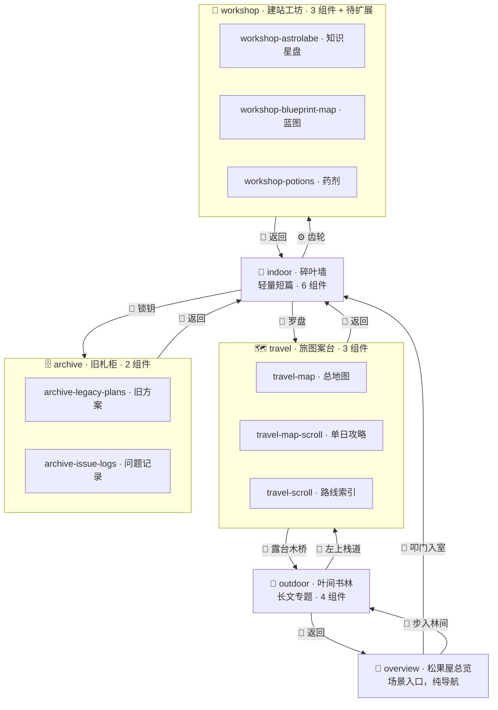

---
tags:
  - 博客
  - 素材规划
  - 内容映射
  - 交互设计
  - 博客页重制
aliases:
  - 互动组件完整手册
  - 笔记重定向指南
  - 素材内容对应表
created: 2026-05-27
updated: 2026-05-27
status: reference
replaces:
  - 博客页可互动组件与笔记重定向指南
  - 博客页素材-内容对应表
---

# 博客页互动组件与内容映射 · 完整手册

> [!abstract] 用途
> 本文档是博客页所有 18 个互动组件的**唯一权威参考**。合并了旧版"素材-内容对应表"和新版"可互动组件与笔记重定向指南"，并新增了基于 vault 现状的内容分配建议。
>
> 每次修改素材-内容绑定关系时，**只改这一份文档**。

---

## 一、互动类型速查

核心逻辑在 `Blog.jsx`，共 **5 种交互类型 + 1 种纯导航**：

| 类型 | 行为 | 用途 |
|------|------|------|
| **portal** | 切换场景 | 纯导航（门、桥、罗盘、齿轮），不触发笔记 |
| **gold / green** | 叶片预览 → 正文 | 单篇轻量笔记 |
| **bamboo / jade / scroll / map-cutout** | 文章列表 modal | 某个 collection 或筛选后的索引 |
| **articleSlug** | 直接打开正文阅读器 | 绑定单篇指定文章 |
| **filter / keyword** | 关键词过滤 | archive 抽屉专用，按标题/标签匹配 |

---

## 二、组件配置详情（18 个组件 × 5 个场景）

> 所有组件定义在 `Blog.jsx` 的 `BLOG_SCENES` 常量中。

### 2.1 indoor · 碎叶墙（6 个组件）

**场景定位：** 松果屋室内，暖光木墙，悬挂符纸。承载**轻量短篇、随笔感悟**。

| ID | 名称 | 类型 | 绑定规则 | 代码行 |
|:---|------|:--:|------|:--:|
| `gold-1` | 建站秘辛 | 🌟金叶 | `blog-design` 第 1 篇 | L213-222 |
| `gold-2` | 屋主札记 | 🌟金叶 | `blog-design` 第 2 篇 | L224-233 |
| `green-1` | 旅途随笔 | 🍃绿叶 | `travel` 中含 `随笔` 标签的首篇，否则首篇 | L235-244 |
| `green-2` | 心境碎片 | 🍃绿叶 | `travel` 中含 `随笔` 标签的次篇，否则次篇 | L246-255 |
| `green-3` | 修真见闻 | 🍃绿叶 | `travel` 第 3 篇 | L257-266 |
| `green-4` | 松果碎语 | 🍃绿叶 | `travel` 第 4 篇 | L268-277 |

> [!warning] indoor 与 travel 存在重叠
> 绿叶 4 片全吃 `travel` collection，和旅图案台场景属性重叠。**建议 indoor 的绿叶改为独立集合。**

---

### 2.2 outdoor · 叶间书林（4 个组件）

**场景定位：** 屋外森林，巨树枝桠悬挂古卷。承载**长文、专题、体系化笔记**。

| ID | 名称 | 类型 | 绑定规则 | 代码行 |
|:---|------|:--:|------|:--:|
| `bamboo-1` | 建站流程 | 🎋竹简 | `project` 全 collection | L311-320 |
| `bamboo-2` | Linux 法门 | 🎋竹简 | `linux-notes` 全 collection | L321-330 |
| `jade-1` | 织墨灵卷 | 🔮玉卷 | `weaveink` 全 collection | L331-340 |
| `jade-2` | 编译原理 | 🔮玉卷 | `compiler-theory` 全 collection | L341-350 |

---

### 2.3 travel · 旅图案台（3 个组件）

**场景定位：** 屋内旅行书案，地图与游记。承载**旅行笔记、攻略、路线**。

| ID | 名称 | 类型 | 绑定规则 | 代码行 |
|:---|------|:--:|------|:--:|
| `travel-map` | 杭州旅游地图册 | 🗺️地图扣图 | `travel` 全 collection 列表 | L373-391 |
| `travel-map-scroll` | 5月3日攻略 | 📜攻略卷轴 | `articleSlug`: `旅行/杭州旅游攻略/5月3日攻略` | L392-411 |
| `travel-scroll` | 一日游路线指南 | 📜路线卷轴 | `travel` 中标题含 `路线`/`行程`/`作战` | L412-423 |

---

### 2.4 archive · 旧札柜（2 个组件）

**场景定位：** 阁楼旧手札柜，**旧方案归档 + 问题追踪**。不承载主题文章，作为历史记录检索层。

| ID | 名称 | 类型 | 绑定规则 | 代码行 |
|:---|------|:--:|------|:--:|
| `archive-legacy-plans` | 旧方案与重制记录 | 🗄️抽屉 | `blog-design` + `project` 中标题/标签含 `旧`/`重制`/`方案`/`架构`/`设计` | L489-511 |
| `archive-issue-logs` | 问题总录与补救日志 | 🗄️抽屉 | `blog-design` + `project` 中标题/标签含 `问题`/`Bug`/`复盘`/`错误`/`修复` | L512-534 |

> [!note] 相比旧版的变化
> 旧版 archive 是 `action: search` + `action: recent`（全站搜索+最近更新）。现已改为**关键词过滤匹配**，更精准地服务于"找历史方案"和"查历史问题"两个场景。

---

### 2.5 workshop · 建站工坊（3 个组件）

**场景定位：** 魔法工作室，承载**建站笔记、技术复盘、架构文档**。

| ID | 名称 | 类型 | 绑定规则 | 代码行 |
|:---|------|:--:|------|:--:|
| `workshop-astrolabe` | Obsidian 知识星盘 | 🪐星盘 | `articleSlug`: `日常随笔/Obsidian本质理解：Markdown、HTML 与 AI 时代的知识工作流` | L560-575 |
| `workshop-blueprint-map` | 空间长廊蓝图 | 🗺️蓝图 | `articleSlug`: `博客网站/博客页-重制版/博客页空间长廊重构方案v0.2` | L576-594 |
| `workshop-potions` | 部署复盘药剂 | 🧪药剂 | `articleSlug`: `建站流程指南-静态网页/平台部署/Cloudflare Pages 部署错误复盘` | L595-613 |

---

## 三、如何修改绑定

三种方式，优先级从简单到复杂：

### 方式 1：绑定单篇笔记 (`articleSlug`)

```javascript
articleSlug: '日常随笔/Obsidian本质理解'
// 指向 content/日常随笔/Obsidian本质理解.md（不含 .md 后缀）
```

### 方式 2：绑定 collection 列表 (`collections`)

```javascript
collections: ['project']
// 或
collections: ['blog-design', 'project']
```

### 方式 3：高级过滤函数 (`filter`)

```javascript
filter: (notes) => notes.filter(n => n.title.includes('杭州'))
filter: (notes) => notes.filter(n => n.tags?.includes('diary'))
```

---

## 四、Collection 分配总览

| Collection | 归属场景 | 组件数 | 备注 |
|------------|:--:|:--:|------|
| `blog-design` | indoor（金叶） | 2 | 建站设计思路 |
| `travel` | indoor（绿叶）+ travel | 4+3 | ⚠️ 跨场景重叠 |
| `project` | outdoor（竹卷） | 1 | 建站流程 |
| `linux-notes` | outdoor（竹卷） | 1 | Linux 学习 |
| `weaveink` | outdoor（玉卷） | 1 | 织墨项目 |
| `compiler-theory` | outdoor（玉卷） | 1 | 编译原理 |
| `blog-design` + `project` | archive（抽屉） | 2 | 旧方案 + 问题记录 |
| 指定 slug | workshop（3 件） | 3 | 直接绑定 |

---

## 五、基于当前 Vault 的内容分配建议

> [!important] 背景
> 最近 vault 新增了大量内容——`内功心法`（5 篇）、`案头随感`（3 篇）、`知识杂货铺`（1 篇）、代码审查报告等。这些新内容目前**没有对应的 collection**，在博客页上无处展示。以下是分配建议。

### 5.1 新建 collection：`methodology`（内功心法）

将 `内功心法/` 目录下的所有笔记归入一个新 collection，在 outdoor 或 workshop 场景展示。

**候选笔记（5 篇）：**

| 笔记 | 适合展示的位置 |
|------|------|
| [[01_藏经阁（知识库）/Obsidian本质理解：Markdown、HTML 与 AI 时代的知识工作流]] | **已在 workshop-astrolabe** ✅ |
| [[01_藏经阁（知识库）/PPT制作新思路：AI生图做皮肤，代码画布做骨架]] | workshop 新增组件 或 outdoor 新增玉卷 |
| [[01_藏经阁（知识库）/Codex三件套：AI做PPT的最强组合]] | 同上，和 PPT 方案成对展示 |
| [[01_藏经阁（知识库）/GSAP官方AI技能包：动画短板被补上了]] | outdoor 或 workshop |
| [[01_藏经阁（知识库）/自动化知识管线：从信息捕猎到日报推送的完整闭环]] | workshop |
| [[Scrapling：一个让爬虫学会"自适应"的Python框架]] | outdoor or workshop |

**建议方案：** workshop 新增一个组件（如"内功典籍"），绑定 `methodology` collection，列出全部 6 篇。

### 5.2 案头随感 → 归入 indoor 或 travel 的绿叶

三篇老韩短剧是轻量内容，和 indoor 的"随笔感悟"定位契合。

**问题：** 当前 indoor 绿叶全绑定 `travel`。如果直接塞进去，会和旅行内容混在一起。

**建议方案 A：** 新建 `casual-notes` collection，把案头随感三篇 + 未来的轻松内容归入。indoor 的 4 片绿叶改为 2 片指 travel、2 片指 casual-notes。

**建议方案 B：** 不另建 collection，用 `filter` 按标签匹配——案头随感的三篇都打了 `#仅供娱乐` `#社会讽刺`，用 filter 把它们捞出来即可。

### 5.3 知识杂货铺 → 暂不接入或放 archive

[[01_藏经阁（知识库）/博物志（见闻与科普）/你吃的每一根香蕉都是同一棵树的克隆体|香蕉克隆]] 这篇是纯科普，和博客的"技术+旅行+建站"主题不完全匹配。建议：

- **暂不接入博客页**，保持知识杂货铺作为 vault 内的独立知识积累
- 或者放进 archive 的"旧方案"抽屉，作为"杂项归档"

### 5.4 代码审查报告 → 归入 archive-issue-logs

[[02_丹炉间（项目区）/松果屋·博客/代码审查报告-完整问题总录|代码审查报告]] 完美命中 `archive-issue-logs` 的关键词过滤规则（含 `问题`/`Bug`/`复盘`/`错误`/`修复`）。无需改动组件绑定，只需确保这篇笔记在 `project` 或 `blog-design` collection 内，就能被抽屉自动捞到。

### 5.5 workshop 组件扩展建议

当前 workshop 只有 3 件，而 `内功心法` 有 6 篇。建议新增：

| 新组件 | 类型 | 绑定 |
|------|:--:|------|
| 内功典籍 | 书本/卷轴扣图 | `methodology` collection 列表 |
| 动画魔典 | 发光书扣图 | `articleSlug`: GSAP 那篇 |
| PPT 双法 | 双面镜扣图 | filter 匹配 PPT 相关的 2 篇 |

---

## 六、场景关系总图



---

## 七、变更记录

| 日期 | 变更 |
|------|------|
| 2026-05-27 | 合并旧版素材-内容对应表和新版重定向指南，新增"基于 vault 现状的分配建议"章节 |
| 2026-05-27 | archive 组件从 search/recent 改为 legacy-plans/issue-logs |

---

## 相关文档

- [[博客页空间长廊重构方案v0.1]]
- [[博客页空间长廊重构方案v0.2]]
- [[博客页重制说明书v0.1]]
- [[右上角折叠式交互"游园星图"方案]]
- [[叶间书林场景长廊重构计划]]
- [[松果屋重构设计书]]
- [[代码审查报告-完整问题总录|代码审查报告]]
- [[内功心法_索引]]
- [[01_藏经阁（知识库）/内功心法_索引]]
