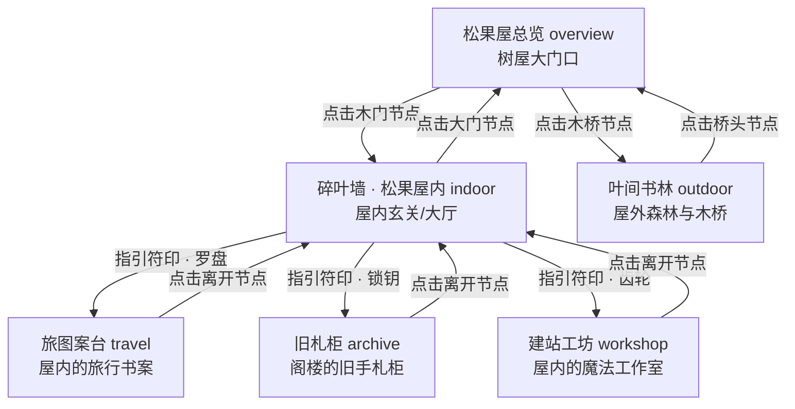

---
tags:
  - 博客
  - 重构方案
  - 空间长廊
  - 传送节点
aliases:
  - 空间长廊 3.5
  - 魔法传送节点方案
created: 2026-05-26
status: draft
version: "0.1"
---

# 空间长廊 3.5：魔法传送节点与空间网络重构方案 (Implementation Plan)

为了解决“总览页面两个大半屏卡片遮挡背景原画、UI 过于生硬”以及“其他场景缺乏空间交互关联”的痛点，我们计划重构 `/blog` 页面的空间漫游交互。

本方案的核心是将全屏遮罩卡片替换为隐于画面中的**“魔法传送节点” (Mystical Portal Nodes)**，并在六张有关联的背景图之间交织出一张逻辑通顺的空间网络。

---

## 1. 空间与叙事设计 (Spatial Logic & Narration)

六张背景图本身在内容和空间上具有完美的互补与关联，它们构成了一个“森林树屋”的整体空间：



---

## 2. 交互与 UI 设计 (UI & Interaction Design)

### 魔法传送节点 (PortalNode)
* **默认（无鼠标滑过）**：
  在背景图对应的逻辑位置（如木门、木桥、墙角）渲染一个隐秘的小发光点，四周伴有微弱的、根据场景主题色渲染的波纹扩散动画（`pulseGlow`），几乎 **100% 暴露出精美的背景原画**。
* **悬停状态**：
  * 发光点放大，粒子加速，发出璀璨的奥术微光。
  * 在发光点旁边优雅地**淡入 (Fade-in) 且微幅滑入 (Slide-up)** 一个尺寸精致的半透明卡片（羊皮纸风格，包含节点标题、故事性文字、以及引导手势）。
  * 整个页面取消了“半屏高光遮罩”，代之以局部的动态交互。

---

## 3. 修改文件列表 (Proposed Modifications)

#### [MODIFY] [Blog.jsx](file:///d:/Yhx06/Documents/全栈学习模板/个人博客网站/personal-blog/src/pages/Blog.jsx)

1. **重构 `BLOG_SCENES` 配置**：
   在各个场景的属性中加入 `portals` 传送门数组：
   * `overview`：
     * **叩门入室** (target: `indoor`)，定位在木门中心：`left: '28%', top: '50%'`。
     * **步入林间** (target: `outdoor`)，定位在木桥入口：`left: '72%', top: '52%'`。
   * `indoor`：
     * **返回大厅** (target: `overview`)，定位在左侧出口门：`left: '8%', top: '55%'`。
     * **行脚罗盘** (target: `travel`)，定位在右侧上部：`left: '88%', top: '30%'`。
     * **分类格柜** (target: `archive`)，定位在右侧中部：`left: '88%', top: '50%'`。
     * **奥术齿轮** (target: `workshop`)，定位在右侧下部：`left: '88%', top: '70%'`。
   * `outdoor` / `travel` / `archive` / `workshop` 均配备各自返回上一级场景的传送节点（例如 `target: 'overview'` 或 `target: 'indoor'`）。

2. **新增样式组件**：
   * `PortalNode`：发光圆环核心，绝对定位，配合 hover 动画。
   * `PortalGlowRing`：利用 keyframes 扩散波纹，模拟灵力脉动。
   * `PortalTooltipCard`：羊皮纸质感悬浮卡，定位在节点上方，使用 Framer Motion 实现丝滑淡入。

3. **JSX 渲染重构**：
   * 移除 `OverviewOverlay`、`OverviewHalf` 和 `EntranceCard` 的旧渲染代码。
   * 在 `SceneContainer` 下，对于当前活动的场景（不管是 `overview`、`indoor` 还是子场景），读取其配置的 `portals` 数组，并循环渲染这组魔法传送节点。
   * 点击传送节点直接触发 `changeScene(target)`，享受空间拉伸和背景渐变转场。

---

## 4. 验证方案 (Verification Plan)

### 自动验证
* 运行静态检查，确保无语法报错，并能够顺利完成打包：
  ```powershell
  npm run build
  ```

### 手动验证
* 访问 `/blog` 路径。
* 观察 `overview` 场景，确认半屏卡片已被移除，代之以大门和木桥处的两个呼吸发光节点。
* 悬停在节点上，检查羊皮纸描述卡片是否平滑浮现；点击节点，检查是否能正常在屋内、屋外之间穿梭。
* 进入 `indoor`，检查右侧是否有一排精致的传送指引，点击它们是否能直接前往“旅行案台”、“旧札柜”和“建站工坊”。
