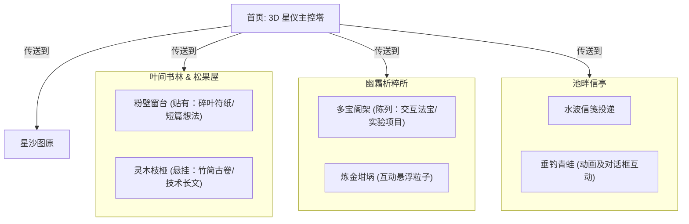

---
tags:
  - 博客
  - 全站设计
  - 重构方案
  - 松果屋
  - 叶间书林
aliases:
  - 全站重构设计企划书
  - 松果屋与叶间书林全站重构
created: 2026-05-25
status: draft
---

# 松果屋与叶间书林：全站重构设计企划书

本案旨在将当前网站（首页、博客、项目、联络、图谱）的交互界面进行深度“修仙/见习魔法师”人设重构。我们将抛弃传统扁平的网页交互组件，将每个页面转译为一个具有空间感、沉浸感、可交互的修仙或炼金场景。

---

## 一、 空间重构设想 (Spatial Layout & UX)

### 1. 【博客页】叶间书林 & 松果屋 (Blog & Notes)
*   **设计概念**：访客进入后，左侧是**松果屋的室内视点**（温馨的木屋，壁炉火光），右侧是**屋外婆娑的书林**。
*   **交互重构**：
    *   **粉壁窗台（碎叶符纸区）**：木屋的木墙 and 窗户上，贴着各种大小不一的绿色与金色的**叶片符纸（Leaf Talismans）**。鼠标浮上去，符纸会微微发光并摆动，点击即可在木屋桌案的卷轴上展开“随笔札记、灵感碎屑（Life/Thoughts）”。
    *   **灵木枝桠（竹简古卷区）**：屋外林中悬浮着由细藤缠绕的**“竹简”**、**“玉简”**与**“古卷”**。它们挂在发光的树梢上，代表较长的“技术秘籍（Tech Notes）”。点击后播放一卷古纸缓缓展开的动态效果，呈现博文正文。
    *   **林间落叶**：屏幕上方偶尔会飘下一两片泛着微光的叶片，道友点击它可以随机捕获一句“戳中道心”的奇闻逸事或灵感短句。

### 2. 【项目页】幽霜析粹所 (Projects)
*   **设计概念**：极寒冰川深处的炼金法宝工坊。
*   **交互重构**：
    *   **多宝阁展架**：页面主体是一个由冰晶与古木构筑的**多宝阁橱柜**。每个格子里盛放着一件“法宝”（例如：会发光的罗盘、漂浮的水晶球、跳动的机械齿轮），分别对应不同的开发项目。
    *   **坩埚互动**：鼠标移到某个法宝格子时，阁架下方的**炼金坩埚**会喷吐出对应色系的魔力粒子，并浮现该法宝的功能介绍（项目说明）。点击法宝则会将其“祭出”（以 3D Modal 或跳转形式展示项目详情）。

### 3. 【联络页】池畔信亭 (Contact)
*   **设计概念**：氤氲仙气缭绕的深夜池塘，一只戴着草帽的小青蛙在岸边垂钓。
*   **交互重构**：
    *   **写信手札**：联络单设计成一张泛黄的**羊皮纸手札**。
    *   **垂钓青蛙邮差**：池塘中央的主角是我们的**青蛙邮差**。写完信点击“投递”时，羊皮手札会折叠成一只飞翔的“光感纸鹤”，飞入池塘化为游鱼，随后青蛙邮差会扬起鱼竿将“游鱼信件”钓起并收入它的背篓中，以此完成投递！
    *   **趣味互动**：点击青蛙会弹出它各种碎碎念的对话气泡（例如：*“呱，今天风力正合适，又钓上来一封手札。”*）。

### 4. 【图谱页】星沙图原 (Atlas)
*   **设计概念**：松果屋内摆放的一张由闪烁星沙铺成的观星沙盘。
*   **交互重构**：
    *   把现有的关系图（GraphView）套在一个**“观星石质沙盘”**的边框中。
    *   节点变成沙盘中漂浮的一颗颗璀璨星光，线条则是连接星宿的微弱灵力丝线。

---

## 二、 需向生图工具寻求帮助的图片资源 (Image Assets & Prompts)

为了支撑起上述视觉场景，我们需要高水准、色彩饱满且带有神秘氛围的素材。以下为您整理好了最适合 AI 生图的英文提示词（Prompts）：

### 1. 灵木书林与松果屋背景 (Blog Page Backdrop)
*   **用途**：用于博客页整体背景，既有木屋的温暖，又有魔法森林的幽邃。
*   **画面设想**：从木屋窗户望向森林，或者是一栋依着巨树而建的小木屋，周围环绕着发出微光的大树，林间挂着若隐若现的书卷和发光的藤蔓。
*   **提示词 (Prompt)**:
    > `A cinematic rendering of a cozy small wooden wizard cottage built onto the trunk of a giant ancient tree, nestled in a mysterious deep-green fantasy forest. Bioluminescent leaves floating in the twilight air, glowing green and gold mushrooms on the mossy forest floor, soft ethereal mist, warm golden-amber light glowing from the cottage window. Whimsical, Ghibli vibes mixed with Octane render, highly detailed texture, 8k, aspect ratio 16:9, depth of field --ar 16:9 --v 6.0`

### 2. 松果屋内的古木墙壁与宣纸粉壁 (Talisman Wall Background)
*   **用途**：博客页左侧“碎叶符纸”悬挂区的衬底，需要极强的木质与纸质肌理。
*   **画面设想**：带有自然纹理的深色木质背景，有一些精美的藤蔓或麻绳，局部有暖黄色的烛光照亮。
*   **提示词 (Prompt)**:
    > `Detailed macro shot of an interior rustic dark wood wall in a wizard cottage, vintage texture, warm candlelight casting soft shadows from the side, some dried glowing magical herbs and hemp ropes hanging, cozy and mysterious mood, fantasy aesthetic, hyper-realistic wood grain, 8k, aspect ratio 16:9 --ar 16:9 --v 6.0`

### 3. 闲来垂钓的青蛙邮差 (Contact Page Character)
*   **用途**：联络页面正中央的核心互动人物，需要抠图使用（最好生在纯黑背景上）。
*   **画面设想**：一只憨态可掬的绿色卡通小青蛙，戴着一顶小草帽，坐在一片圆圆的绿色荷叶上，手持一根细细的竹制鱼竿在垂钓，神态惬意。
*   **提示词 (Prompt)**:
    > `A cute chubby green cartoon frog wearing a tiny traditional straw hat, sitting cross-legged on a big round green lily pad, holding a tiny bamboo fishing rod over the water, looking peaceful and relaxed. Whimsical 3D game asset style, claymation clay texture, soft studio lighting, isolated on solid black background, highly detailed, 8k --v 6.0`

### 4. 幽霜析粹所的冰川炼金台 (Projects Page Backdrop)
*   **用途**：项目页面背景，冰与火（坩埚）的视觉交融。
*   **画面设想**：一个幽蓝色的冰洞中，有一张被寒霜覆盖的沉重石台或木质工作台，台子上摆着漂浮的蓝色水晶、魔药瓶，以及一个微微发热、有金色灵气升腾的金属坩埚。
*   **提示词 (Prompt)**:
    > `A mystical glacial cave laboratory, walls made of glowing blue ice crystals. A sturdy dark ancient wood alchemist workbench covered with frost, featuring colorful magical potion bottles, glowing floating crystals, and a small glowing alchemist crucible with golden sparks rising from it. Frozen fantasy theme, cinematic lighting, octane render, 8k, aspect ratio 16:9 --ar 16:9 --v 6.0`

### 5. 观星石质沙盘边框 (Atlas Page Frame)
*   **用途**：作为知识图谱外层的立体质感框体。
*   **画面设想**：一个古代石盘，边缘刻有神秘的符文和星盘刻度，中心是空的，可以用来透出我们自己的 D3 关系图。
*   **提示词 (Prompt)**:
    > `An ancient round stone astrolabe table, top-down view, center is hollow, the stone rim is carved with mysterious magic runes and celestial map coordinates, glowing gold engraving in the cracks, dark slate texture, wizard tool, fantasy game UI asset, isolated on black background, 8k --v 6.0`
