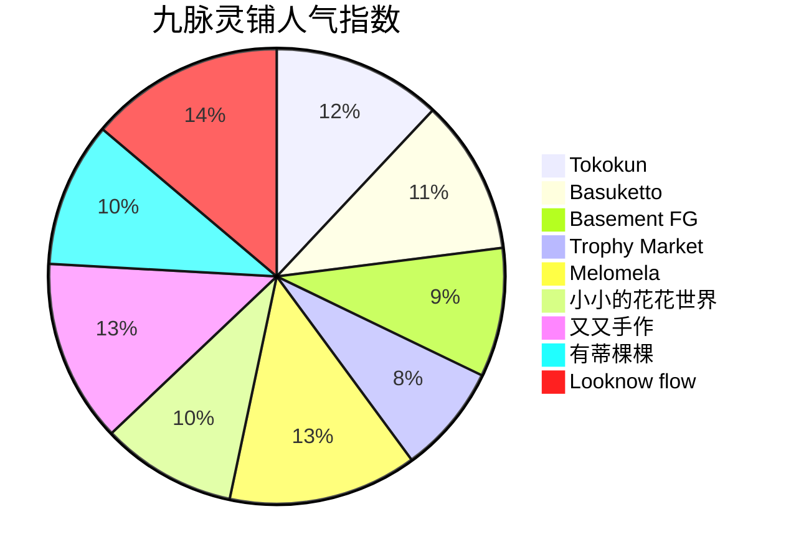

# 🐸蛤蟆祥的凡尘散心记：九脉灵铺速览手札

## 🌟 0. 原始卷轴
[[2026-05-29_淮海路凡尘散心·九脉灵铺速览手札]]

## 🧭 1. 路线总览

## 🎁 2. 店铺星标图谱

## 📚 3. 小白补课区
**什么是Citywalk？**  
想象你变成一只会飞的猫，背上没有GPS定位器，靠直觉在城市里跳房子。Citywalk就是这种自由探索模式，重点不是走多远，而是发现转角处的惊喜。

**探店玄学三定律：**
1. **黄金傍晚定律**：17:00-19:00的自然光是出片神器
2. **店铺呼吸节奏**：每家店停留3-5分钟，像品茶一样感受空间韵律
3. **意外收获法则**：拐角处的无名小店往往藏着宝藏

## 🧩 4. 关键概念/事实整理
| 店铺名称          | 门派特色                  | 修炼秘籍（Tips）                     | 人气指数 |
|-------------------|---------------------------|--------------------------------------|----------|
| Tokokun           | 玩具洞天                  | 小院光影最佳拍摄时段16:30-17:30       | ★★★★☆    |
| Basuketto         | 串珠仙坊                  | 试戴三件不同风格饰品组合              | ★★★★☆    |
| Basement FG       | Hello Kitty中古阁         | 圣诞树撤下后露出隐藏款陈列区          | ★★★★☆    |
| Melomela          | 韩系镜阁                  | 必拍「镜面反射+模特人偶」组合构图     | ★★★★★    |
| 又又手作          | 珠玑道观                  | 体验「金鱼缸前手链DIY」仪式感         | ★★★★★    |
| Looknow flow      | Jellycat阶梯              | 16:00后灯光亮起时拍摄最佳            | ★★★★★    |

## 🧙 5. 修炼心法
**蛤蟆祥的探店三式：**

**避坑指南：**
- 避免在10:00-12:00时段探店（中古店可能补货）
- 古着店建议携带3-4个不同风格的搭配方案
- 手作店体验需预留至少45分钟制作时间

## 🌈 6. 修炼后记
蛤蟆祥摸着圆滚滚的肚子总结：这条路线就像一串珍珠项链，每家店铺都是独特的珍珠。建议搭配「下午茶+探店」套餐，从Tokokun的玩具洞天开始，以Looknow flow的Jellycat阶梯收尾，完美完成一次城市修行。记得带好广角镜头，这里的每个转角都可能遇见惊喜哦~ 🐸✨