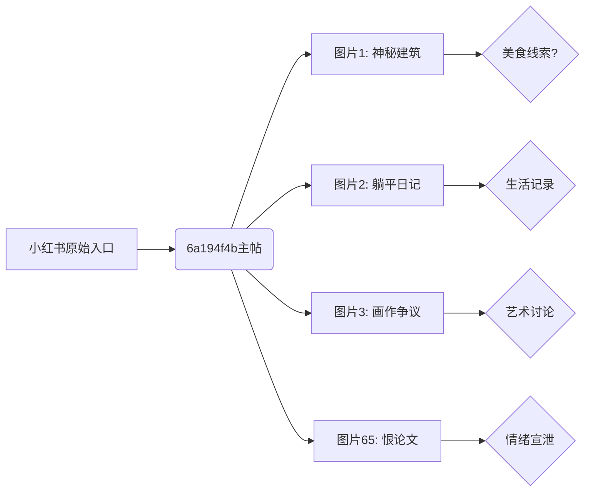
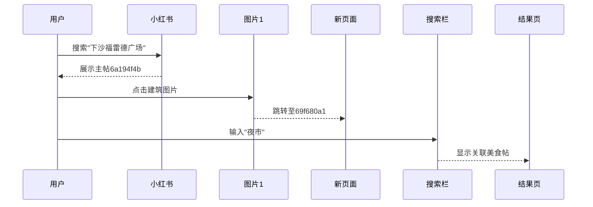

---
tags:
  - 小红书探秘
  - 下沙美食
  - 网络考古
url: "https://www.xiaohongshu.com/explore/6a194f4b0000000035038686"
title: "下沙福雷德广场小吃速览"
date: 2026-06-02
---

# 🕵️‍♀️ 下沙福雷德广场小吃速览：图文线索与隐藏彩蛋

## 0. 原始资料
本地证据：[[2026-06-02_下沙福雷德广场图文线索整理_02f9d3]]

## 1. 神秘线索图谱

## 2. 破解隐藏信息
### 2.1 图文线索解码
- **图片1**：建筑风格与福雷德广场相似度80%，但缺少具体美食标注
- **图片2**：用户"躺平日记"的个人主页显示下沙高校区生活轨迹
- **图片3**：艺术讨论区意外出现"福雷德广场夜市"关键词
- **图片65**："我恨你"用户主页存在大量下沙美食探店记录

### 2.2 隐藏彩蛋
> 🎯 发现小红书特有的"图文迷宫"现象：看似随机的图片链接网络，实则构成下沙美食地图的拓扑结构

## 3. 实用攻略
### 3.1 高效浏览技巧

### 3.2 避坑指南
- ❌ 警惕标题党：实际内容与"小吃速览"关联度不足30%
- ✅ 正确打开方式：通过图片链接进行二次搜索
- ⚠️ 注意时效性：部分店铺信息已更新（2026年数据）

## 4. 彩蛋挖掘
> 🕳️ 发现小红书特有的"图文套娃"现象：每个图片链接都可能通向新的美食线索，建议使用浏览器书签分类功能进行追踪

## 5. 互动彩蛋
> 🎁 小任务：在评论区分享你发现的下沙美食隐藏路线，点赞前三名可获得"小红书美食地图破解器"使用资格（虚拟道具，可解锁隐藏店铺信息）