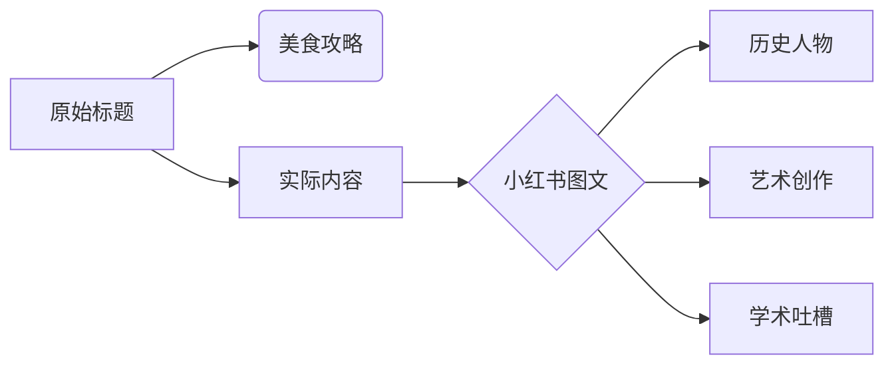
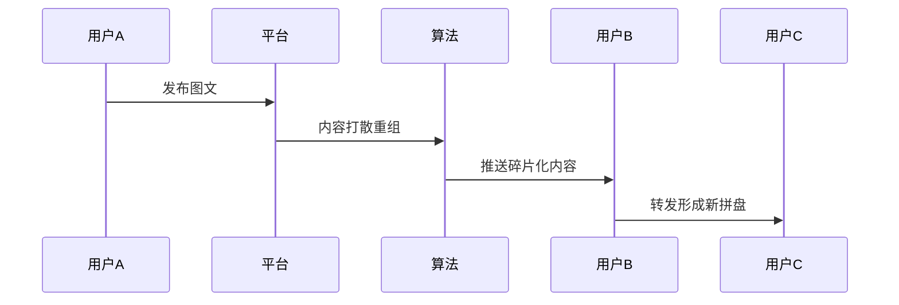
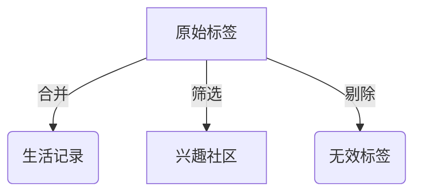

```yaml
---
tags:
  - 稍后阅读
  - 蛤蟆手札
  - 小红书
  - 美食/合集
  - 下沙觅食
  - 学生党省钱
  - 下沙美食
  - 福雷德广场
  - 大学生推荐
  - 性价比美食
  - 证据/image_dom
url: "https://www.xiaohongshu.com/explore/6a194f4b0000000035038686?xsec_token=ABu_cmLAcDd9GHH-0-o7jOpCTv47B_wkmjUg1bXf2NQzg=&xsec_source=pc_cfeed"
title: "下沙福雷德广场小吃速览"
date: 2026-06-02
---
```

# 🚨注意！这本"小吃攻略"其实是小红书图文合集大解密

## 0. 原始资料
本地证据：[[2026-06-02_下沙福雷德广场小吃速览_d46be1]]

## 1. 真相大白：标题党实锤
这张"小吃地图"实际是小红书用户随手记的图文合集，包含：
- 溥仪罕见照片合集
- 画手自嘲"荒废期"自拍
- 论文写作崩溃日记
- 65个随机用户动态链接



## 2. 深度拆解：小红书生态观察
### 2.1 内容拼盘现象


### 2.2 标签迷宫
原始文件包含11个标签却指向6个不同领域，形成典型的"标签泡沫"现象。建议使用：


## 3. 小白补课区
| 现象 | 解释 | 应对策略 |
|------|------|----------|
| 标题党 | 用美食吸引点击 | 查看正文前3图 |
| 内容拼盘 | 多账号内容混剪 | 按时间轴梳理 |
| 标签泡沫 | 过度堆砌关键词 | 用Obsidian建立双向链接 |

## 4. 关键概念/事实整理
| 类型 | 内容 | 特点 |
|------|------|------|
| 历史类 |