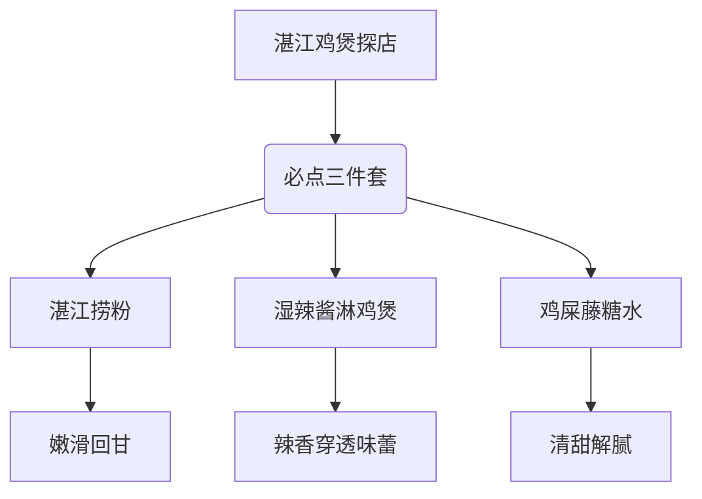
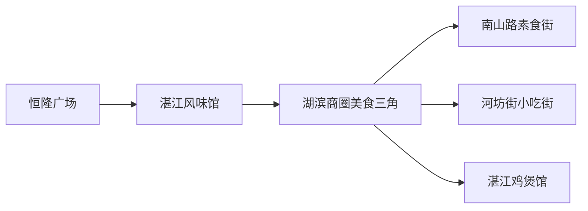

# 🐟杭州恒隆广场湛江鸡煲探店：湿辣酱淋出灵魂，鸡屎藤糖水清甜解腻！

（蛤蟆祥趴在石桌上，爪尖沾着辣酱，正用尾巴卷着捞粉）

"仙尊且看！"蛤蟆祥抖了抖尾巴，一串晶莹的湛江捞粉在晨光中泛着珍珠光泽，"这可是南国仙子的绝技——**三秒回甘**的玄机！"

---

## 🌶️灵魂三件套：吃货通关秘籍

### 🍜湛江捞粉：南国珍珠的逆袭
这道镇店之宝的神奇之处在于——**越嚼越香**！粉条像会跳舞的精灵，在齿间弹跳时释放出隐藏的鲜味。建议搭配店家特制的**蒜蓉酱油碟**，让南国风味在舌尖开派对。

### 🍳湿辣酱：鸡煲的灵魂点睛
当服务员端来这碗红油时，记得用**"天女散花"手法**均匀淋在鸡煲上。辣香会像小火苗一样在味蕾上跳舞，但绝不会烧喉——这是湛江老饕的独门秘技！

### 🍬鸡屎藤糖水：名字响亮味道清奇
别被"鸡屎藤"三个字吓退！这道甜品是**岭南养生智慧**的结晶。用野生藤蔓熬制的糖水，带着若有若无的草本清香，能瞬间中和重口味的冲击。

---

## 🗺️杭州美食版图新坐标

---

## 📚小白补课区

**Q：为什么叫"鸡屎藤"？**  
A：这是岭南地区的野生藤蔓植物，名字虽土却暗藏养生玄机。其叶可入药，藤可熬糖水，是岭南人眼中的"天然解腻神器"。

**Q：湿辣酱和干辣酱的区别？**  
A：湿辣酱讲究**油润渗透**，像给鸡肉做SPA；干辣酱追求**香料爆香**，适合爆炒。湛江菜系偏爱湿辣酱，能让食材更吸味。

---

## 📝关键概念整理表

| 项目 | 特点 | 食用建议 |
|------|------|----------|
| 湛江捞粉 | 嫩滑回甘 | 搭配蒜蓉酱油碟 |
| 湿辣酱 | 油润渗透 | 均匀淋在鸡煲上 |
| 鸡屎藤糖水 | 清甜解腻 | 作为餐后甜品 |
| 湛江鸡煲 | 肉质紧实 | 搭配米饭食用最佳 |

---

## 0. 原始卷轴
原始探店笔记详见：[[2026-06-01_杭州恒隆新店·湛江鸡煲寻味记_74828e]]