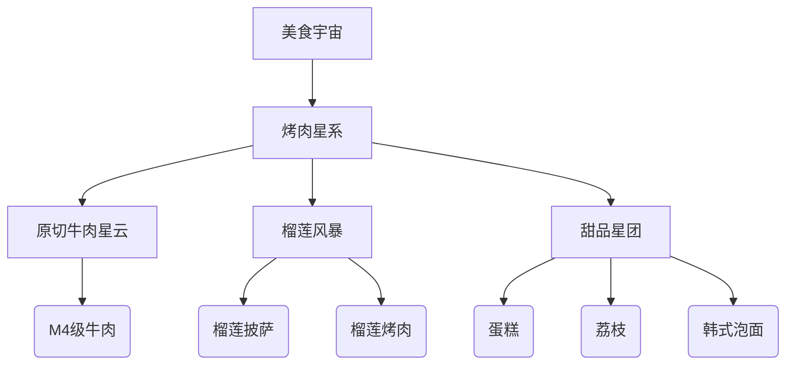
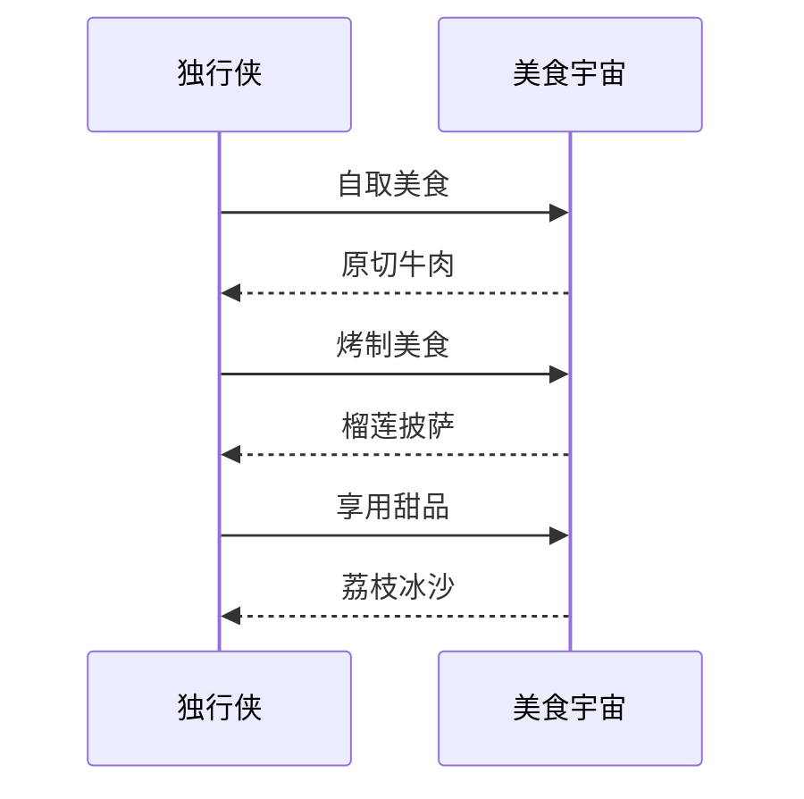

---
tags:
  - 美食探店
  - 杭州美食
  - i人专属
  - 烤肉自助
  - 一人食
url: "https://www.xiaohongshu.com/explore/6a1969bf0000000036032ed5?xsec_token=ABu_cmLAcDd9GHH-0-o7jOpH7MHRlcXQwHCjKFDTzzjYU=&xsec_source=pc_cfeed"
title: "i人狂喜！杭州烤肉自助秘境大揭秘"
date: 2026-06-01
---

# 🍖i人狂喜！杭州烤肉自助秘境大揭秘：榴莲披萨+100种美食的神仙组合

## 🐸蛤蟆祥的美食宇宙观测报告

（伸个懒腰）呱...仙尊万安！今日小蛤在杭州丁桥发现了一处i人专属的美食秘境，简直是独行侠的天堂！让我们用美食雷达扫描一下这个"烤肉宇宙"的奥秘：

## 📍秘境坐标
📍 **杭州·丁桥烤肉自助道场**  
（具体门牌号需仙尊移步原帖细观）

## 🌟i人专属的美食心法
1. **原切无为法**  
   主打M4级原切牛肉，肉质鲜嫩如云，仿佛在舌尖跳华尔兹

2. **榴莲破境丹**  
   榴莲控的终极奥义！榴莲烤肉与榴莲披萨双修，甜咸交织的味觉风暴

3. **百味归一境**  
   100+种品类的美食矩阵，从韩式泡面到鲜荔枝，应有尽有

## 🍽️一人食的终极浪漫

## 🍇小白补课区
| 术语 | 解释 |
|------|------|
| i人 | 内向型人格，喜欢独处的美食探索者 |
| 烤肉自助 | 自助式烤肉餐厅，可自由取用各类食材 |
| M4级牛肉 | 牛肉的大理石花纹等级，代表肉质鲜嫩度 |

## 📦关键美食清单
| 美食类型 | 推荐指数 | 特色描述 |
|----------|----------|----------|
| 原切牛肉 | ⭐⭐⭐⭐ | M4级，肉质鲜嫩 |
| 榴莲披萨 | ⭐⭐⭐⭐⭐ | 榴莲控的终极享受 |
| 韩式泡面 | ⭐⭐⭐ | 配烤肉绝配 |
| 荔枝冰沙 | ⭐⭐⭐⭐ | 清爽解腻 |

## 📚原始卷轴
[[2026-06-01_杭州i人烤肉自助参悟录_57cd4d]]