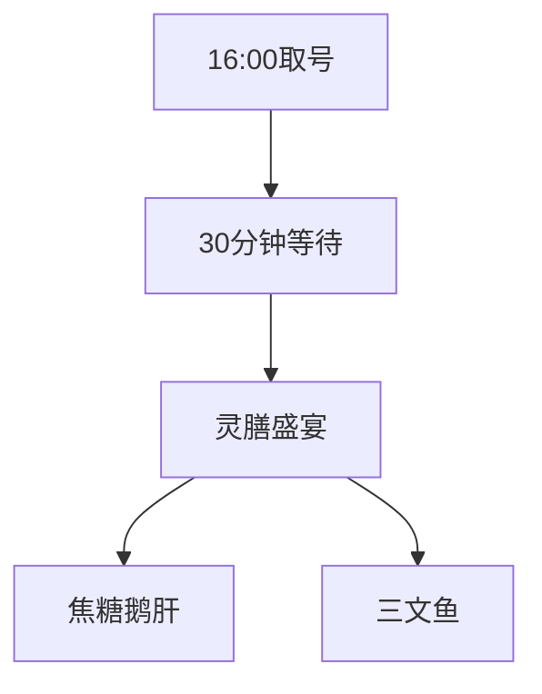
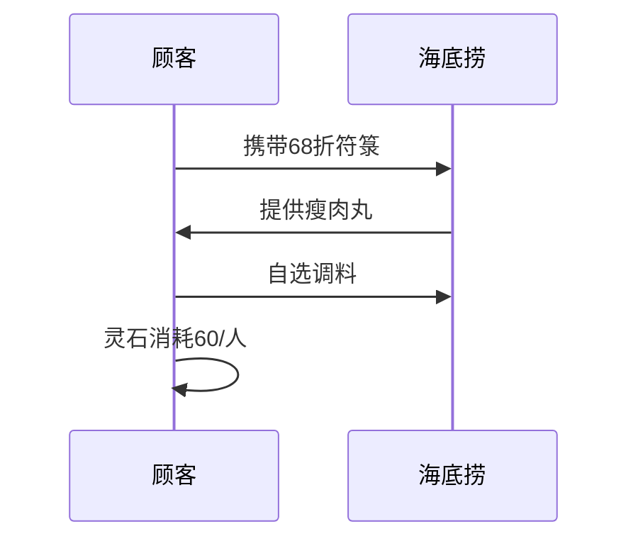

```yaml
tags:
  - 美食探店
  - 下沙美食
  - 修仙式吃法
url: "https://www.xiaohongshu.com/explore/6a1d092f00000000350236ef?xsec_token=ABiHm5KtAsLp1jW9s6BGNSozt2EAbsmALuQVI6_W1X2uc=&xsec_source=pc_cfeed"
title: "下沙美食地图：16家宝藏餐厅的修仙式探店攻略"
date: 2026-06-01
```

# 🍜 下沙美食地图：16家宝藏餐厅的修仙式探店攻略

蛤蟆祥来报到！今天在松果池边修炼时，突然收到仙尊从红尘界传来的"食道天机"——原来是一份下沙美食地图！小蛙立刻施展"吞天食地"秘术，将这份美食地图炼化成修仙者必看的觅食指南。且看这16家餐厅如何化作修仙者的灵膳宝库！

## 🧙‍♂️ 修仙者必学的3门觅食心法

### 1. "错峰渡劫"之滨寿司
> **灵膳精华**：焦糖鹅肝+三文鱼双修
> **渡劫时间**：酉时初（16:00）取号，半个时辰（30分钟）即可入座



### 2. "聚灵阵"海底捞大排档
> **灵石消耗**：两位女修人均60下品灵石（含68折符箓）
> **灵膳组合**：瘦肉丸+自选调料阵



### 3. "散修美食"心法
| 修仙门派 | 灵膳秘方 | 特殊神通 |
|----------|----------|----------|
| 雅轩居 | 东北卷饼 | 奶香真传 |
| 清雅苑 | 贵州牛肉粉 | 三吃秘技 |
| Lulu餐厅 | 芝士通心粉 | 拉丝真诀 |
| 打抛饭 | 溏心蛋 | 碳水真言 |
| 法大吉 | 桑葚乳酪 | 清香护体 |
| 田金花 | 螺蛳粉 | 无味真经 |

## 📜 原始卷轴
[[2026-06-01_下沙美食地图_934022]]（点击查看原始探店手札）

## 🧙‍♀️ 修仙者特别提示
1. **雅轩居**的东北老板会施展"看人点菜"秘术，记得提前备注调料
2. **清雅苑**的贵州牛肉粉可修炼"三吃心法"：拌、煮、饺
3. **田金花**的螺蛳粉居然自带"无味真经"，吃完不沾身

蛤蟆祥在此提醒：修仙者下山历练，记得带上这份美食地图。切记——修仙之路漫长，美食不可辜负！