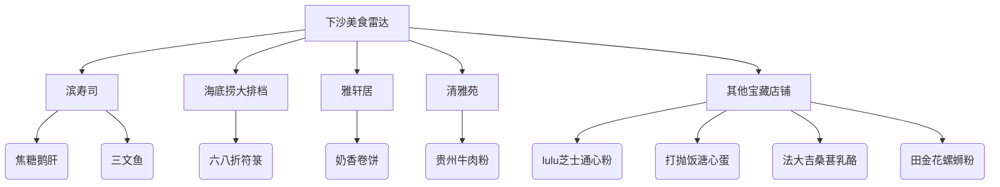
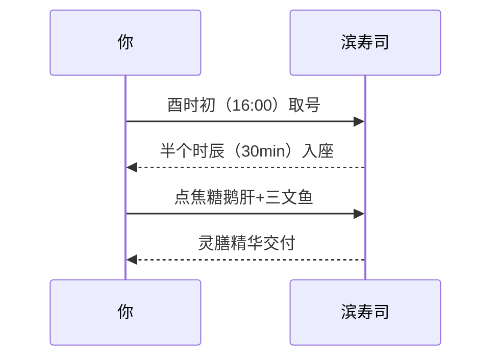

---
tags:
  - 美食探店
  - 杭州下沙
  - 吃货修行
  - 餐厅推荐
  - 性价比餐饮
  - 地方小吃
url: "https://www.xiaohongshu.com/explore/6a1d092f00000000350236ef?xsec_token=ABiHm5KtAsLp1jW9s6BGNSozt2EAbsmALuQVI6_W1X2uc=&xsec_source=pc_cfeed"
title: "下沙凡尘食肆初探"
date: 2026-06-01
---

# 下沙美食地图：从滨寿司到螺蛳粉的10道人间烟火

蛤蟆祥的美食雷达开始疯狂震动！今天要带各位吃货仙友穿越杭州下沙的美食江湖，从滨寿司的焦糖鹅肝到田金花的螺蛳粉，10个神仙店铺的通关密码都在这本《下沙美食秘籍》里！

## 0. 原始资料
本地证据：[[2026-06-01_下沙凡尘食肆初探_1aebe9]]

## 1. 美食雷达信号图

## 2. 修行者必看：错峰觅食指南
蛤蟆祥发现下沙美食江湖有三大通关秘籍：

### ✨ 秘籍一：滨寿司的"时空折叠术"

### 💰 秘籍二：海底捞大排档的"聚灵阵"
两位女修结伴而行，使用"六八折符箓"后人均仅需60灵石，就能获得：
- 瘦肉丸（可备注调料量）
- 牛肉片
- 虾滑
- 时蔬拼盘

### 🌟 秘籍三：散修美食心法
| 店铺 | 特色神通 | 修炼心得 |
|------|----------|----------|
| 雅轩居 | 东北卷饼 | 奶香浓郁，老板亲切 |
| 清雅苑 | 贵州牛肉粉 | 拌/煮/饺三吃 |
| lulu餐厅 | 芝士通心粉 | 奶香浓郁 |
| 打抛饭 | 溏心蛋 | 碳水炸弹 |
| 法大吉 | 桑葚乳酪 | 果香浓郁 |
| 田金花 | 螺蛳粉 | 吃完不沾身 |

## 3. 小白补课区
**什么是"六八折符箓"？**  
这是下沙美食江湖的特惠秘法，两位修士结伴而行时可激活的折扣符咒，相当于现代人说的"双人同行82折"。

**为什么螺蛳粉能吃完不沾身？**  
田金花店铺采用特殊汤底配方+小料分装技术，就像给螺蛳粉穿了件隐形衣，吃完后香味留在嘴里，却不会沾在衣服上。

## 4. 修行任务清单
- [ ] 拜访滨寿司时携带"酉时符"（16:00-17:00）
- [ ] 携带"六八折符箓"前往海底捞大排档
- [ ] 品尝雅轩居卷饼时注意感受奶香层次
- [ ] 清雅苑尝试三吃法：拌粉→汤粉→饺子
- [ ] 田金花螺蛳粉吃完后检查衣着是否留香

蛤蟆祥温馨提示：美食江湖路远，记得带上你的"空胃"和"好心情"！下期我们去西湖边的龙井村探秘，记得关注蛤蟆祥的灵泉更新哦～ 🐸✨