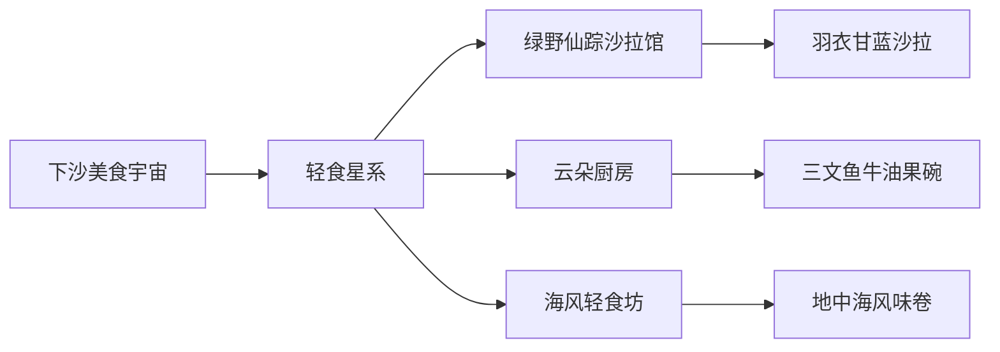
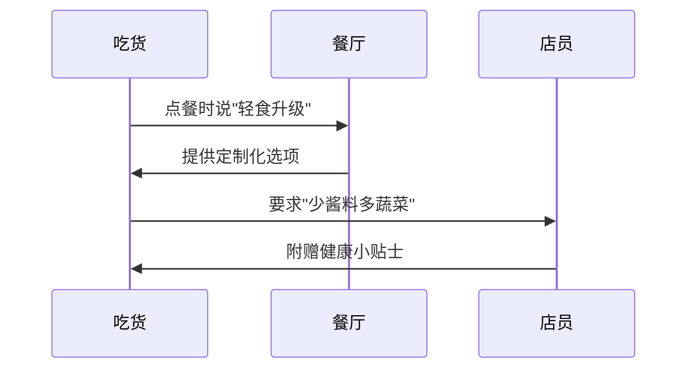

---
tags:
  - 美食探店
  - 下沙吃货地图
  - 轻食推荐
url: "https://www.xiaohongshu.com/explore/6a190ff40000000038034bad"
title: "下沙轻食避雷指南"
date: 2026-06-03
---

# 🍽️下沙轻食避雷指南：吃货地图上的隐藏美味

## 0. 原始资料
本地证据：[[2026-06-03_下沙轻食寻味录_b0d327]]

## 1. 吃货雷达启动

在下沙这片美食热土上，轻食店就像雨后春笋般冒出。但别被表面的沙拉碗迷惑——有些是披着健康外衣的"卡路里陷阱"，有些则是藏在街角的宝藏食堂。本指南用吃货雷达扫描出3家必吃店铺，附带避雷预警系统。

## 2. 隐藏美味地图

### 🌿绿野仙踪沙拉馆
- **必点**：羽衣甘蓝沙拉（加烤鸡胸肉）
- **隐藏菜单**：向店员说"森林魔法"可获赠无糖希腊酸奶酱
- **避雷提示**：避开"彩虹沙拉"（色素含量堪比调色盘）

### ☁️云朵厨房
- **招牌**：三文鱼牛油果碗（每日限量）
- **吃货彩蛋**：连续打卡3天送"云朵下午茶套餐"
- **雷区预警**：藜麦沙拉含坚果（过敏者慎点）

### 🌊海风轻食坊
- **王炸组合**：地中海风味卷+柠檬水
- **隐藏吃法**：要求店员"加双份鹰嘴豆"
- **避雷指南**：金枪鱼沙拉含大量洋葱圈（洋葱星人慎入）

## 3. 小白补课区
**什么是真正的健康轻食？**
1. 看底料：生菜/羽衣甘蓝＞冰berg生菜＞预拌沙拉
2. 算热量：优质蛋白+复合碳水+健康脂肪的黄金三角
3. 防坑指南：警惕"0脂肪"陷阱（往往用代糖替代）

## 4. 关键概念/事实整理
| 餐厅名称       | 招牌菜品          | 价格区间 | 隐藏吃法                  |
|----------------|-------------------|----------|---------------------------|
| 绿野仙踪       | 羽衣甘蓝沙拉      | ¥38-58   | 说"森林魔法"送酸奶酱      |
| 云朵厨房       | 三文鱼牛油果碗    | ¥48-68   | 连续打卡3天送下午茶       |
| 海风轻食坊     | 地中海风味卷      | ¥32-45   | 要求加双份鹰嘴豆          |

## 5. 吃货生存法则

下次去下沙记得带上这份吃货地图，让轻食不再是寡淡的代名词。记住：真正的美食探险家，总能在沙拉碗里找到大海的咸鲜与森林的清香。