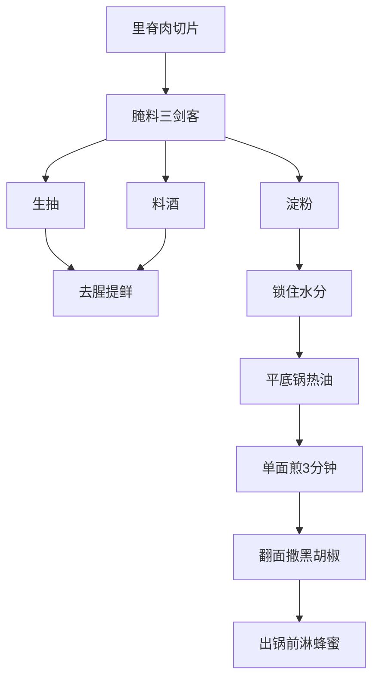

# 厨房小白秒变厨神！妈妈牌香煎里脊肉的美味真谛大揭秘


## 0. 原始资料
本地证据：[[2026-06-01_妈妈牌香煎里脊肉的美味真谛_55e637]]

## 1. 神秘配方大公开


## 2. 妈妈的独门秘籍
- **黄金厚度**：像手机屏幕一样薄（约2mm），煎出来才像云朵般蓬松
- **油温玄学**：听到"滋啦"声像雨打芭蕉，就是下锅的最佳时机
- **翻面哲学**：像对待初恋一样温柔，每面煎3分钟别急躁

## 3. 小白补课区
| 厨房术语 | 科学解释 | 生活化比喻 |
|---------|---------|------------|
| 淀粉锁水 | 形成保护膜防止水分蒸发 | 给肉片穿防水外套 |
| 热锅冷油 | 防止粘锅的魔法咒语 | 给锅子涂防晒霜 |
| 蜂蜜上色 | 美拉德反应的艺术 | 给肉片画腮红 |

## 4. 避坑指南
- ❌ 别用冷冻肉！就像用过期面膜，口感会"拔干"
- ⚠️ 腌制时间控制在15分钟，超过就像泡面煮太软
- ✅ 必备神器：硅胶铲（比铁铲更会"哄"肉片）

## 5. 进阶玩法
```mermaid
sequenceDiagram
    用户->>锅具：预热3分钟
    锅具->>用户：发出滋啦声
    用户->>肉片：撒上孜然粒
    肉片->>空气：飘出烧烤香气
    用户->>盘子：摆盘成爱心形状
    家人->>用户：发出狼吞虎咽音效
```

下次家庭聚餐，用这招让全家以为你报了米其林私教课！记得拍照发朋友圈时配文："原来幸福就是妈妈的味道，只不过这次是用平底锅复刻的~"