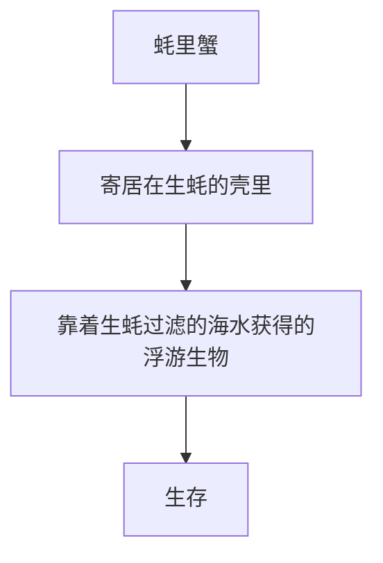

---
tags:
  - 美食探秘
  - 海鲜盲盒
  - 抖音创意
  - 生蚝
  - 蚝里蟹
  - 美食猎奇
  - 开盲盒
  - 极限挑战
  - 食味录（美食与探店）
url: "https://www.douyin.com/video/7644538983430507786"
title: "寻味蚝里蟹：开盲盒与海洋奥秘"
date: 2026-05-31
---

# 寻味蚝里蟹：开盲盒与海洋奥秘

## 0. 原始资料
本地证据：[[2026-05-31_寻味蚝里蟹：开盲盒与海洋奥秘_ac8d80]]

## 1. 开盲盒的诱惑
开盲盒是一种什么样的体验？是不是像在海洋中探索未知的奥秘？我们来看看这个视频中的人物是如何开盲盒的。

```sequenceDiagram
participant 观众 as "观众"
participant 主人公 as "主人公"
note right of 主人公: "开盲盒"
观众->>主人公: "开盲盒"
主人公->>观众: "有没有开盲盒啊"
```

## 2. 蚝里蟹的奥秘
蚝里蟹是一种什么样的生物？它为什么会寄居在生蚝的壳里？我们来看看这个视频中的人物是如何解释蚝里蟹的奥秘的。



## 3. 小白补课区
### 什么是蚝里蟹？
蚝里蟹是一种寄居蟹，通常寄居在生蚝的壳里。

### 什么是生蚝？
生蚝是一种贝类，常年被蚝里蟹吸取养分。

### 什么是遮遮宝？
遮遮宝是一种海鲜，常用来做菜。

## 4. 关键概念/事实整理
| 名称 | 描述 |
| --- | --- |
| 蚝里蟹 | 寄居蟹，通常寄居在生蚝的壳里 |
| 生蚝 | 贝类，常年被蚝里蟹吸取养分 |
| 遮遮宝 | 海鲜，常用来做菜 |

## 5. 美味的体验
最后，我们来看看这个视频中的人物是如何享受美味的体验的。

```sequenceDiagram
participant 观众 as "观众"
participant 主人公 as "主人公"
note right of 主人公: "吃蚝里蟹"
观众->>主人公: "好吃吗"
主人公->>观众: "非常好吃"
```

请点赞、订阅、转发、打赏支持明镜与点点栏目！