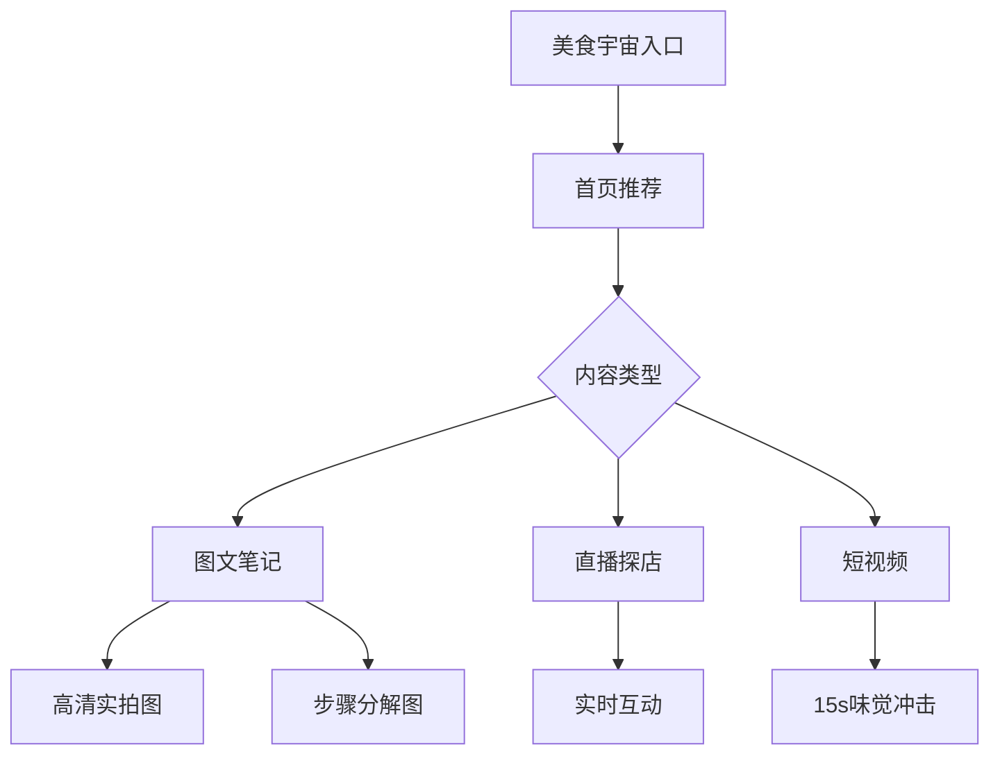
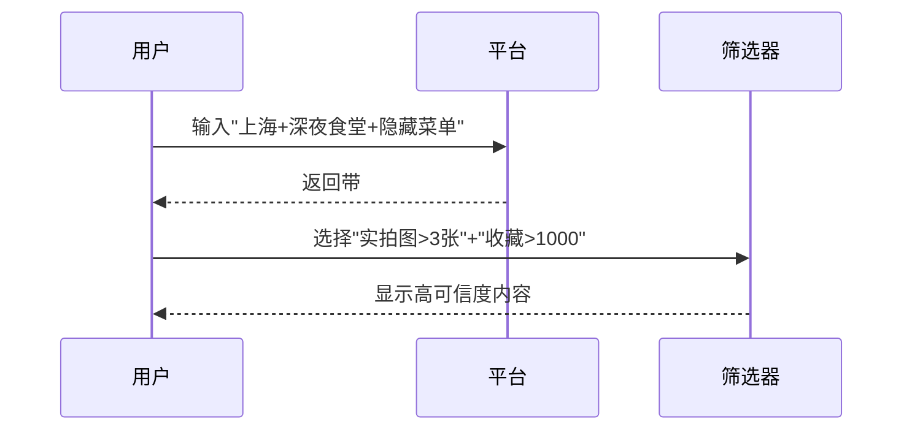

---
tags:
  - 美食种草
  - 社交平台
  - 食味录
url: "https://www.xiaohongshu.com/explore?channel_id=homefeed.food_v3"
title: "小红书美食宇宙全图鉴"
date: 2026-06-02
---

# 小红书美食宇宙全图鉴：从泡面到米其林的种草指南

## 0. 原始资料
本地证据：[[2026-06-02_小红书美食频道索引_04ed5a]]

## 1. 食物猎人导航手册

> 用星际旅行的视角探索美食宇宙，每个红点都是潜在的味觉奇遇

### 3. 小白补课区
**Q：为什么说小红书是美食猎人的诺亚方舟？**  
A：想象你站在美食银河系的入口，这里有：
- **泡面星球**：速食达人的秘密基地
- **米其林星云**：高端餐饮的星际导航
- **街边小吃星系**：隐藏在城市褶皱里的美味暗物质

**新手必知三定律**：
1. **种草不拔草**：点赞收藏前先看"避雷指南"标签
2. **图片即证据**：高清实拍图比文字更诚实
3. **时间魔法**：凌晨2点发布的探店笔记往往藏着惊喜

### 4. 关键概念/事实整理
| 食物维度 | 探索工具 | 生存指南 |
|---------|---------|---------|
| **内容类型** | 图文笔记/直播探店/短视频 | 识别"商家合作"水军的3个特征 |
| **用户画像** | 95后吃货占比68% | 高赞评论区的"踩坑预警"暗语 |
| **浏览技巧** | 智能推荐算法解析 | 如何用#标签定位城市限定美食 |

## 2. 食物猎人装备库
### 2.1 星际导航仪（搜索技巧）

### 2.2 防坑探测器
> 识别虚假种草的三大信号：
1. 图片滤镜过重（怀疑滤镜掩盖真实）
2. 文案模板化（警惕AI生成内容）
3. 评论区沉默（真实体验者会激烈讨论）

## 3. 食物猎人行动日志
> **今日发现**：在#成都美食#标签下，有用户分享"凌晨4点的巷子口抄手摊"，附带的热成像图显示摊位温度高达80℃，评论区有127人验证"确实比白天好吃"。

> **本周趋势**：#预制菜革命#话题下，有达人用科学实验对比速冻水饺与手工水饺的淀粉析出率，引发2.3万次讨论。

## 4. 食物猎人伦理守则
> 在美食宇宙探险时，请遵守：
- **3秒原则**：看到诱人美食先等3秒，避免冲动种草
- **交叉验证**：同一店铺笔记需查看至少5个不同用户的评价
- **时空法则**：注意笔记发布时间与店铺营业时间的关联性

> 🌟 **今日金句**："在小红书，每个点赞都是对美食宇宙的投票，每个收藏都是对味觉文明的传承。"