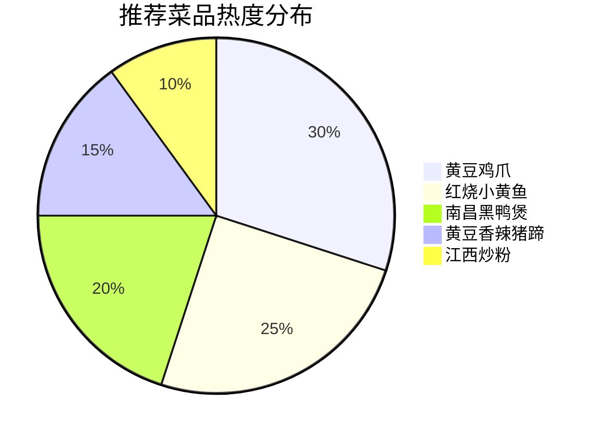
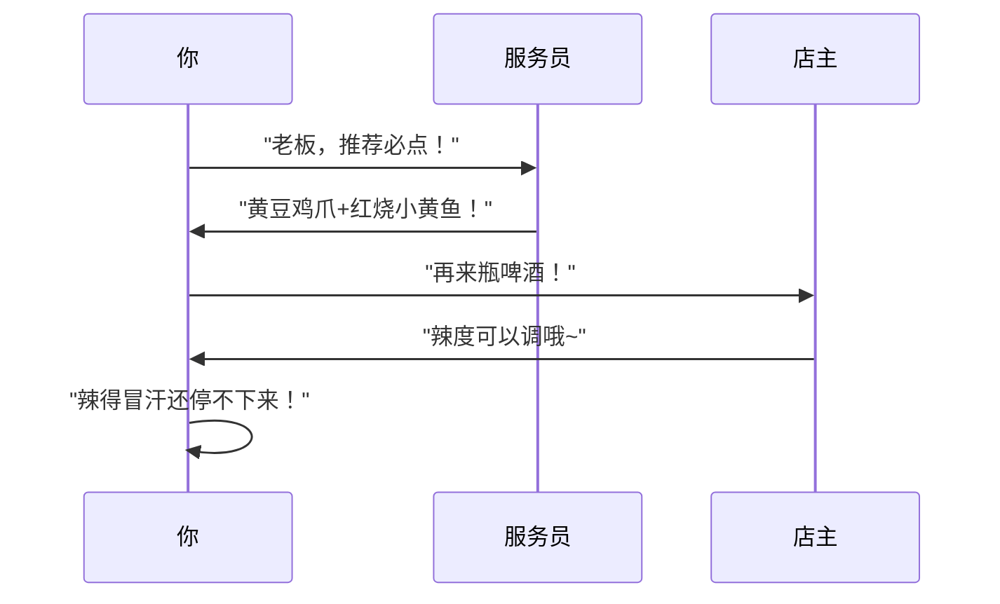

---
tags:
  - 杭州美食
  - 探店攻略
  - 打工人食堂
  - 江西菜
url: "https://www.xiaohongshu.com/explore/6a1cf3e4000000003501f02a"
title: "杭州拱墅江西小炒避世馆"
date: 2026-06-01
---

# 🌶️打工人食堂の江西辣味秘境：杭州拱墅区「香么天」探店手记

呱呱！蛤蟆仙君今日在杭州拱墅区发现了一处"辣味结界"——香么天江西小炒！这间藏在米市巷的市井小店，简直是打工人下班后的"味觉充电站"！

```mermaid
graph TD
    A[打工人下班] --> B{寻找美食}
    B --> C[打开小红书]
    C --> D[搜索"杭州江西菜"]
    D --> E[发现香么天]
    E --> F[冲向米市巷]
    F --> G[开启辣味修炼]
```

## 📍定位秘境
- **坐标**：杭州拱墅区米市巷（街边小馆）
- **门面**：霓虹灯下挂着"香么天"招牌的市井小店
- **氛围**：红格子桌布+烟火气爆棚的装修风格

## 🌶️辣味修炼手册


### 🔥必点五绝
1. **黄豆鸡爪** 🌶️🌶️🌶️
   - 脱骨神器：黄豆炖得绵密入味，酱汁裹满每根鸡爪
   - 吃法：嗦完手指都想舔干净！建议搭配啤酒食用

2. **红烧小黄鱼** 🌶️🌶️
   - 外焦里嫩的鱼肉吸饱汤汁
   - 秘诀：用汤汁拌饭，米饭秒变"黄金甲"

3. **南昌黑鸭煲** 🌶️🌶️🌶️🌶️
   - 辣度封顶的"味觉核弹"
   - 鸭肉紧实不柴，汤汁浓郁到能挂住勺子

4. **黄豆香辣猪蹄** 🌶️🌶️
   - 胶原蛋白炸弹：QQ弹弹的猪蹄裹满辣酱
   - 吃法：建议搭配冰镇啤酒，解辣又解压

5. **江西炒粉** 🌶️🌶️🌶️
   - 锅气十足的"碳水炸弹"
   - 特点：米粉裹满辣酱，香到舔盘

## 🖼️视觉证据链

> **蛤蟆法眼解析**：霓虹灯下的美食江湖，人均30+的"辣味修仙场"


> **辣味密码**：鲜辣卤制牛筋配豆黄红椒，勺子都吃不腻

## 🍻打工人修炼指南


## 📌修行任务清单
- [ ] 周末组队探秘米市巷
- [ ] 尝试挑战"南昌黑鸭煲"辣度极限
- [ ] 拍摄"江西炒粉"拌饭教程视频

## 📜原始卷轴
[[2026-06-01_杭州拱墅香么天江西小炒避世馆_c24b5c]]

> **蛤蟆仙君结语**：这间藏在杭州拱墅的江西小炒店，用30+的亲民价格，给打工人奉上了最地道的辣味修行体验。下次三五好友聚会，记得带上这本"辣味秘籍"！