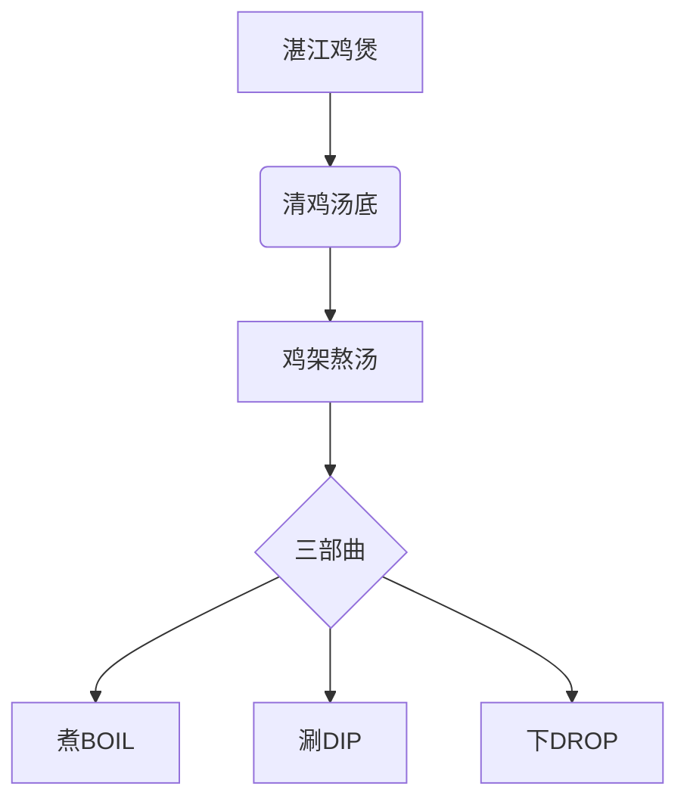

---
tags:
  - 杭州美食
  - 湛江鸡煲
  - 探店新发现
  - 鸡屎藤糖水
  - 广东鸡煲
  - 恒隆广场
url: "https://www.xiaohongshu.com/explore/6a1a9196000000000800233e?xsec_token=AByYGZFs9-c0Kazok0LXxzonsrguNj1ei4tMf-B6mcmZY=&xsec_source=pc_cfeed"
title: "杭州恒隆蒋姜姜湛江鸡煲探店，必点湛江鸡煲与捞粉"
date: 2026-06-21
---

# 🐔【杭州美食雷达】湛江鸡煲登陆恒隆！三步吃出南国风情

## 🖼️ 图集手札

<div style="display: none;">


</div>

## 🧭 0. 原始资料
本地证据：[[2026-06-21_杭州恒隆蒋姜姜湛江鸡煲探店，必点湛江鸡煲与捞粉_a3b36f]]

---

（蛤蟆祥甩着长舌从池边跃起）  
"仙尊且看！这杭州恒隆广场新晋的湛江鸡煲馆，可不简单！"  


## 🌴 1. 南国风味登陆记
杭州的食客们有福啦！这家名为「蒋姜姜·湛江饭店」的新店，把广东湛江的地道风味搬到了西湖边。从鲜香四溢的鸡煲到Q弹爽滑的捞粉，每一口都是南国风情的邀请函。



---

## 🍲 2. 吃鸡三部曲秘籍
蛤蟆祥亲测，这湛江鸡煲必须按"三部曲"解锁：

### 第一步：煮BOIL（8分钟）
> 🥘 **清鸡头道汤**：  
> 鸡架+鸡翅+鸡爪开锅同煮，8分钟后先喝头道汤，清鲜与药材的完美融合！

### 第二步：涮DIP（15-20秒）
> 🍽 **皮滑肉嫩**：  
> 带皮鸡肉片在汤中涮15-20秒，皮微卷即起，蘸上特制湿辣酱，绝了！

### 第三步：下DROP（按表操作）
> 🥘 **鸡杂盛宴**：  
> 内脏和配菜入锅，按背面时间表涮煮，最后来碗清爽解腻的鸡屎藤糖水收尾！

---

## 🍜 3. 小白补课区
**湛江鸡煲VS普通火锅**  
| 特点        | 普通火锅       | 湛江鸡煲       |
|-------------|----------------|----------------|
| 汤底        | 清汤/麻辣      | 鸡骨清汤+药材  |
| 吃法        | 随意涮煮       | 三部曲仪式感   |
| 配菜        | 多样           | 鸡杂+配菜为主  |
| 甜品        | 少见           | 鸡屎藤糖水     |

---

## 🍬 4. 关键概念/事实整理
| 项目         | 特点                          |
|--------------|-------------------------------|
| 镇店之宝     | 湛江捞粉（出圈必点，嫩滑越吃越香） |
| 必点菜品     | 湛江鸡煲（淋上湿辣酱，震撼美味） |
| 甜品惊喜     | 鸡屎藤糖水（清爽解腻）        |
| 吃法秘籍     | 三部曲+湿辣酱                 |
| 探店TIP      | 约上饭搭子同往，避免纠结      |

---

## 🚀 6. 行动指南
1. 📍定位：杭州恒隆广场「蒋姜姜·湛江饭店」
2. 🕒最佳时段：避开排队高峰，建议与饭搭子前往
3. 💡隐藏吃法：  
   ```mermaid
   sequenceDiagram
       participant 顾客
       participant 厨师
       顾客->>厨师: 点单时备注"配特制湿辣酱"
       厨师-->>顾客: 附赠湿辣酱碟
   ```
4. 🎁探店彩蛋：搭配出圈的湛江捞粉与特色鸡屎藤糖水，解锁最地道的吃法！

---

## 📌 7. 蛤蟆祥的终极建议
"仙尊若想体验地道湛江风味，记得带好饭搭子！先喝三碗鸡骨清汤，鸡肉涮15秒蘸湿辣酱，捞粉大口唆，最后来碗鸡屎藤糖水解腻——这才是完整的湛江美食修行啊！" 🐸
