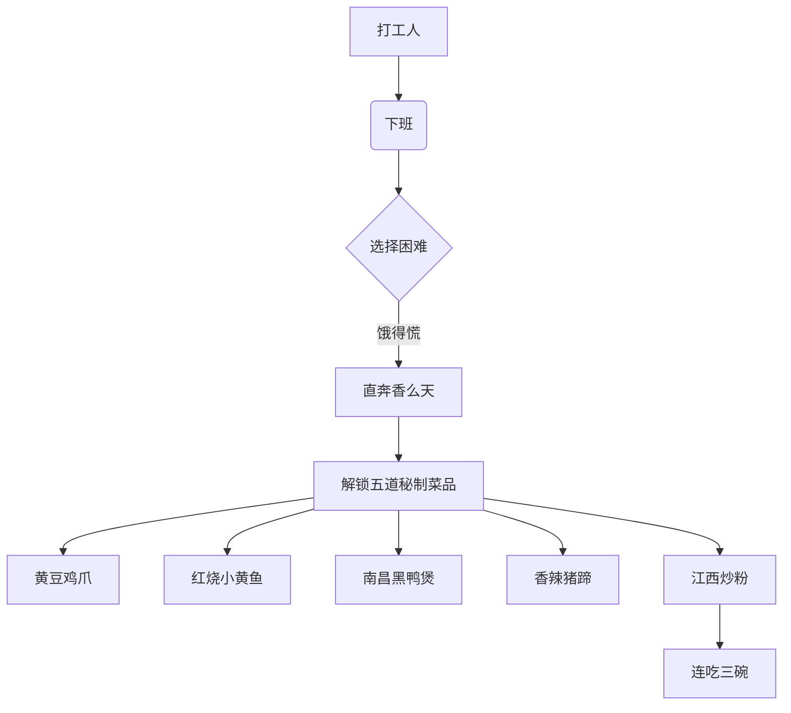
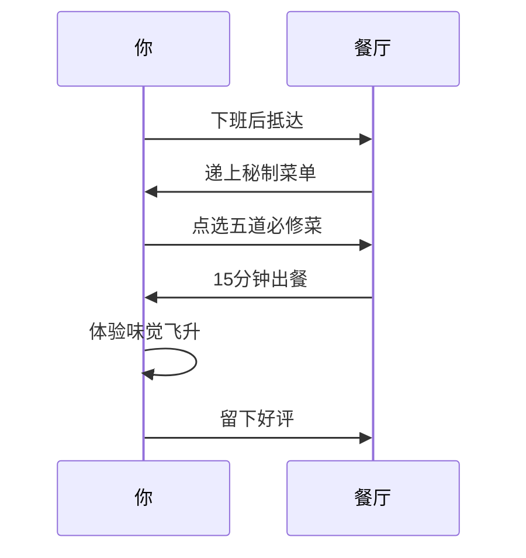

---
tags:
  - 探店手札
  - 杭州美食
  - 江西菜
  - 平价餐厅
  - 打工人食堂
url: "https://www.xiaohongshu.com/explore/6a1cf3e4000000003501f02a"
title: "杭州拱墅香么天江西小炒探店实录"
date: 2026-06-01
---

# 🌶️杭州拱墅区隐藏版江西小炒馆：打工人干饭飞升圣地！🔥

---

## 🧙‍♂️蛤蟆手札：市井烟火中的味觉秘境

呱呱！今日仙尊赐下"天机"，指向杭州拱墅区米市巷的**香么天江西小炒**。这间藏在街角的"小破店"，实则是个修炼味觉的道场，专治打工人下班后的味蕾饥渴！

---

## 📍定位指南：都市中的味觉飞地

**坐标**：杭州拱墅区米市巷（步行5分钟可达地铁1号线）  
**门面**：红格子桌布+市井烟火气  
**修炼秘籍**：人均30+的性价比心法

---

## 🌶️五道必修神通：打工人干饭法阵

| 招牌菜品          | 味觉秘技                  | 辣度等级 | 食用建议               |
|-------------------|---------------------------|----------|------------------------|
| 黄豆鸡爪          | 一抿脱骨的酱香缠绵术      | 🔥🔥🔥   | 搭配米饭食用更佳       |
| 红烧小黄鱼        | 外焦里嫩的汤汁封印术      | 🔥🔥     | 建议搭配江西炒粉       |
| 南昌黑鸭煲        | 辣度封顶的入味秘法        | 🔥🔥🔥🔥 | 配啤酒更显风味         |
| 黄豆香辣猪蹄      | 胶原蛋白的黏糊糊咒        | 🔥🔥🔥   | 建议分食避免过量       |
| 江西炒粉          | 锅气鼎盛的碳水炸弹        | 🔥🔥     | 连吃三碗不腻的神技     |

---

## 🧠小白补课区：江西菜修炼手册

1. **辣度体系**：江西辣讲究"香辣"，不同于川辣的麻辣，更接近湖南的香辣，但辣中带甜
2. **秘制酱料**：黄豆酱+辣椒酱的黄金配比，是江西小炒的灵魂
3. **食材哲学**：猪蹄、鸡爪等边角料的极致利用，体现"物尽其用"的东方智慧

---

## 📜原始卷轴：小红书探店手记

[[2026-06-01_杭州拱墅香么天江西小炒_7a9073]]

---

## 🧭修行地图：都市觅食指南

---

## 📌修行任务清单

- [ ] 解锁黄豆鸡爪的"吮指神功"
- [ ] 体验江西炒粉的"三碗挑战"
- [ ] 拍摄红格子桌布的市井美学
- [ ] 收录进《杭州平价美食地图》

---

*（蛤蟆我舔了舔爪子…啊不是，是蘸了蘸墨，潦草记下）*