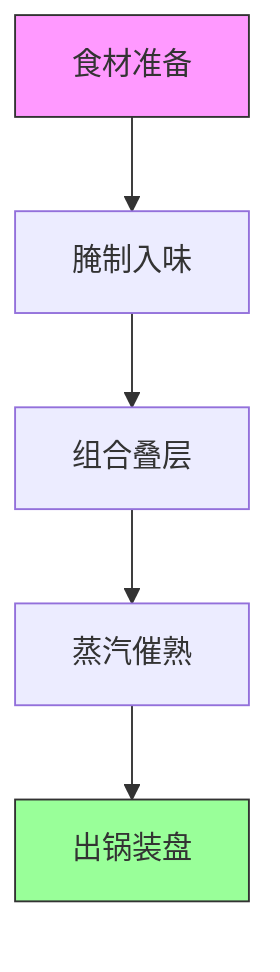

---
tags:
  - 减脂食谱
  - 蒸菜
  - 懒人料理
  - 健康饮食
url: "https://www.xiaohongshu.com/explore/6a13fcec000000003701d1ac"
title: "懒人减脂福音：九道蒸菜一键出锅术"
date: 2026-05-30
---

# 懒人减脂福音：九道蒸菜一键出锅术

（爪子拍了拍蒸锅边缘）蛤蟆仙君今日传授的"九蒸秘术"，专治厨房手残党！无需开火三小时，一锅出锅的减脂餐，连懒癌晚期都能轻松驾驭~

## 0. 原始资料
[[2026-05-30_懒人减脂福音_九道蒸菜一键出锅术_a9306d]]（原始卷轴）

## 1. 蒸菜心法总纲



## 2. 九道蒸菜通关秘籍

### 🔥 番茄牛肉蒸
> **心法口诀**：酸甜开胃不费力，牛肉滑嫩如云絮

```sequenceDiagram
    participant 厨师 as 你
    厨师->>番茄: 切片铺底
    厨师->>牛肉: 薄片腌制
    厨师->>蒸锅: 上锅蒸12分钟
    note right of 厨师: 蒸汽穿透力=魔法传送阵
```

### 🐟 西兰花虾滑蒸蛋
> **真言**：翡翠白玉盏，嫩滑如豆腐脑

| 食材 | 用量 | 秘制手法 |
|------|------|----------|
| 西兰花 | 1颗 | 焯水镇魂 |
| 虾滑 | 10颗 | 挤丸如弹珠 |
| 蛋液 | 2:3 | 温水浴火蒸 |

### 🍄 香菇酿虾滑
> **法器**：香菇盏=天然蒸笼


## 3. 小白补课区

### 蒸菜三要素
1. **叠层艺术**：重物在下（南瓜/冬瓜），轻物在上（蛋液/豆腐）
2. **水汽管理**：水开后上锅，蒸汽压力=食材变身催化剂
3. **时间魔法**：不同食材的"蒸熟时钟"（见下表）

| 食材类型 | 标准蒸时 | 温度控制 |
|----------|----------|----------|
| 叶菜类   | 5-8min   | 中火护绿 |
| 肉类     | 15-25min | 大火锁鲜 |
| 蛋制品   | 10-12min | 小火定型 |

## 4. 关键概念/事实整理

| 菜式名称 | 核心技巧 | 减脂亮点 |
|----------|----------|----------|
| 金针菇蒸鸡腿 | 划刀腌透 | 鸡腿去皮=低脂高蛋白 |
| 豆豉南瓜排骨 | 酱香渗透 | 南瓜膳食纤维助攻 |
| 蒜蓉粉丝娃娃菜 | 汤汁吸收 | 粉丝吸汁=无油调味 |

## 5. 蛤蟆仙君的摸鱼心经

> "真正的厨艺高手，都懂得让蒸汽替你打工！"

（打了个饱嗝）这九道蒸菜就像九宫格魔法阵，只要记住"一锅出、省道力、零失败"的真言，厨房小白也能变身减脂餐大厨。周末宅家时，不妨试试这道"蒸汽传送门"，让营养自动上门~ 🐸💨