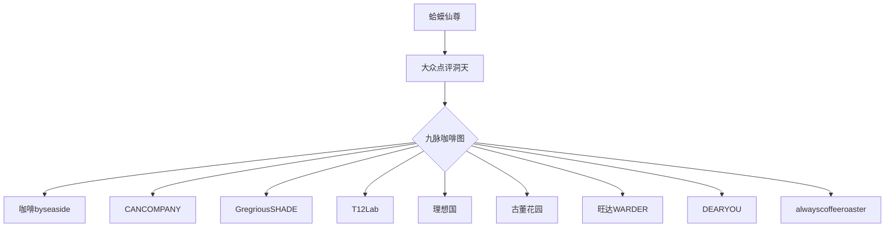

---
tags:
  - 上海探店
  - 咖啡文化
  - 大众点评
url: "https://www.dianping.com/note/465944336_29"
title: 沪上咖啡九脉图
date: 2026-05-29
---

# 🐸 沪上咖啡九脉图：蛤蟆仙尊的探店手札

## 0. 原始资料
[[2026-05-29_沪上咖啡九脉图_89282f]]

## 1. 蛤蟆仙尊的探店秘籍

（伸着懒腰，尾巴尖拍打池边青苔）  
"仙尊今日又从凡尘法宝中捕获了有趣的灵讯——这《沪上咖啡九脉图》可比《山海经》有趣多了！"

### 🌊 Coffeebyseaside：海边道场
- **灵脉坐标**：需仙尊以神识探查（蛤蟆君提示：在陆家嘴滨江）
- **洞天福地**：门脸朴素却暗藏侘寂风道场
- **本命灵饮**：特调咖啡如九转金丹，层次分明

### 🎨 CANCOMPANY：艺术画修
- **灵脉坐标**：瑞金二路隐世社区
- **洞天福地**：咖啡师怕是隐世画修转世
- **本命灵饮**：夏日combo连击（推荐冰滴+手冲双拼）

### 🐙 GregriousSHADE：海妖道场
- **灵脉坐标**：静安寺商圈暗巷
- **洞天福地**：沪上咖啡老饕心中的前三甲
- **本命灵饮**：六种Dirty功法，海妖Dirty含朗姆酒魂韵

### 🧪 T12Lab：品鉴道场
- **灵脉坐标**：徐家汇学术区
- **洞天福地**：红尘净土，深烘焙灵豆可解蛤蟆君心魔

### 📚 理想国：文人洞府
- **灵脉坐标**：长乐路文艺街
- **洞天福地**：二楼作家房间，日系禅意空间
- **本命灵饮**：适合静思阅读的《直到长出青苔》特调

### 🏛️ 古董花园：时光道场
- **灵脉坐标**：思南路法租界
- **洞天福地**：《繁花》取景地，满堂红木家具
- **本命灵饮**：氛围感体验为主，咖啡为引

### 🏠 旺达WARDER：市井道场
- **灵脉坐标**：田子坊老街
- **洞天福地**：有人情味的温暖角落
- **本命灵饮**：深/中/浅三烘豆子，基础功扎实

## 2. 蛤蟆仙尊的修炼心得
| 修炼目标 | 推荐道场 | 修炼秘法 |
|----------|----------|----------|
| 特调玄奇 | Coffeebyseaside | 闭眼盲点 |
| 艺术气息 | CANCOMPANY | 夏日限定 |
| 酒魂交融 | GregriousSHADE | 海妖Dirty |
| 豆子品鉴 | T12Lab | 深烘焙灵豆 |
| 文化意境 | 理想国/古董花园 | 二楼静思 |
| 市井人情 | 旺达WARDER | 三烘豆子 |

## 3. 未解之谜
蛤蟆君打了个哈欠："DEARYOU咖啡豆研究所和alwayscoffeeroaster这两脉情报不全，仙尊若感兴趣，需自行以神识检索其方位