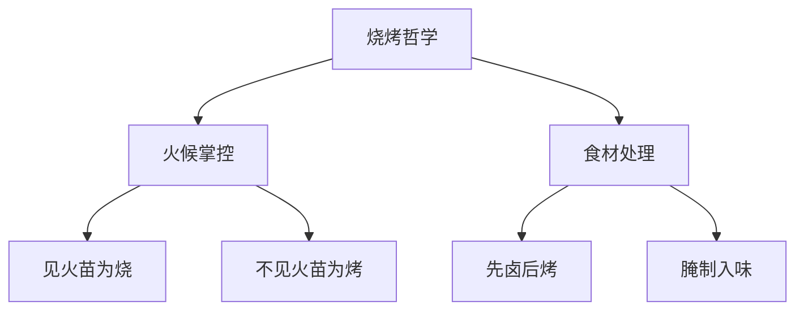
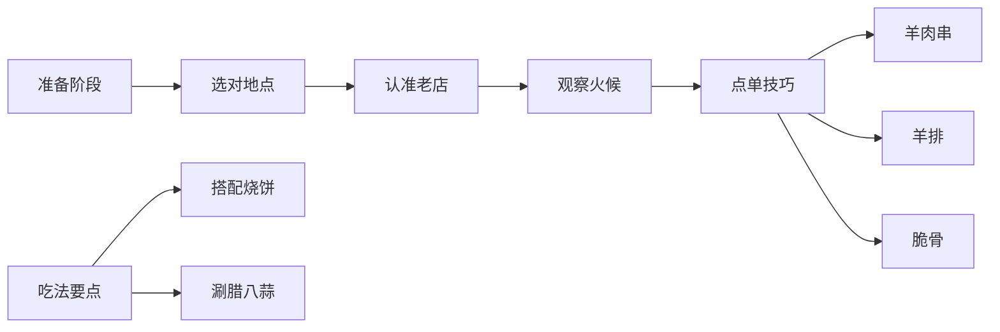

---
tags:
  - 美食探店
  - 人文观察
  - B站视频解析
  - 传统技艺传承
url: "https://www.bilibili.com/video/BV1uoVQ6AEPt/"
title: "济南烧烤局：老友重聚的烟火气与羊排秘籍"
date: 2026-06-01
---

# 济南烧烤局：老友重聚的烟火气与羊排秘籍

## 0. 原始资料
本地证据：[[2026-06-01_泉城烧烤悟道录_1cec54]]

## 1. 烧烤界的「道法自然」


在济南老城区的烟火气里，藏着一套完整的烧烤心法。UP主与老友老瑞的对话，像极了武林高手切磋的场景——"见火苗者为烧，不见火苗者为烤"，这句口诀堪比《九阴真经》的烧烤版。

## 2. 三重人间烟火气
```sequenceDiagram
    participant 老瑞 as 厦门友人
    participant 李哥 as 济南店主
    participant 观众 as 视频观众
    老瑞->>李哥: 点单羊肉串
    李哥-->>老瑞: 递上羊排
    老瑞->>观众: "这羊排像炸过再烤"
    李哥->>观众: "先卤后烤的秘方"
    老瑞->>李哥: "15年没尝到的烟火气"
```

这场烧烤局的三重境界：
1. **味觉江湖**：羊排外酥内润的口感，藏着"先卤后烤"的武林秘籍
2. **人情世故**：厦门老友与济南店主的"年年一会"江湖约定
3. **文化传承**：UP主用镜头记录传统烧烤技艺的非遗守护

## 3. 小白补课区
烧烤界的"见火不见火"之辩，就像武侠小说里的明劲暗劲。济南师傅的秘籍在于：
- **火候掌控**：离火苗高度决定肉串受热均匀度
- **预处理工艺**：羊排需先卤制入味再烤制锁水
- **签子艺术**：羊肉串要"随便接"却讲究穿串手法

## 4. 关键概念/事实整理
| 概念         | 解释                                                                 |
|--------------|----------------------------------------------------------------------|
| 烧烤哲学     | "见火苗为烧，不见火苗为烤"的技法区分                                  |
| 羊排秘制     | 先卤后烤的双重处理工艺                                               |
| 烟火气传承   | UP主3年拍摄记录传统烧烤技艺的非遗保护                                |
| 老友江湖     | 厦门-济南的"年年一会"跨城友谊契约                                    |

## 5. 烧烤局生存指南


**实战TIP**：
- 羊排必点：认准"外酥内润"的黄金口感
- 签子玄学：济南师傅穿串手法影响肉质口感
- 饮品搭配：推荐本地啤酒+腊八蒜的黄金组合

## 6. 烧烤江湖的未来
当UP主说出"很多年轻厨师没学过传统技法"时，就像武林泰斗在叹息后继无人。这场烧烤局不仅是味觉盛宴，更是：
- **文化传承**：用影像记录即将消失的烧烤技艺
- **城市纽带**：厦门-济南的跨城友谊见证
- **人间烟火**：15年未遇的市井温暖重现

下次去济南，不妨循着这个坐标：华夏工业中心41305，体验"牛排管够"的豪气。毕竟，真正的烧烤哲学，不在菜单里，而在老友碰杯时的那声"来来来"中。