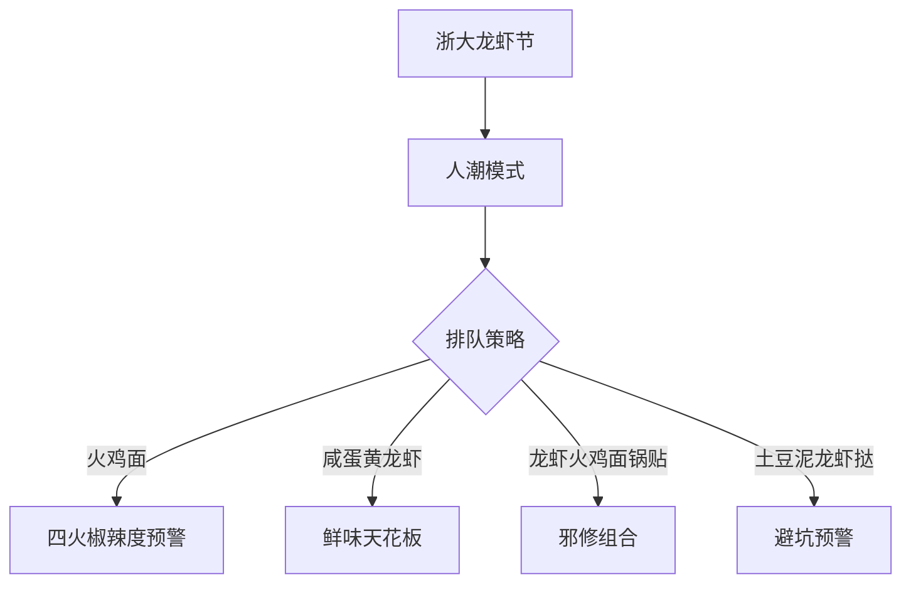
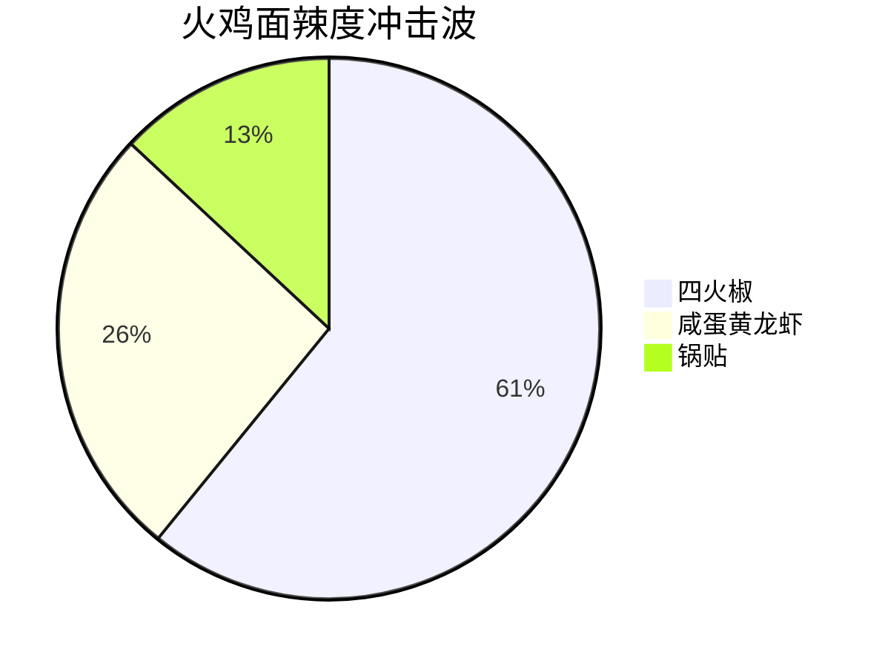
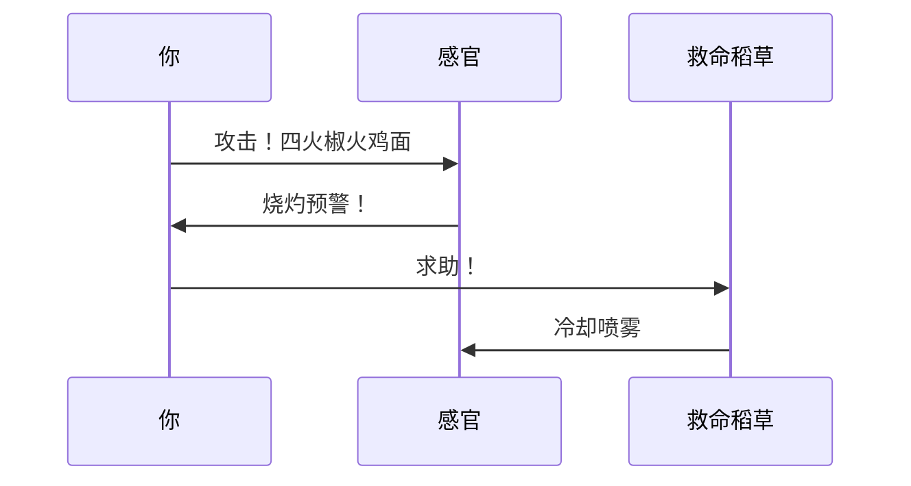

```yaml
---
tags:
  - 美食探店
  - 校园活动
  - 浙江大学
  - 节庆攻略
  - 火鸡面
  - 龙虾节
  - 小红书
url: "https://www.xiaohongshu.com/explore/6a1962d0000000003802261f?xsec_token=ABu_cmLAcDd9GHH-0-o7jOpMGe7zbP1a03cQmbTvh5Mpo=&xsec_source=pc_cfeed"
title: "浙大龙虾节：火鸡面VS咸蛋黄龙虾，吃货的修罗场"
date: 2026-06-01
---
```

# 🦞浙大龙虾节：火鸡面VS咸蛋黄龙虾，吃货的修罗场

<div class="obsidian-carousel" style="display: flex; overflow-x: auto; scroll-snap-type: x mandatory; gap: 8px; width: 100%; max-width: 480px; margin: 15px auto; padding-bottom: 8px; -webkit-overflow-scrolling: touch;">
  <div style="flex: 0 0 100%; scroll-snap-align: start; box-sizing: border-box; border-radius: 12px; overflow: hidden; border: 1px solid var(--background-modifier-border);">
    
  </div>
  <div style="flex: 0 0 100%; scroll-snap-align: start; box-sizing: border-box; border-radius: 12px; overflow: hidden; border: 1px solid var(--background-modifier-border);">
    
  </div>
  <div style="flex: 0 0 100%; scroll-snap-align: start; box-sizing: border-box; border-radius: 12px; overflow: hidden; border: 1px solid var(--background-modifier-border);">
    
  </div>
  <div style="flex: 0 0 100%; scroll-snap-align: start; box-sizing: border-box; border-radius: 12px; overflow: hidden; border: 1px solid var(--background-modifier-border);">
    
  </div>
  <div style="flex: 0 0 100%; scroll-snap-align: start; box-sizing: border-box; border-radius: 12px; overflow: hidden; border: 1px solid var(--background-modifier-border);">
    
  </div>
  <div style="flex: 0 0 100%; scroll-snap-align: start; box-sizing: border-box; border-radius: 12px; overflow: hidden; border: 1px solid var(--background-modifier-border);">
    
  </div>
  <div style="flex: 0 0 100%; scroll-snap-align: start; box-sizing: border-box; border-radius: 12px; overflow: hidden; border: 1px solid var(--background-modifier-border);">
    
  </div>
  <div style="flex: 0 0 100%; scroll-snap-align: start; box-sizing: border-box; border-radius: 12px; overflow: hidden; border: 1px solid var(--background-modifier-border);">
    
  </div>
  <div style="flex: 0 0 100%; scroll-snap-align: start; box-sizing: border-box; border-radius: 12px; overflow: hidden; border: 1px solid var(--background-modifier-border);">
    
  </div>
  <div style="flex: 0 0 100%; scroll-snap-align: start; box-sizing: border-box; border-radius: 12px; overflow: hidden; border: 1px solid var(--background-modifier-border);">
    
  </div>
  <div style="flex: 0 0 100%; scroll-snap-align: start; box-sizing: border-box; border-radius: 12px; overflow: hidden; border: 1px solid var(--background-modifier-border);">
    
  </div>
  <div style="flex: 0 0 100%; scroll-snap-align: start; box-sizing: border-box; border-radius: 12px; overflow: hidden; border: 1px solid var(--background-modifier-border);">
    
  </div>
  <div style="flex: 0 0 100%; scroll-snap-align: start; box-sizing: border-box; border-radius: 12px; overflow: hidden; border: 1px solid var(--background-modifier-border);">
    
  </div>
  <div style="flex: 0 0 100%; scroll-snap-align: start; box-sizing: border-box; border-radius: 12px; overflow: hidden; border: 1px solid var(--background-modifier-border);">
    
  </div>
</div>
<div style="text-align: center; font-size: 0.85em; color: var(--text-muted); margin-top: -5px; margin-bottom: 15px;">💡 左右滑动或使用滚轮查看更多图片</div>


## 0. 原始资料
本地证据：[[2026-06-01_浙大龙虾节觅食实录_c37398]]

## 1. 现场生存指南


## 2. 吃货修罗场实录
### 🔥辣度排行榜


### 🚨避坑雷达
| 食物名称       | 推荐指数 | 风险提示               |
|----------------|----------|------------------------|
| 火鸡面         | ⭐⭐⭐⭐🔥 | 不建议12岁以下食用     |
| 咸蛋黄龙虾     | ⭐⭐⭐⭐⭐  | 需搭配冰镇饮料         |
| 龙虾火鸡面锅贴 | ⭐⭐⭐⭐✨  | 建议分食，辣度叠加     |
| 土豆泥龙虾挞   | ⭐⭐     | 口感偏厚重             |

## 3. 小白补课区
### 🌶️辣度分级指南


### 🦞龙虾节冷知识
1. **历史渊源**：始于2018年浙大紫金港校区美食节
2. **隐藏菜单**：每年7月17日（谐音"吃虾"）有神秘新品
3. **修仙秘籍**：错峰时段（17:00-18:00）排队缩短50%

## 4. 吃货行动清单
- [ ] 下载「浙大龙虾节」小程序查看实时排队指数
- [ ] 准备防辣装备：薄荷糖/牛奶/纸巾
- [ ] 携带"邪修组合"：柠檬水+薄荷糖+冰淇淋
- [ ] 拍照打卡点：STCC舞台区（图1）、龙虾节杯装区（图6）

## 5. 下次修行建议
1. **错峰策略**：周五17:00后人流量下降30%
2. **隐藏路线**：从东门进入可避开主排队区
3. **美食雷达**：关注@浙大美食官微获取新品情报

> 🐸蛤蟆祥终极忠告：带好500ml水+20元现金，手机充电宝，毕竟浙大龙虾节的WiFi信号比龙虾壳还稀有！