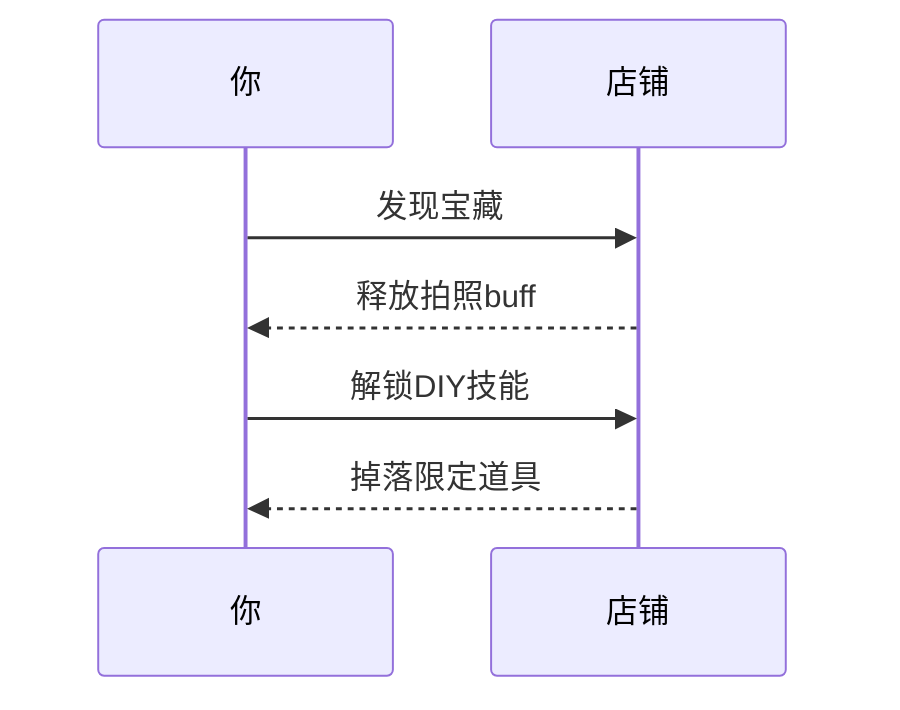
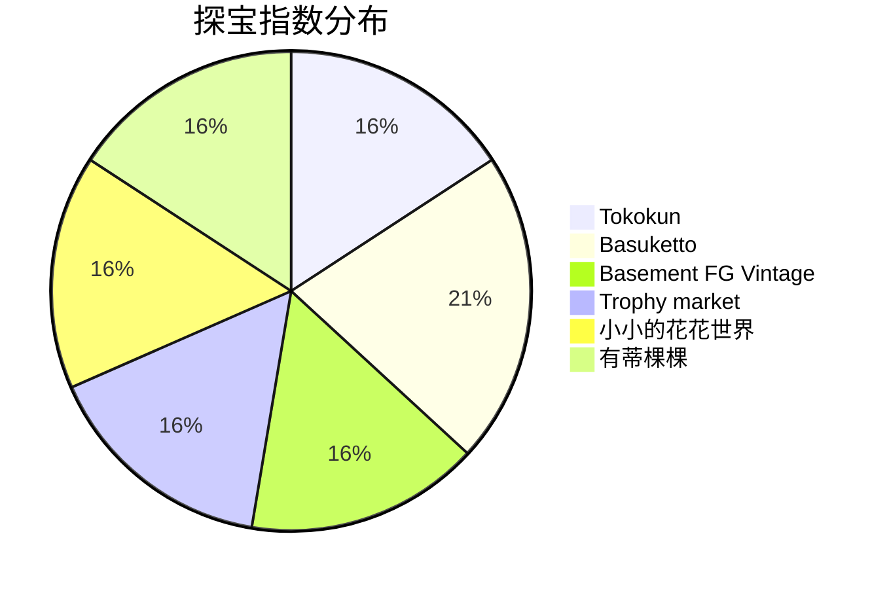
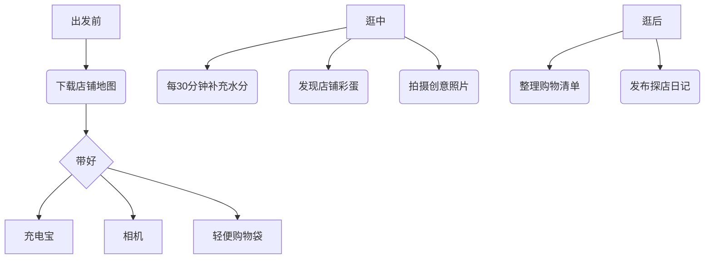

```yaml
tags:
  - 探店手札
  - 淮海路
  - 上海宝藏
url: "https://www.dianping.com/note/442707691_29"
title: 淮海路探宝：九大宝藏店铺打卡指南
date: 2026-05-29
```

# 淮海路探宝：九大宝藏店铺打卡指南

"逛吃逛吃"的终极奥义是什么？是把街道变成寻宝地图！今天带大家解锁上海淮海路的隐藏副本——九家神仙店铺的通关秘籍，保证让你边逛边笑，边买边拍！

---

## 0. 原始资料
本地证据：[[2026-05-29_淮海路闲游探宝手札_53bc06]]

---

## 1. 探宝路线图


---

## 2. 店铺通关秘籍

### 🌟🌟🌟🌟🌟 五星必刷


1. **又又手作店**  
   - **通关密码**：金鱼琉璃缸+本命手串DIY  
   - **隐藏成就**：完成"手作大师"称号  
   - **TIP**：建议预留1小时体验炼器（手串制作）

2. **Melomela**  
   - **场景特效**：ins风滤镜自动加载  
   - **拍照秘籍**：阶梯角度+逆光模式=电影感大片  
   - **彩蛋**：店员会客串"道具管家"

3. **Looknow flow**  
   - **终极奖励**：Jellycat灵宠大赏  
   - **必买清单**：限定款"会呼吸的云朵"系列

---

### 🌟🌟🌟 三星推荐


1. **Tokokun**  
   - **人潮预警**：周末开启"人海模式"（建议错峰）  
   - **拍照圣地**：门外小院自带"复古滤镜"

2. **Basuketto**  
   - **分店彩蛋**：每家店的饰品风格都像开了"盲盒"  
   - **隐藏玩法**：收集不同分店的限定款

---

## 3. 逛吃心法


---

## 4. 本地人私藏TIP
- **交通秘籍**：地铁10号线"淮海中路"站2号口出，步行3分钟直达Tokokun
- **时间管理**：建议预留2.5-3小时，避开12:00-14:00午间人潮
- **穿搭建议**：浅色系服装+亮色配饰，与店铺风格更搭调
- **隐藏玩法**：收集九家店铺的名片，可兑换限定版"淮海路探宝证书"

---

## 5. 仙尊附言
这次探宝之旅像在玩现实版《古董美少女》，每个店铺都是精心设计的场景。建议搭配《上海老街新玩法》[[2026-05-29_上海淮海路秘境探店手札_cc16ca]]一起食用，解锁更多隐藏关卡！下次准备挑战"武康路魔法街"，记得关注后续攻略哦~ 🐸✨